# API flow

Every endpoint, every function it reaches, and every status change along the way — as
diagrams. [`WALKTHROUGH.md`](WALKTHROUGH.md) explains what each line of code *means*; this
explains what calls what, in what order, and what the caller sees while it happens.

The diagrams are deliberately split. One picture of the whole system would be unreadable,
and the interesting parts are the seams: where the request ends and the background task
begins, where one step forks into three, where a change reaches a watcher.

**Contents**

| | |
|---|---|
| [1](#1--the-map) | The map — who calls whom |
| [2](#2--post-v1cases) | `POST /v1/cases` — accepting a case |
| [3](#3--the-background-task) | The background task — `_run` and `drain` |
| [4](#4--inside-the-graph) | Inside the graph — fan-out and join |
| [5](#5--inside-read) | Inside `read` — one document |
| [6](#6--inside-compare) | Inside `compare` — all documents |
| [7](#7--get-v1casescase_id) | `GET /v1/cases/{case_id}` — polling |
| [8](#8--delete-v1casescase_id) | `DELETE /v1/cases/{case_id}` |
| [9](#9--socketio-subscribe) | Socket.IO — `subscribe`, `case`, `done` |
| [10](#10--how-a-watcher-is-woken) | How a watcher is woken — the event swap |
| [11](#11--status-lifecycle) | Status lifecycle |
| [12](#12--the-failure-paths) | The failure paths |
| [13](#13--the-supporting-routes) | The supporting routes |
| [14](#14--one-case-end-to-end) | One case, end to end |

Everything below is traced from a real run of the three sample documents.

---

## 1 · The map

Six modules. An arrow means "calls into"; nothing points back up.

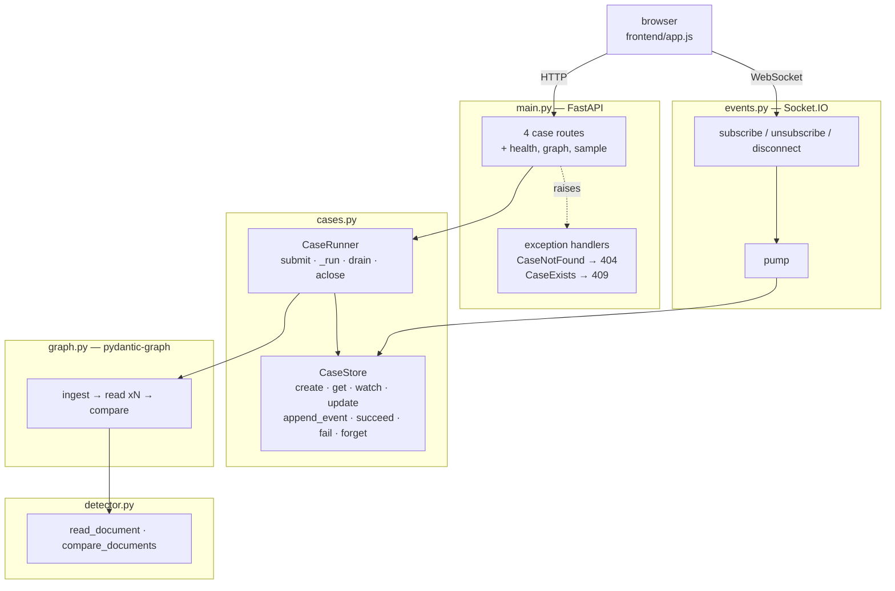
```mermaid
flowchart TD
    browser["browser<br/>frontend/app.js"]

    subgraph api["main.py — FastAPI"]
        routes["4 case routes<br/>+ health, graph, sample"]
        handlers["exception handlers<br/>CaseNotFound → 404<br/>CaseExists → 409"]
    end

    subgraph sock["events.py — Socket.IO"]
        subscribe_h["subscribe / unsubscribe / disconnect"]
        pump_f["pump"]
    end

    subgraph run["cases.py"]
        runner["CaseRunner<br/>submit · _run · drain · aclose"]
        store["CaseStore<br/>create · get · watch · update<br/>append_event · succeed · fail · forget"]
    end

    subgraph pipeline["graph.py — pydantic-graph"]
        steps["ingest → read xN → compare"]
    end

    subgraph logic["detector.py"]
        det["read_document · compare_documents"]
    end

    browser -->|HTTP| routes
    browser -->|WebSocket| subscribe_h
    routes --> runner
    routes -.->|raises| handlers
    subscribe_h --> pump_f
    pump_f --> store
    runner --> store
    runner --> steps
    steps --> det
```

Two things to read off it:

- **`detector.py` is a leaf.** It imports only `models.py`. No `async`, no store, no
  socket — which is why it can be called from a REPL.
- **Nothing calls `CaseRunner` except the routes.** The socket layer goes straight to
  `runner.store`, because watching is a store concern, not a running concern.

---

## 2 · `POST /v1/cases`

The request that does no work. Validation, registration, task creation, reply — and the
analysis has not started when the response goes out.

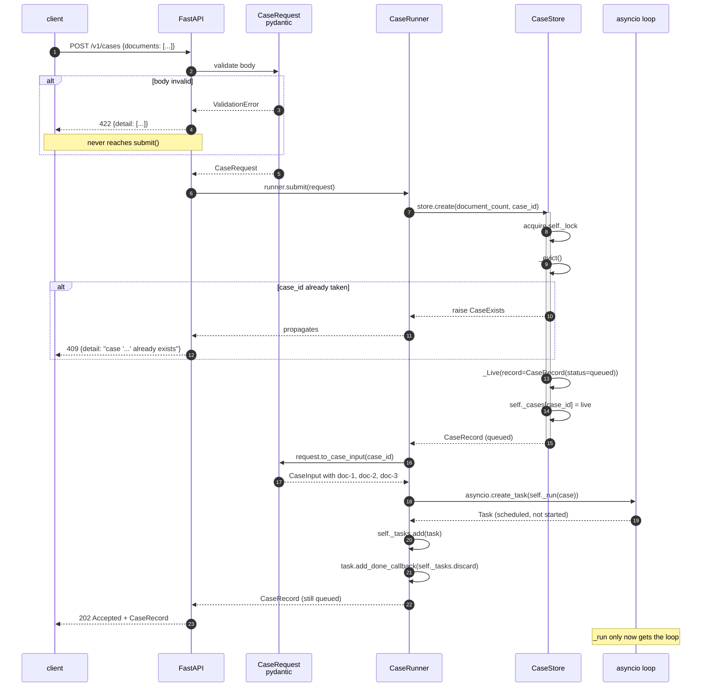
```mermaid
sequenceDiagram
    autonumber
    participant C as client
    participant F as FastAPI
    participant M as CaseRequest<br/>pydantic
    participant R as CaseRunner
    participant S as CaseStore
    participant L as asyncio loop

    C->>F: POST /v1/cases {documents: [...]}
    F->>M: validate body

    alt body invalid
        M-->>F: ValidationError
        F-->>C: 422 {detail: [...]}
        Note over C,F: never reaches submit()
    end

    M-->>F: CaseRequest
    F->>R: runner.submit(request)

    R->>S: store.create(document_count, case_id)
    activate S
    S->>S: acquire self._lock
    S->>S: _evict()
    alt case_id already taken
        S-->>R: raise CaseExists
        R-->>F: propagates
        F-->>C: 409 {detail: "case '...' already exists"}
    end
    S->>S: _Live(record=CaseRecord(status=queued))
    S->>S: self._cases[case_id] = live
    S-->>R: CaseRecord (queued)
    deactivate S

    R->>M: request.to_case_input(case_id)
    M-->>R: CaseInput with doc-1, doc-2, doc-3

    R->>L: asyncio.create_task(self._run(case))
    L-->>R: Task (scheduled, not started)
    R->>R: self._tasks.add(task)
    R->>R: task.add_done_callback(self._tasks.discard)

    R-->>F: CaseRecord (still queued)
    F-->>C: 202 Accepted + CaseRecord

    Note over L: _run only now gets the loop
```

What the caller holds at step 22:

```json
{
  "case_id": "case-demo",
  "status": "queued",
  "document_count": 3,
  "submitted_at": "2026-09-17T10:14:58.159696Z",
  "finished_at": null,
  "events": [],
  "report": null,
  "error": null
}
```

`events` is empty and `report` is `null` — but both keys are present. The shape does not
change for the rest of the case's life; only the values do.

### Why the task is held in a set

`asyncio` keeps only a weak reference to a running task. `self._tasks.add(task)` is what
stops the garbage collector taking `_run` mid-analysis; `add_done_callback` removes it
afterwards so the set does not grow forever.

---

## 3 · The background task

`_run` is where the case actually happens. It is driving the graph, but its other job is
forwarding: turning what the steps recorded into store updates that watchers can see.

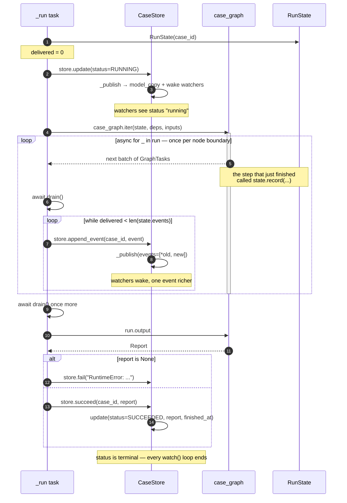
```mermaid
sequenceDiagram
    autonumber
    participant T as _run task
    participant S as CaseStore
    participant G as case_graph
    participant St as RunState

    T->>St: RunState(case_id)
    Note over T: delivered = 0

    T->>S: store.update(status=RUNNING)
    S->>S: _publish → model_copy + wake watchers
    Note over S: watchers see status "running"

    T->>G: case_graph.iter(state, deps, inputs)
    activate G

    loop async for _ in run — once per node boundary
        G-->>T: next batch of GraphTasks
        Note over G,St: the step that just finished<br/>called state.record(...)
        T->>T: await drain()
        loop while delivered < len(state.events)
            T->>S: store.append_event(case_id, event)
            S->>S: _publish(events=[*old, new])
            Note over S: watchers wake, one event richer
        end
    end

    deactivate G
    T->>T: await drain() once more
    T->>G: run.output
    G-->>T: Report

    alt report is None
        T->>S: store.fail("RuntimeError: ...")
    else
        T->>S: store.succeed(case_id, report)
        S->>S: update(status=SUCCEEDED, report, finished_at)
    end

    Note over S: status is terminal — every watch() loop ends
```

### What each iteration actually yields

Traced from the sample run. The `async for` hands back the *next* batch of tasks, so the
events it forwards are the ones the *previous* batch recorded:

| iteration | yields | `drain()` forwards |
|---|---|---|
| 1 | `['ingest']` | — |
| 2 | `['fan_out_documents']` | `ingest` · "3 documents received" |
| 3 | `['read', 'read', 'read']` | — |
| 4 | `['collect_documents']` | `read` · doc-3 |
| 5 | `['collect_documents']` | `read` · doc-1 |
| 6 | `['collect_documents']` | `read` · doc-2 |
| 7 | `['compare']` | — |
| 8 | `['__end__']` | `compare` · "3 mismatches, verdict blocked" |
| 9 | `EndMarker` | — |
| — | *after the loop* | — |

Three things worth noticing.

**Iteration 3 is the fan-out.** One yield carrying three `read` tasks. That is the only
place in the run where more than one task appears in a batch.

**Iterations 4–6 arrive in completion order.** doc-3 first, then doc-1, then doc-2 —
which is ascending read delay, not submission order. Each one is a separate yield, so each
one reaches the browser on its own.

**The trailing `drain()` forwards nothing here.** `compare`'s event is already picked up at
iteration 8, because `__end__` is itself a node boundary. The second call is a guard
against a graph shape where the last node's event would otherwise be stranded; on this
graph it is a no-op.

### `drain` itself

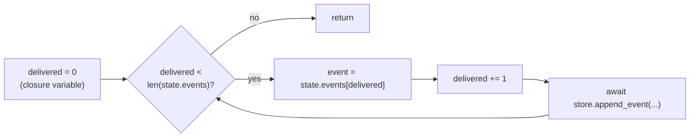
```mermaid
flowchart LR
    A["delivered = 0<br/>(closure variable)"] --> B{"delivered &lt;<br/>len(state.events)?"}
    B -->|no| C["return"]
    B -->|yes| D["event = state.events[delivered]"]
    D --> E["delivered += 1"]
    E --> F["await store.append_event(...)"]
    F --> B
```

Reading by index rather than iterating is deliberate: the fan-out branches are still
appending to `state.events` while this runs, and indexing up to a length re-read each time
round is safe against that. `nonlocal delivered` is what lets the inner function advance
the outer high-water mark.

---

## 4 · Inside the graph

Three steps, five edges, one fork and one join.

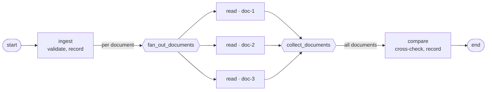
```mermaid
flowchart LR
    start(["start"]) --> ingest["ingest<br/>validate, record"]
    ingest -->|per document| fork{{"fan_out_documents"}}
    fork --> r1["read · doc-1"]
    fork --> r2["read · doc-2"]
    fork --> r3["read · doc-3"]
    r1 --> join{{"collect_documents"}}
    r2 --> join
    r3 --> join
    join -->|all documents| compare["compare<br/>cross-check, record"]
    compare --> fin(["end"])
```

The three `read` boxes are the same function. The graph makes *N* of them at run time, one
per element of the list `ingest` returned.

### What flows along each edge

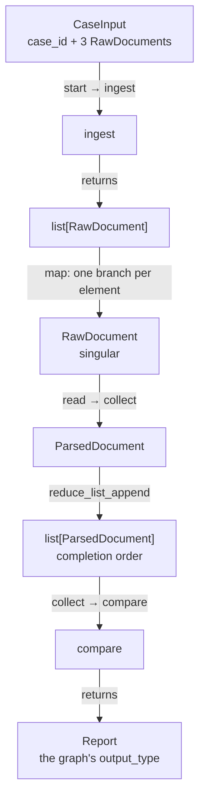
```mermaid
flowchart TD
    A["CaseInput<br/>case_id + 3 RawDocuments"] -->|start → ingest| B["ingest"]
    B -->|returns| C["list[RawDocument]"]
    C -->|map: one branch per element| D["RawDocument<br/>singular"]
    D -->|read → collect| E["ParsedDocument"]
    E -->|reduce_list_append| F["list[ParsedDocument]<br/>completion order"]
    F -->|collect → compare| G["compare"]
    G -->|returns| H["Report<br/>the graph's output_type"]
```

`read` is typed `StepContext[RunState, RunDeps, RawDocument]` — singular. It has no idea it
is one of three, which is exactly why the fan-out costs nothing to write.

### Each step, in full

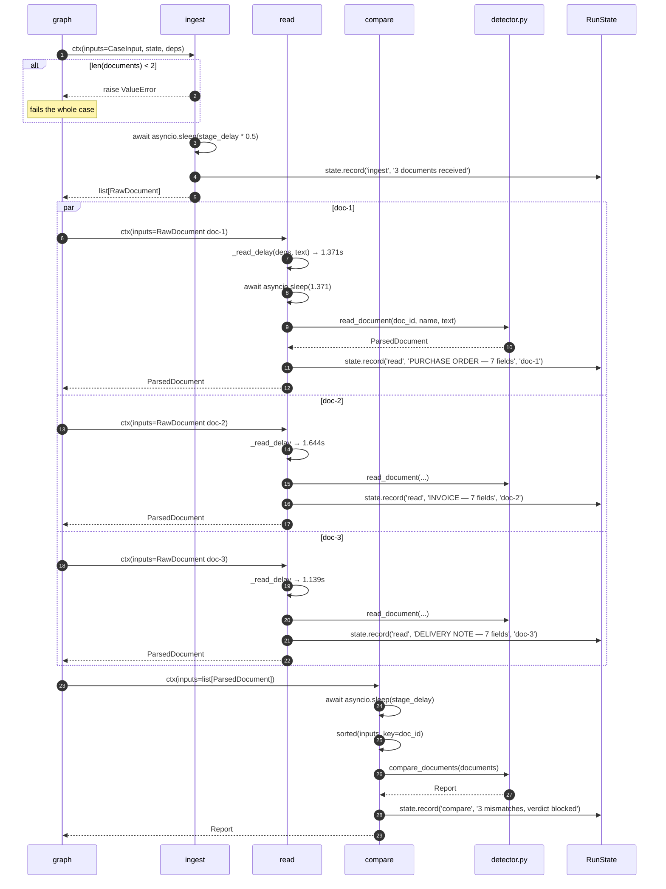
```mermaid
sequenceDiagram
    autonumber
    participant G as graph
    participant I as ingest
    participant Rd as read
    participant Cm as compare
    participant D as detector.py
    participant St as RunState

    G->>I: ctx(inputs=CaseInput, state, deps)
    alt len(documents) < 2
        I-->>G: raise ValueError
        Note over G: fails the whole case
    end
    I->>I: await asyncio.sleep(stage_delay * 0.5)
    I->>St: state.record('ingest', '3 documents received')
    I-->>G: list[RawDocument]

    par doc-1
        G->>Rd: ctx(inputs=RawDocument doc-1)
        Rd->>Rd: _read_delay(deps, text) → 1.371s
        Rd->>Rd: await asyncio.sleep(1.371)
        Rd->>D: read_document(doc_id, name, text)
        D-->>Rd: ParsedDocument
        Rd->>St: state.record('read', 'PURCHASE ORDER — 7 fields', 'doc-1')
        Rd-->>G: ParsedDocument
    and doc-2
        G->>Rd: ctx(inputs=RawDocument doc-2)
        Rd->>Rd: _read_delay → 1.644s
        Rd->>D: read_document(...)
        Rd->>St: state.record('read', 'INVOICE — 7 fields', 'doc-2')
        Rd-->>G: ParsedDocument
    and doc-3
        G->>Rd: ctx(inputs=RawDocument doc-3)
        Rd->>Rd: _read_delay → 1.139s
        Rd->>D: read_document(...)
        Rd->>St: state.record('read', 'DELIVERY NOTE — 7 fields', 'doc-3')
        Rd-->>G: ParsedDocument
    end

    G->>Cm: ctx(inputs=list[ParsedDocument])
    Cm->>Cm: await asyncio.sleep(stage_delay)
    Cm->>Cm: sorted(inputs, key=doc_id)
    Cm->>D: compare_documents(documents)
    D-->>Cm: Report
    Cm->>St: state.record('compare', '3 mismatches, verdict blocked')
    Cm-->>G: Report
```

`sorted(..., key=doc_id)` in `compare` is what undoes the completion-order shuffle, so the
report's document list is in submission order however the reads finished.

### Why three concurrent `record()` calls need no lock

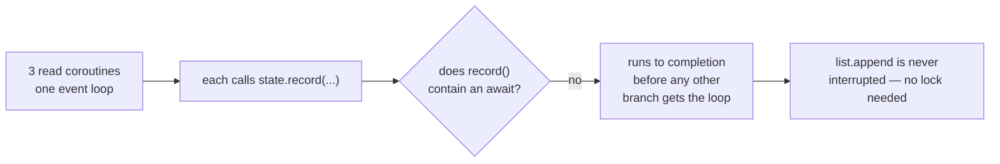
```mermaid
flowchart LR
    A["3 read coroutines<br/>one event loop"] --> B["each calls state.record(...)"]
    B --> C{"does record()<br/>contain an await?"}
    C -->|no| D["runs to completion<br/>before any other<br/>branch gets the loop"]
    D --> E["list.append is never<br/>interrupted — no lock needed"]
```

Coroutines interleave only at `await`. `record()` has none, so it is atomic with respect to
its siblings. The same argument would not hold for threads.

---

## 5 · Inside `read`

One document, from raw text to `ParsedDocument`.

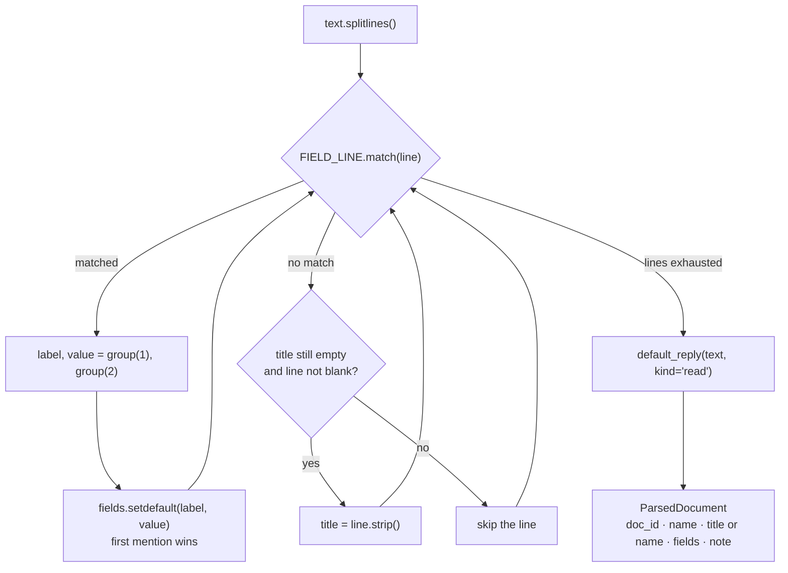
```mermaid
flowchart TD
    A["text.splitlines()"] --> B{"FIELD_LINE.match(line)"}
    B -->|matched| C["label, value = group(1), group(2)"]
    C --> D["fields.setdefault(label, value)<br/>first mention wins"]
    D --> B
    B -->|no match| E{"title still empty<br/>and line not blank?"}
    E -->|yes| F["title = line.strip()"]
    E -->|no| G["skip the line"]
    F --> B
    G --> B
    B -->|lines exhausted| H["default_reply(text, kind='read')"]
    H --> I["ParsedDocument<br/>doc_id · name · title or name · fields · note"]
```

`default_reply` is the stand-in for the model call — `crc32` of the prompt picks one of
four canned lines, so the same document always gets the same note. This is the one function
a real implementation would replace.

What the regex accepts and rejects:

| line | result |
|---|---|
| `Total Amount: 51,000.00   ` | `('Total Amount', '51,000.00')` |
| `Time: 10:30` | `('Time', '10:30')` — second colon is value |
| `PURCHASE ORDER` | no match → becomes the title |
| `The buyer confirmed on Tuesday that delivery is fine: see attached` | no match — 52 chars before the colon |

---

## 6 · Inside `compare`

All documents at once. The whole comparison is one inversion followed by one pass.

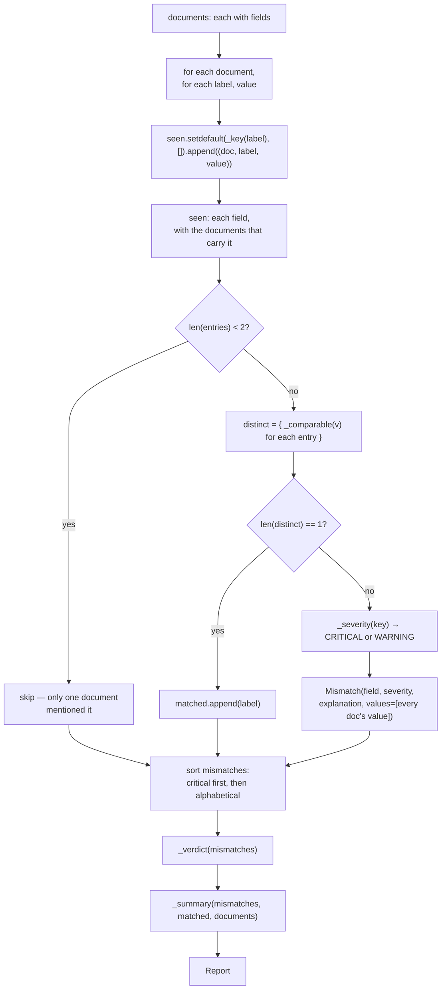
```mermaid
flowchart TD
    A["documents: each with fields"] --> B["for each document,<br/>for each label, value"]
    B --> C["seen.setdefault(_key(label), []).append((doc, label, value))"]
    C --> D["seen: each field,<br/>with the documents that carry it"]

    D --> E{"len(entries) &lt; 2?"}
    E -->|yes| F["skip — only one document<br/>mentioned it"]
    E -->|no| G["distinct = { _comparable(v) for each entry }"]
    G --> H{"len(distinct) == 1?"}
    H -->|yes| I["matched.append(label)"]
    H -->|no| J["_severity(key) → CRITICAL or WARNING"]
    J --> K["Mismatch(field, severity,<br/>explanation, values=[every doc's value])"]

    F --> L["sort mismatches:<br/>critical first, then alphabetical"]
    I --> L
    K --> L
    L --> M["_verdict(mismatches)"]
    M --> N["_summary(mismatches, matched, documents)"]
    N --> O["Report"]
```

### The normalising helpers

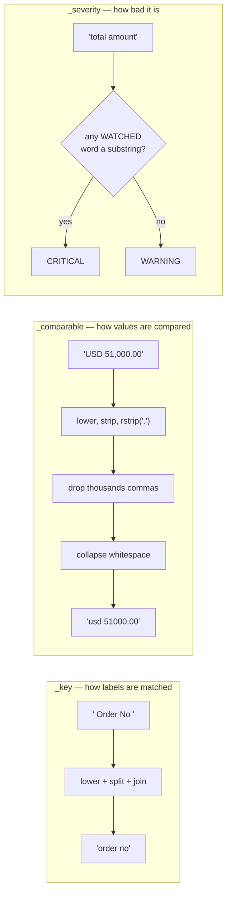
```mermaid
flowchart LR
    subgraph key["_key — how labels are matched"]
        K1["'  Order   No '"] --> K2["lower + split + join"] --> K3["'order no'"]
    end
    subgraph cmp["_comparable — how values are compared"]
        C1["'USD 51,000.00'"] --> C2["lower, strip, rstrip('.')"] --> C3["drop thousands commas"] --> C4["collapse whitespace"] --> C5["'usd 51000.00'"]
    end
    subgraph sev["_severity — how bad it is"]
        S1["'total amount'"] --> S2{"any WATCHED<br/>word a substring?"}
        S2 -->|yes| S3["CRITICAL"]
        S2 -->|no| S4["WARNING"]
    end
```

### `_verdict`

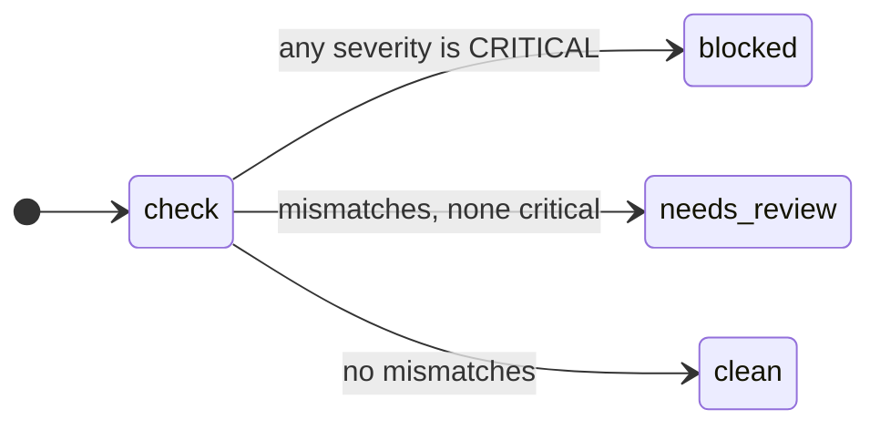
```mermaid
stateDiagram-v2
    direction LR
    [*] --> check
    check --> blocked: any severity is CRITICAL
    check --> needs_review: mismatches, none critical
    check --> clean: no mismatches
```

> A case where no field appears on two documents also returns `clean` — nothing disagreed,
> but nothing was checked either. Left in on purpose, and called out in the walkthrough.

### `_summary` — the seam

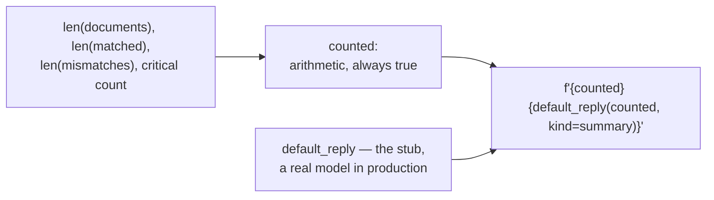
```mermaid
flowchart LR
    A["len(documents), len(matched),<br/>len(mismatches), critical count"] --> B["counted:<br/>arithmetic, always true"]
    B --> C["f'{counted} {default_reply(counted, kind=summary)}'"]
    D["default_reply — the stub,<br/>a real model in production"] --> C
```

---

## 7 · `GET /v1/cases/{case_id}`

The polling half. No work, no waiting — whatever the record says right now.

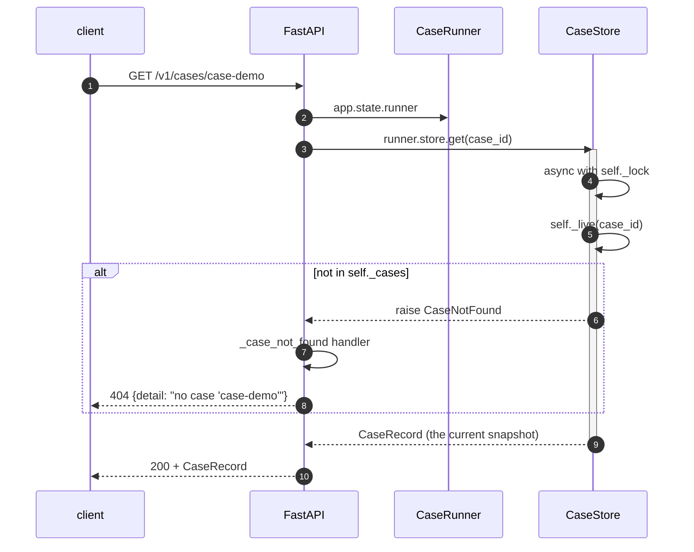
```mermaid
sequenceDiagram
    autonumber
    participant C as client
    participant F as FastAPI
    participant R as CaseRunner
    participant S as CaseStore

    C->>F: GET /v1/cases/case-demo
    F->>R: app.state.runner
    F->>S: runner.store.get(case_id)
    activate S
    S->>S: async with self._lock
    S->>S: self._live(case_id)
    alt not in self._cases
        S-->>F: raise CaseNotFound
        F->>F: _case_not_found handler
        F-->>C: 404 {detail: "no case 'case-demo'"}
    end
    S-->>F: CaseRecord (the current snapshot)
    deactivate S
    F-->>C: 200 + CaseRecord
```

The same route answers at every stage of the case's life:

| when | `status` | `events` | `report` |
|---|---|---|---|
| right after POST | `queued` | `[]` | `null` |
| during the reads | `running` | 1–4 entries | `null` |
| after `compare` | `succeeded` | 5 entries | the `Report` |
| after a failure | `failed` | however far it got | `null`, `error` set |
| after DELETE | — | — | 404 |

---

## 8 · `DELETE /v1/cases/{case_id}`

Drops the record and releases anyone watching. It does *not* cancel the run.

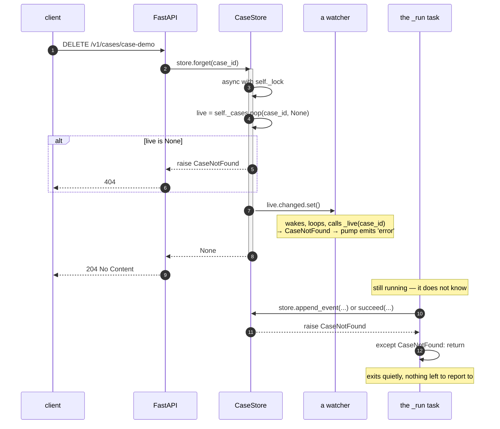
```mermaid
sequenceDiagram
    autonumber
    participant C as client
    participant F as FastAPI
    participant S as CaseStore
    participant W as a watcher
    participant T as the _run task

    C->>F: DELETE /v1/cases/case-demo
    F->>S: store.forget(case_id)
    activate S
    S->>S: async with self._lock
    S->>S: live = self._cases.pop(case_id, None)
    alt live is None
        S-->>F: raise CaseNotFound
        F-->>C: 404
    end
    S->>W: live.changed.set()
    Note over W: wakes, loops, calls _live(case_id)<br/>→ CaseNotFound → pump emits 'error'
    S-->>F: None
    deactivate S
    F-->>C: 204 No Content

    Note over T: still running — it does not know
    T->>S: store.append_event(...) or succeed(...)
    S-->>T: raise CaseNotFound
    T->>T: except CaseNotFound: return
    Note over T: exits quietly, nothing left to report to
```

Verified: after a mid-run delete the runner's task set drains to zero and no exception
escapes. The case simply stops existing.

---

## 9 · Socket.IO subscribe

The pushing half. Every `case` frame is a whole `CaseRecord` — the same object the GET
returns.

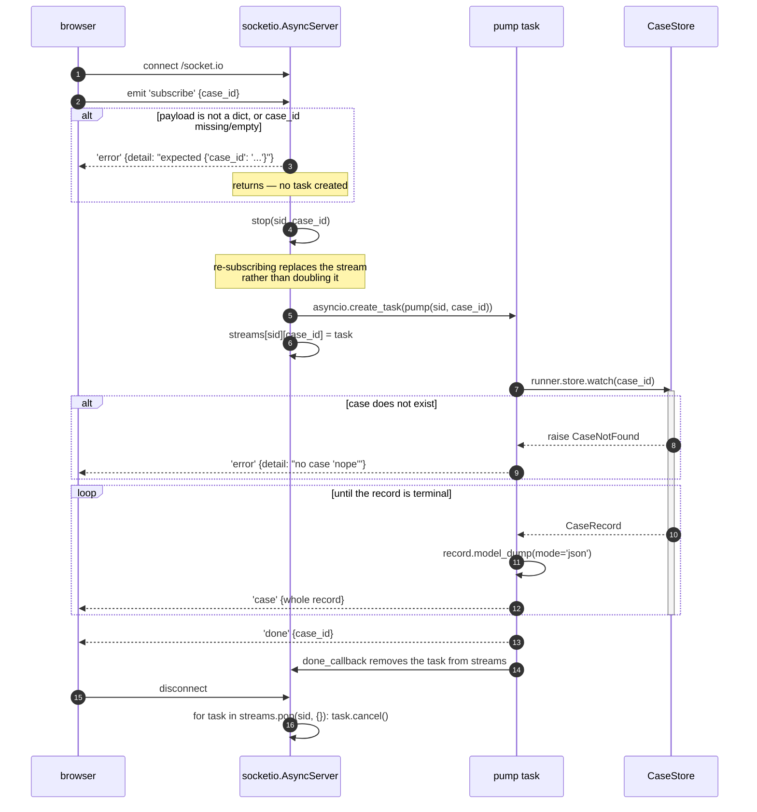
```mermaid
sequenceDiagram
    autonumber
    participant C as browser
    participant Sv as socketio.AsyncServer
    participant P as pump task
    participant S as CaseStore

    C->>Sv: connect /socket.io
    C->>Sv: emit 'subscribe' {case_id}

    alt payload is not a dict, or case_id missing/empty
        Sv-->>C: 'error' {detail: "expected {'case_id': '...'}"}
        Note over Sv: returns — no task created
    end

    Sv->>Sv: stop(sid, case_id)
    Note over Sv: re-subscribing replaces the stream<br/>rather than doubling it
    Sv->>P: asyncio.create_task(pump(sid, case_id))
    Sv->>Sv: streams[sid][case_id] = task

    P->>S: runner.store.watch(case_id)
    activate S

    alt case does not exist
        S-->>P: raise CaseNotFound
        P-->>C: 'error' {detail: "no case 'nope'"}
    end

    loop until the record is terminal
        S-->>P: CaseRecord
        P->>P: record.model_dump(mode='json')
        P-->>C: 'case' {whole record}
    end
    deactivate S

    P-->>C: 'done' {case_id}
    P->>Sv: done_callback removes the task from streams

    C->>Sv: disconnect
    Sv->>Sv: for task in streams.pop(sid, {}): task.cancel()
```

### Every payload shape, and what comes back

| client emits | server emits |
|---|---|
| `subscribe {"case_id": "case-demo"}` | `case` … `case` … `done {"case_id": "case-demo"}` |
| `subscribe {"case_id": "nope"}` | `error {"detail": "no case 'nope'"}` |
| `subscribe "case-demo"` | `error {"detail": "expected {'case_id': '...'}"}` |
| `subscribe {"case_id": ""}` | `error {"detail": "expected {'case_id': '...'}"}` |
| `subscribe {}` | `error {"detail": "expected {'case_id': '...'}"}` |
| `unsubscribe {"case_id": "case-demo"}` | nothing — the task is cancelled |

All five verified by driving the handlers directly.

Note where the two errors come from. The three malformed payloads are rejected by
`subscribe` before any task exists. `no case 'nope'` comes from `pump`, because the id
looked fine and only `store.watch` could know there was nothing behind it.

A case that *fails* still ends with `done`, not `error` — `failed` is terminal, so
`watch()` returns normally. `error` means "I could not stream this", never "the analysis
went badly".

### `model_dump(mode='json')`

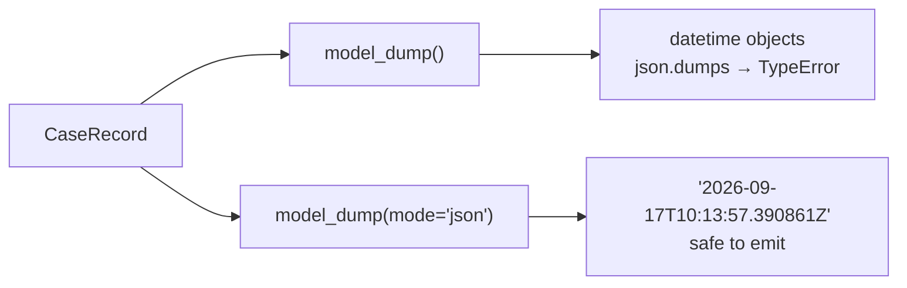
```mermaid
flowchart LR
    A["CaseRecord"] --> B["model_dump()"] --> C["datetime objects<br/>json.dumps → TypeError"]
    A --> D["model_dump(mode='json')"] --> E["'2026-09-17T10:13:57.390861Z'<br/>safe to emit"]
```

The FastAPI routes never need this — returning a model lets FastAPI serialise it.
Socket.IO is handed a plain dict, so the conversion happens here.

---

## 10 · How a watcher is woken

The subtlest mechanism in the project, and the reason several browser tabs can watch one
case without any of them missing an update.

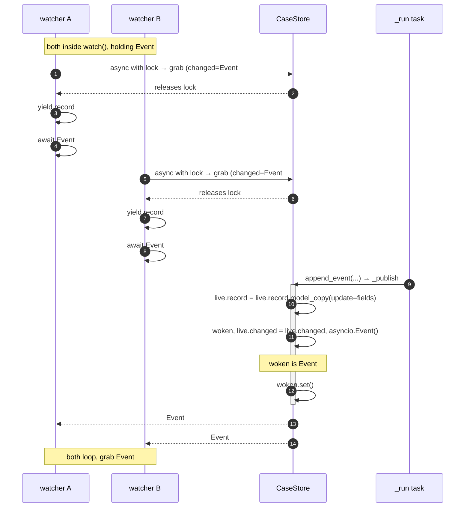
```mermaid
sequenceDiagram
    autonumber
    participant W1 as watcher A
    participant W2 as watcher B
    participant S as CaseStore
    participant T as _run task

    Note over W1,W2: both inside watch(), holding Event#1

    W1->>S: async with lock → grab (changed=Event#1, record)
    S-->>W1: releases lock
    W1->>W1: yield record
    W1->>W1: await Event#1.wait()

    W2->>S: async with lock → grab (changed=Event#1, record)
    S-->>W2: releases lock
    W2->>W2: yield record
    W2->>W2: await Event#1.wait()

    T->>S: append_event(...) → _publish
    activate S
    S->>S: live.record = live.record.model_copy(update=fields)
    S->>S: woken, live.changed = live.changed, asyncio.Event()
    Note over S: woken is Event#1<br/>live.changed is now Event#2
    S->>S: woken.set()
    deactivate S

    S-->>W1: Event#1 set → wakes
    S-->>W2: Event#1 set → wakes
    Note over W1,W2: both loop, grab Event#2, yield the new record
```

### Why replacing, not set-then-clear

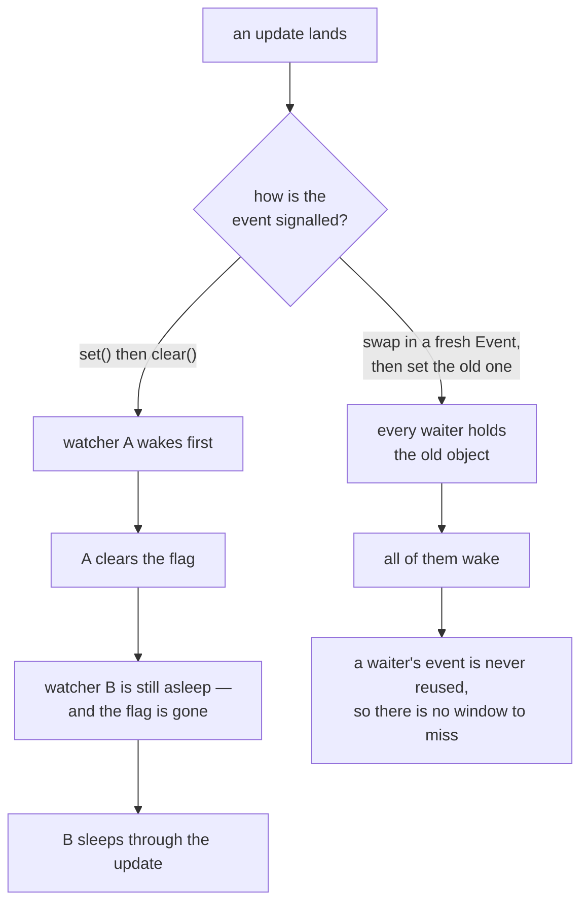
```mermaid
flowchart TD
    A["an update lands"] --> B{"how is the<br/>event signalled?"}
    B -->|"set() then clear()"| C["watcher A wakes first"]
    C --> D["A clears the flag"]
    D --> E["watcher B is still asleep —<br/>and the flag is gone"]
    E --> F["B sleeps through the update"]
    B -->|"swap in a fresh Event,<br/>then set the old one"| G["every waiter holds<br/>the old object"]
    G --> H["all of them wake"]
    H --> I["a waiter's event is never reused,<br/>so there is no window to miss"]
```

### Why the event is grabbed *before* the yield

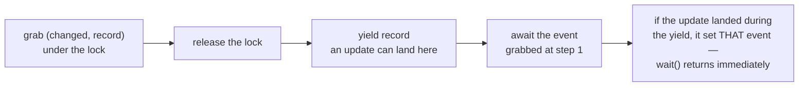
```mermaid
flowchart LR
    A["grab (changed, record)<br/>under the lock"] --> B["release the lock"]
    B --> C["yield record<br/>an update can land here"]
    C --> D["await the event<br/>grabbed at step 1"]
    D --> E["if the update landed during<br/>the yield, it set THAT event —<br/>wait() returns immediately"]
```

Grab the event *after* yielding instead and there is a race: the update fires while the
watcher is between steps, then the watcher starts waiting for the *next* one, and the
change it just missed never arrives.

---

## 11 · Status lifecycle

```mermaid
stateDiagram-v2
    [*] --> queued: store.create()<br/>POST returns here

    queued --> running: _run → store.update(status=RUNNING)

    running --> running: store.append_event()<br/>status unchanged, events grows

    running --> succeeded: store.succeed(report)<br/>sets report + finished_at
    running --> failed: store.fail(detail)<br/>sets error + finished_at

    succeeded --> [*]: is_terminal → watch() ends → 'done'
    failed --> [*]: is_terminal → watch() ends → 'done'

    note right of queued
        report: null, error: null
        events: []
    end note

    note right of running
        5 append_event calls
        on a 3-document case
    end note

    note right of succeeded
        report set, error null
        critical_count computed
    end note
```

`is_terminal` is defined once, on `JobStatus`, and three places ask it:

```mermaid
flowchart LR
    A["JobStatus.is_terminal"] --> B["CaseRecord.is_terminal<br/>forwards it"]
    B --> C["CaseStore.watch<br/>stops iterating"]
    B --> D["events.pump<br/>emits 'done'"]
    B --> E["CaseStore._evict<br/>via finished_at"]
```

### What each store method writes

| method | `status` | other fields |
|---|---|---|
| `create` | `queued` | `case_id`, `document_count`, `submitted_at` |
| `update(status=RUNNING)` | `running` | — |
| `append_event` | unchanged | `events` replaced with `[*old, new]` |
| `succeed` | `succeeded` | `report`, `finished_at` |
| `fail` | `failed` | `error`, `finished_at` |
| `forget` | — | record removed entirely |

Every one of them goes through `_publish`, so every one of them wakes the watchers.

---

## 12 · The failure paths

Four ways a case can go wrong, and they are answered in four different places.

```mermaid
flowchart TD
    A["POST /v1/cases"] --> B{"body valid?"}
    B -->|"no — &lt;2 docs, empty text,<br/>unknown key"| C["422<br/>pydantic, before any code runs"]
    B -->|yes| D{"case_id free?"}
    D -->|no| E["409<br/>CaseExists → exception handler"]
    D -->|yes| F["202 + queued record"]

    F --> G["_run on a background task"]
    G --> H{"what happens?"}
    H -->|"step raises"| I["except Exception<br/>store.fail('ValueError: ...')<br/>status → failed"]
    H -->|"case deleted mid-run"| J["except CaseNotFound<br/>return quietly"]
    H -->|"shutdown"| K["except CancelledError<br/>re-raise"]
    H -->|ok| L["store.succeed(report)<br/>status → succeeded"]

    M["GET or DELETE<br/>an unknown id"] --> N["404<br/>CaseNotFound → exception handler"]
```

### The three `except` clauses, and why each differs

```mermaid
flowchart LR
    subgraph c1["except asyncio.CancelledError: raise"]
        A1["not an error — an instruction.<br/>Swallowing it means the task<br/>refuses to die on shutdown."]
    end
    subgraph c2["except CaseNotFound: return"]
        A2["someone deleted the case.<br/>There is nothing left to<br/>report an outcome to."]
    end
    subgraph c3["except Exception: store.fail(...)"]
        A3["deliberately broad. A case that<br/>never reaches a terminal state<br/>is one a client polls forever."]
    end
```

A failed case, traced from a real induced error inside `read_document`:

```json
{
  "case_id": "case-bad",
  "status": "failed",
  "error": "ValueError: unreadable layout on page 2",
  "report": null,
  "events": [
    {"stage": "ingest", "message": "3 documents received", "doc_id": null}
  ],
  "finished_at": "2026-09-17T..."
}
```

`ingest` had already recorded its line, so the trail keeps it. The reads never got to
record theirs. `error` is `f'{type(exc).__name__}: {exc}'` — the class name is kept because
`"unreadable layout on page 2"` alone would not say what kind of failure it was.

### Status codes, by origin

| code | raised by | reaches the client via |
|---|---|---|
| `422` | pydantic validating `CaseRequest` | FastAPI's built-in handler |
| `409` | `CaseStore.create` → `CaseExists` | `_case_exists` handler |
| `404` | `CaseStore._live` → `CaseNotFound` | `_case_not_found` handler |
| `204` | `forget_case` returning `None` | `status_code` on the decorator |
| `202` | `submit` | `status_code` on the decorator |
| `failed` status | any step raising | recorded in the record, still a `200` |

The last row is the important distinction: **a failed analysis is not an HTTP error.** The
request to fetch it succeeded; the thing it fetched says `failed`.

---

## 13 · The supporting routes

Three routes with no case in them.

```mermaid
sequenceDiagram
    autonumber
    participant C as client
    participant F as FastAPI
    participant G as graph.py
    participant S as sample.py

    C->>F: GET /health
    F-->>C: 200 {"status": "ok", "stage_delay_seconds": 1.0}

    C->>F: GET /v1/sample
    F->>S: SAMPLE
    S-->>F: 3 dicts of name + text
    F-->>C: 200 [{...}, {...}, {...}]

    C->>F: GET /v1/graph
    F->>G: render_mermaid(title=...)
    G->>G: case_graph.render(title)
    G-->>F: Mermaid source
    F-->>C: 200 text/plain
```

`/v1/graph` returns the diagram drawn from the wiring that actually runs — the same five
`builder.edge_from(...)` calls that execute the pipeline:

```
---
title: Document mismatch pipeline
---
stateDiagram-v2
  ingest
  state fan_out_documents <<fork>>
  read
  state collect_documents <<join>>
  compare

  [*] --> ingest
  ingest --> fan_out_documents: per document
  fan_out_documents --> read
  read --> collect_documents
  collect_documents --> compare: all documents
  compare --> [*]
```

### Startup and shutdown

```mermaid
sequenceDiagram
    autonumber
    participant U as uvicorn
    participant F as FastAPI
    participant R as CaseRunner

    U->>F: startup
    F->>F: lifespan — before yield
    F->>R: app.state.runner = CaseRunner()
    Note over F: mounts already assembled —<br/>events.py reads app.state.runner<br/>at event time, not now

    Note over U,R: serving

    U->>F: shutdown
    F->>F: lifespan — finally block
    F->>R: await runner.aclose()
    R->>R: tuple(self._tasks) — snapshot first
    R->>R: task.cancel() for each
    R->>R: await gather(*tasks, return_exceptions=True)
    Note over R: in-flight cases cancelled,<br/>never orphaned
```

`tuple(self._tasks)` takes the snapshot because cancelling triggers the done callback that
mutates the set being iterated.

### Mount order

```mermaid
flowchart TD
    A["incoming request"] --> B{"/socket.io/... ?"}
    B -->|yes| C["Socket.IO ASGI app"]
    B -->|no| D{"matches a declared route?"}
    D -->|yes| E["/health, /v1/graph, /v1/sample,<br/>/v1/cases..."]
    D -->|no| F["StaticFiles at '/'<br/>mounted LAST"]
    F --> G["index.html and the frontend"]
```

A mount at `/` matches everything, so it has to come last. Move it above the routes and
every API call would return the HTML page instead.

---

## 14 · One case, end to end

Everything above, in one trace. `TFD_STAGE_DELAY=1.0`, three sample documents, a browser
that POSTs and then connects.

```mermaid
sequenceDiagram
    autonumber
    participant B as browser
    participant F as FastAPI
    participant R as CaseRunner
    participant S as CaseStore
    participant T as _run task
    participant G as graph
    participant P as pump

    B->>F: POST /v1/cases {3 documents}
    F->>R: submit(request)
    R->>S: create() → queued
    R->>T: create_task(_run)
    R-->>B: 202 {case_id, status: queued}

    B->>P: socket subscribe {case_id}
    P->>S: watch(case_id)
    S-->>P: CaseRecord queued
    P-->>B: 'case' status=queued events=0

    T->>S: update(status=RUNNING)
    S-->>P: wakes
    P-->>B: 'case' status=running events=0

    T->>G: graph.iter(...)
    G->>G: ingest — sleep 0.5s, record
    T->>S: append_event(ingest)
    S-->>P: wakes
    P-->>B: 'case' status=running events=1

    par three reads at once
        G->>G: read doc-3 — 1.139s
    and
        G->>G: read doc-1 — 1.371s
    and
        G->>G: read doc-2 — 1.644s
    end

    T->>S: append_event(read doc-3)
    S-->>P: wakes
    P-->>B: 'case' events=2
    T->>S: append_event(read doc-1)
    S-->>P: wakes
    P-->>B: 'case' events=3
    T->>S: append_event(read doc-2)
    S-->>P: wakes
    P-->>B: 'case' events=4

    G->>G: compare — sleep 1s, compare_documents, record
    T->>S: append_event(compare)
    S-->>P: wakes
    P-->>B: 'case' events=5

    G-->>T: Report (verdict blocked, 3 mismatches)
    T->>S: succeed(report)
    S-->>P: wakes
    P-->>B: 'case' status=succeeded report={...}
    Note over P: record.is_terminal → watch() returns
    P-->>B: 'done' {case_id}
```

Eight `case` frames, then `done` — exactly the sequence `store.watch()` yields:

```
status=queued     events=0   report=None   terminal=False
status=running    events=0   report=None   terminal=False
status=running    events=1   report=None   terminal=False
status=running    events=2   report=None   terminal=False
status=running    events=3   report=None   terminal=False
status=running    events=4   report=None   terminal=False
status=running    events=5   report=None   terminal=False
status=succeeded  events=5   report=yes    terminal=True
```

A client that connects at frame five gets `events=4` immediately and has missed nothing it
needs — every frame is complete, so the latest one is always enough.

---

## Function index

Every function in `app/`, and where it is reached from.

| function | called by | diagram |
|---|---|---|
| `lifespan` | uvicorn startup/shutdown | [13](#13--the-supporting-routes) |
| `submit` route | client POST | [2](#2--post-v1cases) |
| `get_case` route | client GET | [7](#7--get-v1casescase_id) |
| `forget_case` route | client DELETE | [8](#8--delete-v1casescase_id) |
| `health`, `sample`, `graph` routes | client GET | [13](#13--the-supporting-routes) |
| `_case_not_found`, `_case_exists` | FastAPI, on raise | [12](#12--the-failure-paths) |
| `CaseRequest.to_case_input` | `CaseRunner.submit` | [2](#2--post-v1cases) |
| `CaseRunner.submit` | `submit` route | [2](#2--post-v1cases) |
| `CaseRunner._run` | the background task | [3](#3--the-background-task) |
| `drain` (closure in `_run`) | `_run`, per node boundary | [3](#3--the-background-task) |
| `CaseRunner.aclose` | `lifespan`, on shutdown | [13](#13--the-supporting-routes) |
| `CaseStore.create` | `CaseRunner.submit` | [2](#2--post-v1cases) |
| `CaseStore._evict` | `CaseStore.create` | [2](#2--post-v1cases) |
| `CaseStore.get` | `get_case` route | [7](#7--get-v1casescase_id) |
| `CaseStore.watch` | `events.pump` | [9](#9--socketio-subscribe) |
| `CaseStore.update` | `_run`, `succeed`, `fail` | [3](#3--the-background-task) |
| `CaseStore.append_event` | `drain` | [3](#3--the-background-task) |
| `CaseStore.succeed` / `fail` | `_run` | [11](#11--status-lifecycle) |
| `CaseStore.forget` | `forget_case` route | [8](#8--delete-v1casescase_id) |
| `CaseStore._live` | every store method | [7](#7--get-v1casescase_id) |
| `CaseStore._publish` | every writing store method | [10](#10--how-a-watcher-is-woken) |
| `ingest` step | the graph | [4](#4--inside-the-graph) |
| `read` step | the graph, once per document | [4](#4--inside-the-graph) |
| `compare` step | the graph | [4](#4--inside-the-graph) |
| `_read_delay` | `read` | [4](#4--inside-the-graph) |
| `RunState.record` | all three steps | [4](#4--inside-the-graph) |
| `render_mermaid` | `graph` route | [13](#13--the-supporting-routes) |
| `read_document` | `read` step | [5](#5--inside-read) |
| `compare_documents` | `compare` step | [6](#6--inside-compare) |
| `_key`, `_comparable`, `_severity` | `compare_documents` | [6](#6--inside-compare) |
| `_verdict`, `_summary` | `compare_documents` | [6](#6--inside-compare) |
| `default_reply` | `read_document`, `_summary` | [5](#5--inside-read), [6](#6--inside-compare) |
| `build_socket_app` | `main.py`, at import | [9](#9--socketio-subscribe) |
| `pump` | `subscribe` handler | [9](#9--socketio-subscribe) |
| `subscribe` / `unsubscribe` / `disconnect` | Socket.IO server | [9](#9--socketio-subscribe) |
| `stop` | `subscribe`, `unsubscribe` | [9](#9--socketio-subscribe) |
