# API flow

Every endpoint, every function it calls, and every status change — in Dracula-coloured
Mermaid. [`WALKTHROUGH.md`](WALKTHROUGH.md) explains what the code *means*; this shows what
*calls what*, in order.

Diagrams are kept small on purpose. One picture of the whole system is unreadable, and big
diagrams are the ones that fail to render.

## How to read these

Colours mean the same thing everywhere:

| colour | meaning |
|---|---|
| 🟣 purple `#bd93f9` | an entry point — a route, a socket event, a task starting |
| 🔵 cyan `#8be9fd` | a plain function call |
| 🟠 orange `#ffb86c` | a **status change** written to the store |
| 🟢 green `#50fa7b` | a success path |
| 🔴 red `#ff5555` | an error or failure path |
| 🩷 pink `#ff79c6` | concurrency — a fork, a join, a wake-up |
| ⚪ grey `#6272a4` | a note, or something deliberately doing nothing |

Sequence-diagram participants are abbreviated. The full list:

| short | is |
|---|---|
| `Client` | the browser, `frontend/app.js` |
| `API` | `main.py` — FastAPI routes and exception handlers |
| `Runner` | `cases.CaseRunner` |
| `Store` | `cases.CaseStore` |
| `Task` | the `asyncio.Task` running `CaseRunner._run` |
| `Graph` | `graph.case_graph`, a `pydantic-graph` |
| `State` | `graph.RunState` — one run's event list |
| `Detect` | `detector.py` — pure, synchronous logic |
| `Sock` | `events.py` — the Socket.IO server |
| `Pump` | one `events.pump` task, one per subscription |

**Contents**

| | |
|---|---|
| [1](#1--the-map) | The map |
| [2](#2--post-v1cases) | `POST /v1/cases` |
| [3](#3--the-background-task) | The background task |
| [4](#4--inside-the-graph) | Inside the graph |
| [5](#5--inside-read_document) | Inside `read_document` |
| [6](#6--inside-compare_documents) | Inside `compare_documents` |
| [7](#7--get-v1casescase_id) | `GET /v1/cases/{case_id}` |
| [8](#8--delete-v1casescase_id) | `DELETE /v1/cases/{case_id}` |
| [9](#9--socketio) | Socket.IO |
| [10](#10--how-a-watcher-is-woken) | How a watcher is woken |
| [11](#11--status-updates) | Status updates |
| [12](#12--the-failure-paths) | The failure paths |
| [13](#13--supporting-routes-and-lifecycle) | Supporting routes and lifecycle |
| [14](#14--one-case-end-to-end) | One case, end to end |
| [15](#15--function-index) | Function index |

Every trace below is from a real run of the three sample documents.

---

## 1 · The map

Six modules. An arrow means "calls into". Nothing points back up.

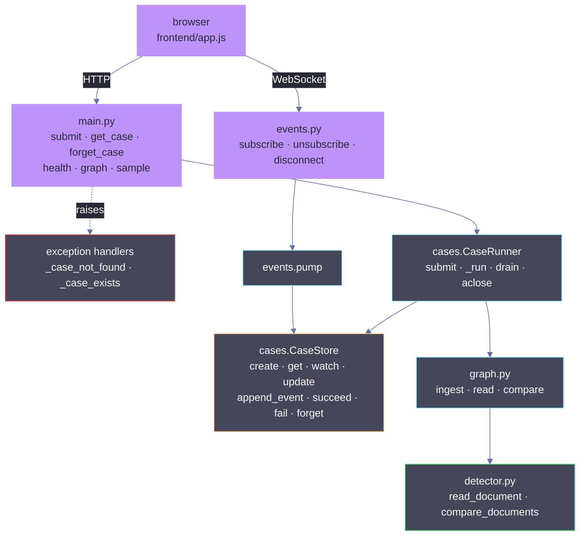
```mermaid
%%{init:{'theme':'base','themeVariables':{'darkMode':true,'background':'#282a36','mainBkg':'#44475a','primaryColor':'#44475a','primaryTextColor':'#f8f8f2','primaryBorderColor':'#bd93f9','lineColor':'#6272a4','textColor':'#f8f8f2','nodeBorder':'#bd93f9','clusterBkg':'#21222c','clusterBorder':'#6272a4','edgeLabelBackground':'#282a36','actorBkg':'#44475a','actorBorder':'#bd93f9','actorTextColor':'#f8f8f2','actorLineColor':'#6272a4','signalColor':'#f8f8f2','signalTextColor':'#f8f8f2','noteBkgColor':'#414458','noteBorderColor':'#ffb86c','noteTextColor':'#f8f8f2','activationBkgColor':'#6272a4','activationBorderColor':'#bd93f9','labelBoxBkgColor':'#44475a','labelBoxBorderColor':'#bd93f9','labelTextColor':'#f8f8f2','loopTextColor':'#f8f8f2','sequenceNumberColor':'#282a36'}}}%%
flowchart TD
    Client["browser<br/>frontend/app.js"]
    Routes["main.py<br/>submit · get_case · forget_case<br/>health · graph · sample"]
    Handlers["exception handlers<br/>_case_not_found · _case_exists"]
    Sock["events.py<br/>subscribe · unsubscribe · disconnect"]
    Pump["events.pump"]
    Runner["cases.CaseRunner<br/>submit · _run · drain · aclose"]
    Store["cases.CaseStore<br/>create · get · watch · update<br/>append_event · succeed · fail · forget"]
    Graph["graph.py<br/>ingest · read · compare"]
    Detect["detector.py<br/>read_document · compare_documents"]

    Client -->|HTTP| Routes
    Client -->|WebSocket| Sock
    Routes --> Runner
    Routes -.->|raises| Handlers
    Sock --> Pump
    Pump --> Store
    Runner --> Store
    Runner --> Graph
    Graph --> Detect

    class Client,Routes,Sock entry
    class Runner,Pump,Graph fn
    class Store state
    class Detect leaf
    class Handlers bad

    classDef entry fill:#bd93f9,stroke:#bd93f9,color:#282a36
    classDef fn fill:#44475a,stroke:#8be9fd,color:#f8f8f2
    classDef state fill:#44475a,stroke:#ffb86c,color:#f8f8f2
    classDef leaf fill:#44475a,stroke:#50fa7b,color:#f8f8f2
    classDef bad fill:#44475a,stroke:#ff5555,color:#f8f8f2
```

Two things to read off it:

- **`detector.py` is a leaf.** It imports only `models.py` — no `async`, no store, no
  socket. That is why it can be called from a REPL.
- **Only the routes touch `CaseRunner`.** The socket layer goes straight to `runner.store`,
  because watching is a store concern, not a running concern.

---

## 2 · `POST /v1/cases`

The request that does no work. It validates, registers, schedules — and replies before the
analysis starts.

### 2a · The route

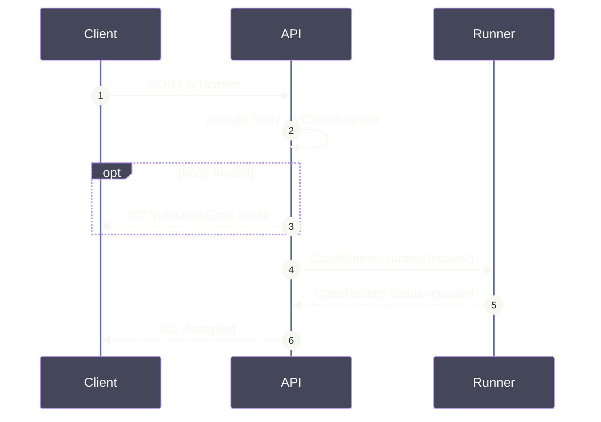
```mermaid
%%{init:{'theme':'base','themeVariables':{'darkMode':true,'background':'#282a36','mainBkg':'#44475a','primaryColor':'#44475a','primaryTextColor':'#f8f8f2','primaryBorderColor':'#bd93f9','lineColor':'#6272a4','textColor':'#f8f8f2','nodeBorder':'#bd93f9','clusterBkg':'#21222c','clusterBorder':'#6272a4','edgeLabelBackground':'#282a36','actorBkg':'#44475a','actorBorder':'#bd93f9','actorTextColor':'#f8f8f2','actorLineColor':'#6272a4','signalColor':'#f8f8f2','signalTextColor':'#f8f8f2','noteBkgColor':'#414458','noteBorderColor':'#ffb86c','noteTextColor':'#f8f8f2','activationBkgColor':'#6272a4','activationBorderColor':'#bd93f9','labelBoxBkgColor':'#44475a','labelBoxBorderColor':'#bd93f9','labelTextColor':'#f8f8f2','loopTextColor':'#f8f8f2','sequenceNumberColor':'#282a36'}}}%%
sequenceDiagram
    autonumber
    participant Client
    participant API
    participant Runner

    Client->>API: POST /v1/cases
    API->>API: validate body as CaseRequest

    opt body invalid
        API-->>Client: 422 ValidationError detail
    end

    API->>Runner: CaseRunner.submit(request)
    Runner-->>API: CaseRecord status=queued
    API-->>Client: 202 Accepted
```

`request: CaseRequest` in the signature is what triggers validation. A bad body never
reaches `submit`.

### 2b · Inside `CaseRunner.submit`

Four calls, in this order.

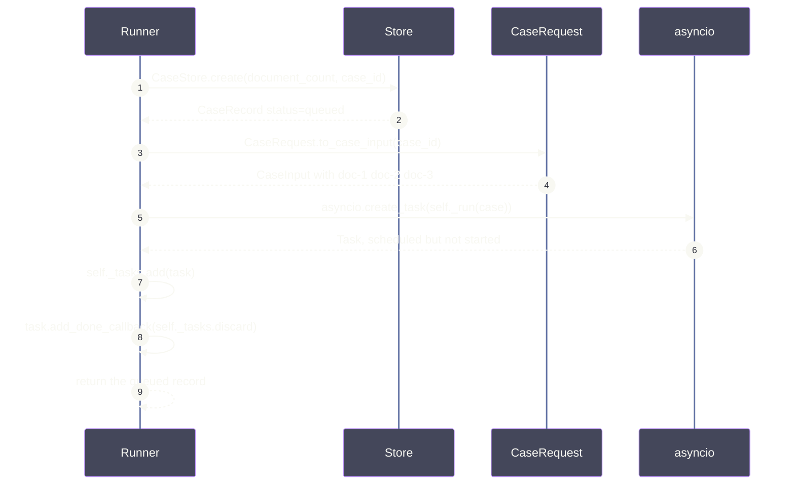
```mermaid
%%{init:{'theme':'base','themeVariables':{'darkMode':true,'background':'#282a36','mainBkg':'#44475a','primaryColor':'#44475a','primaryTextColor':'#f8f8f2','primaryBorderColor':'#bd93f9','lineColor':'#6272a4','textColor':'#f8f8f2','nodeBorder':'#bd93f9','clusterBkg':'#21222c','clusterBorder':'#6272a4','edgeLabelBackground':'#282a36','actorBkg':'#44475a','actorBorder':'#bd93f9','actorTextColor':'#f8f8f2','actorLineColor':'#6272a4','signalColor':'#f8f8f2','signalTextColor':'#f8f8f2','noteBkgColor':'#414458','noteBorderColor':'#ffb86c','noteTextColor':'#f8f8f2','activationBkgColor':'#6272a4','activationBorderColor':'#bd93f9','labelBoxBkgColor':'#44475a','labelBoxBorderColor':'#bd93f9','labelTextColor':'#f8f8f2','loopTextColor':'#f8f8f2','sequenceNumberColor':'#282a36'}}}%%
sequenceDiagram
    autonumber
    participant Runner
    participant Store
    participant Model as CaseRequest
    participant Sched as asyncio

    Runner->>Store: CaseStore.create(document_count, case_id)
    Store-->>Runner: CaseRecord status=queued

    Runner->>Model: CaseRequest.to_case_input(case_id)
    Model-->>Runner: CaseInput with doc-1 doc-2 doc-3

    Runner->>Sched: asyncio.create_task(self._run(case))
    Sched-->>Runner: Task, scheduled but not started

    Runner->>Runner: self._tasks.add(task)
    Runner->>Runner: task.add_done_callback(self._tasks.discard)
    Runner-->>Runner: return the queued record
```

`self._tasks.add(task)` is not bookkeeping — `asyncio` holds only a weak reference to a
running task, so without it the garbage collector can take `_run` mid-analysis.

### 2c · Inside `CaseStore.create`

This is where the case first gets a status.

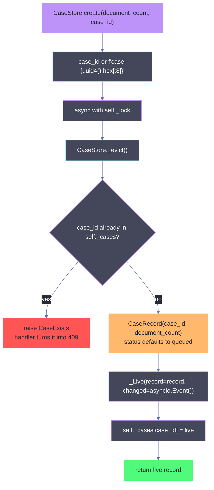
```mermaid
%%{init:{'theme':'base','themeVariables':{'darkMode':true,'background':'#282a36','mainBkg':'#44475a','primaryColor':'#44475a','primaryTextColor':'#f8f8f2','primaryBorderColor':'#bd93f9','lineColor':'#6272a4','textColor':'#f8f8f2','nodeBorder':'#bd93f9','clusterBkg':'#21222c','clusterBorder':'#6272a4','edgeLabelBackground':'#282a36','actorBkg':'#44475a','actorBorder':'#bd93f9','actorTextColor':'#f8f8f2','actorLineColor':'#6272a4','signalColor':'#f8f8f2','signalTextColor':'#f8f8f2','noteBkgColor':'#414458','noteBorderColor':'#ffb86c','noteTextColor':'#f8f8f2','activationBkgColor':'#6272a4','activationBorderColor':'#bd93f9','labelBoxBkgColor':'#44475a','labelBoxBorderColor':'#bd93f9','labelTextColor':'#f8f8f2','loopTextColor':'#f8f8f2','sequenceNumberColor':'#282a36'}}}%%
flowchart TD
    A["CaseStore.create(document_count, case_id)"] --> B["case_id or f'case-{uuid4().hex[:8]}'"]
    B --> C["async with self._lock"]
    C --> D["CaseStore._evict()"]
    D --> E{"case_id already in self._cases?"}
    E -->|yes| F["raise CaseExists<br/>handler turns it into 409"]
    E -->|no| G["CaseRecord(case_id, document_count)<br/>status defaults to queued"]
    G --> H["_Live(record=record, changed=asyncio.Event())"]
    H --> I["self._cases[case_id] = live"]
    I --> J["return live.record"]

    class A entry
    class D,B fn
    class F bad
    class G status
    class J ok

    classDef entry fill:#bd93f9,stroke:#bd93f9,color:#282a36
    classDef fn fill:#44475a,stroke:#8be9fd,color:#f8f8f2
    classDef status fill:#ffb86c,stroke:#ffb86c,color:#282a36
    classDef bad fill:#ff5555,stroke:#ff5555,color:#282a36
    classDef ok fill:#50fa7b,stroke:#50fa7b,color:#282a36
```

Note `_evict()` runs **before** the duplicate check, so a clashing id still triggers a
sweep.

What the client holds after the 202:

```json
{
  "case_id": "case-demo",
  "status": "queued",
  "document_count": 3,
  "submitted_at": "2026-09-17T10:14:58.159696Z",
  "finished_at": null,
  "events": [],
  "report": null,
  "error": null
}
```

`events` is empty and `report` is `null`, but both keys are already there. The *shape* never
changes again — only the values.

---

## 3 · The background task

`CaseRunner._run` drives the graph. Its other job is forwarding: turning what the steps
recorded into store writes that watchers can see.

### 3a · The shape of a run

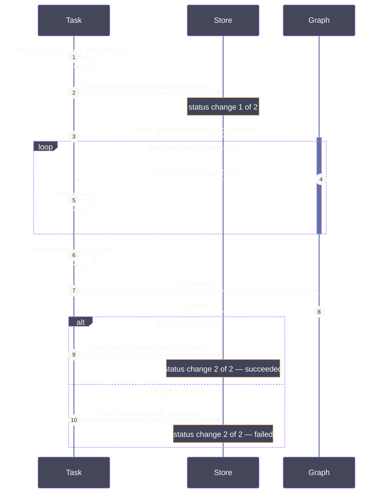
```mermaid
%%{init:{'theme':'base','themeVariables':{'darkMode':true,'background':'#282a36','mainBkg':'#44475a','primaryColor':'#44475a','primaryTextColor':'#f8f8f2','primaryBorderColor':'#bd93f9','lineColor':'#6272a4','textColor':'#f8f8f2','nodeBorder':'#bd93f9','clusterBkg':'#21222c','clusterBorder':'#6272a4','edgeLabelBackground':'#282a36','actorBkg':'#44475a','actorBorder':'#bd93f9','actorTextColor':'#f8f8f2','actorLineColor':'#6272a4','signalColor':'#f8f8f2','signalTextColor':'#f8f8f2','noteBkgColor':'#414458','noteBorderColor':'#ffb86c','noteTextColor':'#f8f8f2','activationBkgColor':'#6272a4','activationBorderColor':'#bd93f9','labelBoxBkgColor':'#44475a','labelBoxBorderColor':'#bd93f9','labelTextColor':'#f8f8f2','loopTextColor':'#f8f8f2','sequenceNumberColor':'#282a36'}}}%%
sequenceDiagram
    autonumber
    participant Task
    participant Store
    participant Graph

    Task->>Task: RunState(case_id), delivered = 0
    Task->>Store: CaseStore.update(status=RUNNING)
    Note over Store: status change 1 of 2

    Task->>Graph: case_graph.iter(state, deps, inputs)
    activate Graph

    loop once per node boundary
        Graph-->>Task: next batch of GraphTasks
        Task->>Task: await drain()
    end
    deactivate Graph

    Task->>Task: await drain() once more
    Task->>Graph: run.output
    Graph-->>Task: Report

    alt report is not None
        Task->>Store: CaseStore.succeed(case_id, report)
        Note over Store: status change 2 of 2 — succeeded
    else report is None
        Task->>Store: CaseStore.fail(case_id, detail)
        Note over Store: status change 2 of 2 — failed
    end
```

Exactly **two** status changes per successful case: `queued` to `running`, then `running` to
`succeeded`. Everything in between changes `events`, not `status`.

### 3b · Inside `drain`

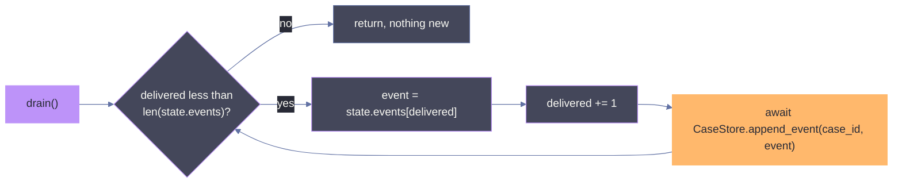
```mermaid
%%{init:{'theme':'base','themeVariables':{'darkMode':true,'background':'#282a36','mainBkg':'#44475a','primaryColor':'#44475a','primaryTextColor':'#f8f8f2','primaryBorderColor':'#bd93f9','lineColor':'#6272a4','textColor':'#f8f8f2','nodeBorder':'#bd93f9','clusterBkg':'#21222c','clusterBorder':'#6272a4','edgeLabelBackground':'#282a36','actorBkg':'#44475a','actorBorder':'#bd93f9','actorTextColor':'#f8f8f2','actorLineColor':'#6272a4','signalColor':'#f8f8f2','signalTextColor':'#f8f8f2','noteBkgColor':'#414458','noteBorderColor':'#ffb86c','noteTextColor':'#f8f8f2','activationBkgColor':'#6272a4','activationBorderColor':'#bd93f9','labelBoxBkgColor':'#44475a','labelBoxBorderColor':'#bd93f9','labelTextColor':'#f8f8f2','loopTextColor':'#f8f8f2','sequenceNumberColor':'#282a36'}}}%%
flowchart LR
    A["drain()"] --> B{"delivered less than<br/>len(state.events)?"}
    B -->|no| C["return, nothing new"]
    B -->|yes| D["event = state.events[delivered]"]
    D --> E["delivered += 1"]
    E --> F["await CaseStore.append_event(case_id, event)"]
    F --> B

    class A entry
    class F status
    class C idle

    classDef entry fill:#bd93f9,stroke:#bd93f9,color:#282a36
    classDef status fill:#ffb86c,stroke:#ffb86c,color:#282a36
    classDef idle fill:#44475a,stroke:#6272a4,color:#f8f8f2
```

`delivered` is a high-water mark, and `nonlocal delivered` is what lets the inner function
advance the outer variable. Reading by index rather than iterating is deliberate: the
fan-out branches are still appending while this runs.

### 3c · What each iteration actually yields

Traced from a real run. `async for` hands back the *next* batch of tasks, so the events it
forwards are the ones the *previous* batch recorded.

| iteration | yields | `drain()` forwards |
|---|---|---|
| 1 | `['ingest']` | — |
| 2 | `['fan_out_documents']` | `ingest` · "3 documents received" |
| 3 | `['read', 'read', 'read']` | — |
| 4 | `['collect_documents']` | `read` · doc-3 |
| 5 | `['collect_documents']` | `read` · doc-1 |
| 6 | `['collect_documents']` | `read` · doc-2 |
| 7 | `['compare']` | — |
| 8 | `['__end__']` | `compare` · "3 mismatches, verdict blocked" |
| 9 | `EndMarker` | — |
| — | the trailing `drain()` | — |

**Iteration 3 is the fan-out** — the only yield carrying more than one task.

**Iterations 4 to 6 arrive in completion order** — doc-3, doc-1, doc-2, which is ascending
read delay, not submission order. Each is a separate yield, so each reaches the browser on
its own.

**The trailing `drain()` forwards nothing here.** `__end__` is itself a node boundary, so
`compare`'s event is already picked up at iteration 8. The extra call guards a graph shape
where the last event would otherwise be stranded.

---

## 4 · Inside the graph

### 4a · The shape

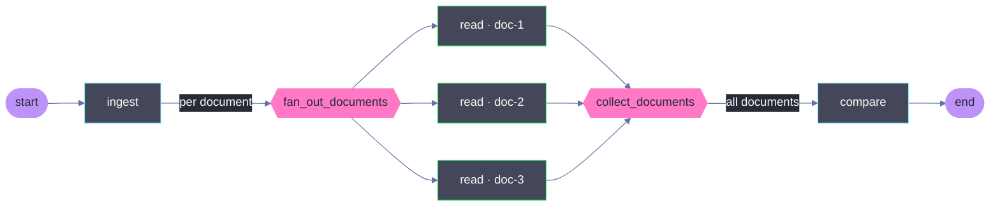
```mermaid
%%{init:{'theme':'base','themeVariables':{'darkMode':true,'background':'#282a36','mainBkg':'#44475a','primaryColor':'#44475a','primaryTextColor':'#f8f8f2','primaryBorderColor':'#bd93f9','lineColor':'#6272a4','textColor':'#f8f8f2','nodeBorder':'#bd93f9','clusterBkg':'#21222c','clusterBorder':'#6272a4','edgeLabelBackground':'#282a36','actorBkg':'#44475a','actorBorder':'#bd93f9','actorTextColor':'#f8f8f2','actorLineColor':'#6272a4','signalColor':'#f8f8f2','signalTextColor':'#f8f8f2','noteBkgColor':'#414458','noteBorderColor':'#ffb86c','noteTextColor':'#f8f8f2','activationBkgColor':'#6272a4','activationBorderColor':'#bd93f9','labelBoxBkgColor':'#44475a','labelBoxBorderColor':'#bd93f9','labelTextColor':'#f8f8f2','loopTextColor':'#f8f8f2','sequenceNumberColor':'#282a36'}}}%%
flowchart LR
    S(["start"]) --> I["ingest"]
    I -->|per document| F{{"fan_out_documents"}}
    F --> R1["read · doc-1"]
    F --> R2["read · doc-2"]
    F --> R3["read · doc-3"]
    R1 --> J{{"collect_documents"}}
    R2 --> J
    R3 --> J
    J -->|all documents| C["compare"]
    C --> E(["end"])

    class S,E entry
    class I,C fn
    class R1,R2,R3 leaf
    class F,J conc

    classDef entry fill:#bd93f9,stroke:#bd93f9,color:#282a36
    classDef fn fill:#44475a,stroke:#8be9fd,color:#f8f8f2
    classDef leaf fill:#44475a,stroke:#50fa7b,color:#f8f8f2
    classDef conc fill:#ff79c6,stroke:#ff79c6,color:#282a36
```

The three `read` boxes are the same function. The graph makes *N* of them at run time, one
per element of the list `ingest` returned.

### 4b · What flows along each edge

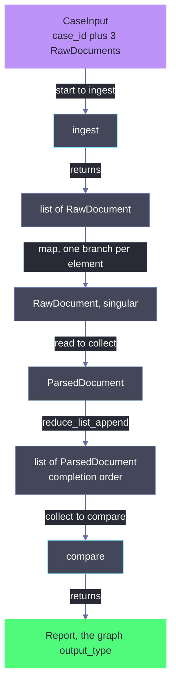
```mermaid
%%{init:{'theme':'base','themeVariables':{'darkMode':true,'background':'#282a36','mainBkg':'#44475a','primaryColor':'#44475a','primaryTextColor':'#f8f8f2','primaryBorderColor':'#bd93f9','lineColor':'#6272a4','textColor':'#f8f8f2','nodeBorder':'#bd93f9','clusterBkg':'#21222c','clusterBorder':'#6272a4','edgeLabelBackground':'#282a36','actorBkg':'#44475a','actorBorder':'#bd93f9','actorTextColor':'#f8f8f2','actorLineColor':'#6272a4','signalColor':'#f8f8f2','signalTextColor':'#f8f8f2','noteBkgColor':'#414458','noteBorderColor':'#ffb86c','noteTextColor':'#f8f8f2','activationBkgColor':'#6272a4','activationBorderColor':'#bd93f9','labelBoxBkgColor':'#44475a','labelBoxBorderColor':'#bd93f9','labelTextColor':'#f8f8f2','loopTextColor':'#f8f8f2','sequenceNumberColor':'#282a36'}}}%%
flowchart TD
    A["CaseInput<br/>case_id plus 3 RawDocuments"] -->|start to ingest| B["ingest"]
    B -->|returns| C["list of RawDocument"]
    C -->|map, one branch per element| D["RawDocument, singular"]
    D -->|read to collect| E["ParsedDocument"]
    E -->|reduce_list_append| F["list of ParsedDocument<br/>completion order"]
    F -->|collect to compare| G["compare"]
    G -->|returns| H["Report, the graph output_type"]

    class B,G fn
    class C,D,E,F leaf
    class A entry
    class H ok

    classDef entry fill:#bd93f9,stroke:#bd93f9,color:#282a36
    classDef fn fill:#44475a,stroke:#8be9fd,color:#f8f8f2
    classDef leaf fill:#44475a,stroke:#6272a4,color:#f8f8f2
    classDef ok fill:#50fa7b,stroke:#50fa7b,color:#282a36
```

`read` is typed `StepContext[RunState, RunDeps, RawDocument]` — singular. It has no idea it
is one of three, which is why the fan-out costs nothing to write.

### 4c · `ingest`, call by call

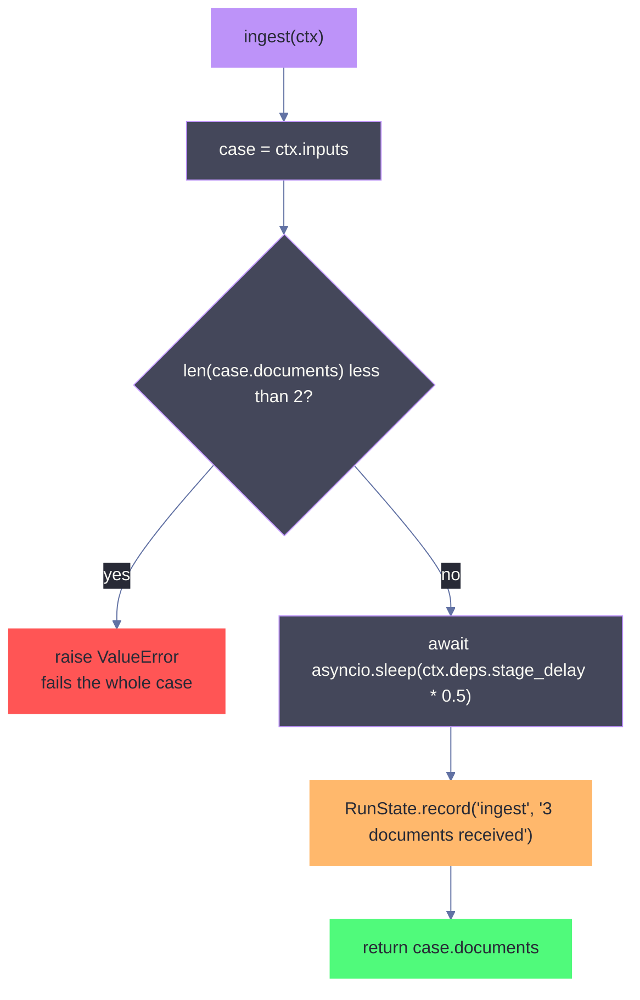
```mermaid
%%{init:{'theme':'base','themeVariables':{'darkMode':true,'background':'#282a36','mainBkg':'#44475a','primaryColor':'#44475a','primaryTextColor':'#f8f8f2','primaryBorderColor':'#bd93f9','lineColor':'#6272a4','textColor':'#f8f8f2','nodeBorder':'#bd93f9','clusterBkg':'#21222c','clusterBorder':'#6272a4','edgeLabelBackground':'#282a36','actorBkg':'#44475a','actorBorder':'#bd93f9','actorTextColor':'#f8f8f2','actorLineColor':'#6272a4','signalColor':'#f8f8f2','signalTextColor':'#f8f8f2','noteBkgColor':'#414458','noteBorderColor':'#ffb86c','noteTextColor':'#f8f8f2','activationBkgColor':'#6272a4','activationBorderColor':'#bd93f9','labelBoxBkgColor':'#44475a','labelBoxBorderColor':'#bd93f9','labelTextColor':'#f8f8f2','loopTextColor':'#f8f8f2','sequenceNumberColor':'#282a36'}}}%%
flowchart TD
    A["ingest(ctx)"] --> B["case = ctx.inputs"]
    B --> C{"len(case.documents) less than 2?"}
    C -->|yes| D["raise ValueError<br/>fails the whole case"]
    C -->|no| E["await asyncio.sleep(ctx.deps.stage_delay * 0.5)"]
    E --> F["RunState.record('ingest', '3 documents received')"]
    F --> G["return case.documents"]

    class A entry
    class D bad
    class F status
    class G ok

    classDef entry fill:#bd93f9,stroke:#bd93f9,color:#282a36
    classDef bad fill:#ff5555,stroke:#ff5555,color:#282a36
    classDef status fill:#ffb86c,stroke:#ffb86c,color:#282a36
    classDef ok fill:#50fa7b,stroke:#50fa7b,color:#282a36
```

The only step allowed to fail the whole case, because what it checks is a property of the
submission rather than of one document.

### 4d · `read`, call by call

Runs once per document, all at the same time.

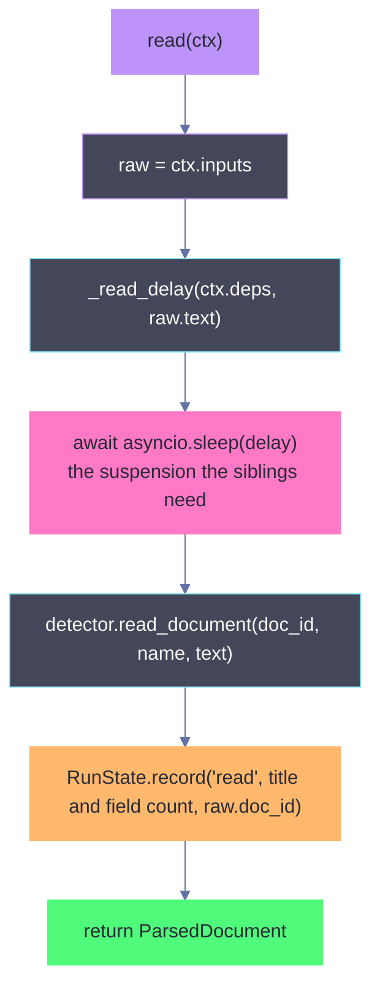
```mermaid
%%{init:{'theme':'base','themeVariables':{'darkMode':true,'background':'#282a36','mainBkg':'#44475a','primaryColor':'#44475a','primaryTextColor':'#f8f8f2','primaryBorderColor':'#bd93f9','lineColor':'#6272a4','textColor':'#f8f8f2','nodeBorder':'#bd93f9','clusterBkg':'#21222c','clusterBorder':'#6272a4','edgeLabelBackground':'#282a36','actorBkg':'#44475a','actorBorder':'#bd93f9','actorTextColor':'#f8f8f2','actorLineColor':'#6272a4','signalColor':'#f8f8f2','signalTextColor':'#f8f8f2','noteBkgColor':'#414458','noteBorderColor':'#ffb86c','noteTextColor':'#f8f8f2','activationBkgColor':'#6272a4','activationBorderColor':'#bd93f9','labelBoxBkgColor':'#44475a','labelBoxBorderColor':'#bd93f9','labelTextColor':'#f8f8f2','loopTextColor':'#f8f8f2','sequenceNumberColor':'#282a36'}}}%%
flowchart TD
    A["read(ctx)"] --> B["raw = ctx.inputs"]
    B --> C["_read_delay(ctx.deps, raw.text)"]
    C --> D["await asyncio.sleep(delay)<br/>the suspension the siblings need"]
    D --> E["detector.read_document(doc_id, name, text)"]
    E --> F["RunState.record('read', title and field count, raw.doc_id)"]
    F --> G["return ParsedDocument"]

    class A entry
    class C,E fn
    class D conc
    class F status
    class G ok

    classDef entry fill:#bd93f9,stroke:#bd93f9,color:#282a36
    classDef fn fill:#44475a,stroke:#8be9fd,color:#f8f8f2
    classDef conc fill:#ff79c6,stroke:#ff79c6,color:#282a36
    classDef status fill:#ffb86c,stroke:#ffb86c,color:#282a36
    classDef ok fill:#50fa7b,stroke:#50fa7b,color:#282a36
```

`_read_delay` on the three sample documents, at `stage_delay=1.0`:

| document | `len(text)` | delay |
|---|---|---|
| Purchase order | 159 | 1.371s |
| Invoice | 147 | 1.644s |
| Delivery note | 161 | 1.139s |

The longest document is not the slowest — jitter dominates at this size. Those three
delays, sorted, are exactly the order the audit trail comes back in.

### 4e · `compare`, call by call

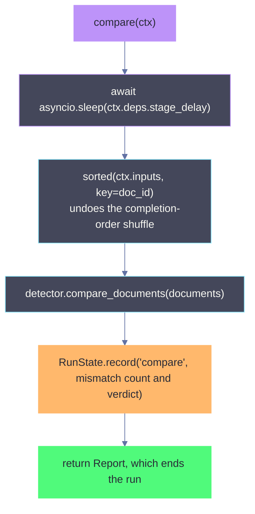
```mermaid
%%{init:{'theme':'base','themeVariables':{'darkMode':true,'background':'#282a36','mainBkg':'#44475a','primaryColor':'#44475a','primaryTextColor':'#f8f8f2','primaryBorderColor':'#bd93f9','lineColor':'#6272a4','textColor':'#f8f8f2','nodeBorder':'#bd93f9','clusterBkg':'#21222c','clusterBorder':'#6272a4','edgeLabelBackground':'#282a36','actorBkg':'#44475a','actorBorder':'#bd93f9','actorTextColor':'#f8f8f2','actorLineColor':'#6272a4','signalColor':'#f8f8f2','signalTextColor':'#f8f8f2','noteBkgColor':'#414458','noteBorderColor':'#ffb86c','noteTextColor':'#f8f8f2','activationBkgColor':'#6272a4','activationBorderColor':'#bd93f9','labelBoxBkgColor':'#44475a','labelBoxBorderColor':'#bd93f9','labelTextColor':'#f8f8f2','loopTextColor':'#f8f8f2','sequenceNumberColor':'#282a36'}}}%%
flowchart TD
    A["compare(ctx)"] --> B["await asyncio.sleep(ctx.deps.stage_delay)"]
    B --> C["sorted(ctx.inputs, key=doc_id)<br/>undoes the completion-order shuffle"]
    C --> D["detector.compare_documents(documents)"]
    D --> E["RunState.record('compare', mismatch count and verdict)"]
    E --> F["return Report, which ends the run"]

    class A entry
    class C,D fn
    class E status
    class F ok

    classDef entry fill:#bd93f9,stroke:#bd93f9,color:#282a36
    classDef fn fill:#44475a,stroke:#8be9fd,color:#f8f8f2
    classDef status fill:#ffb86c,stroke:#ffb86c,color:#282a36
    classDef ok fill:#50fa7b,stroke:#50fa7b,color:#282a36
```

Without the sort, the report's document list would follow whichever read finished first and
the page would reshuffle between runs.

### 4f · Why three concurrent `record()` calls need no lock

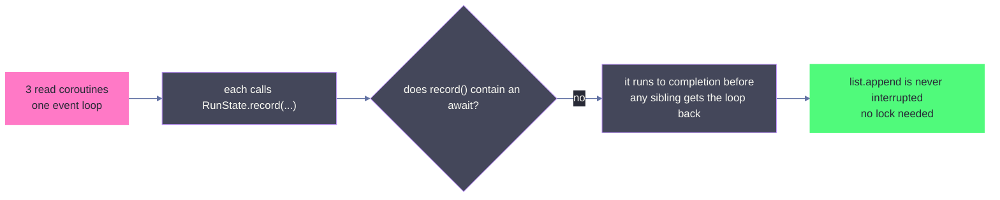
```mermaid
%%{init:{'theme':'base','themeVariables':{'darkMode':true,'background':'#282a36','mainBkg':'#44475a','primaryColor':'#44475a','primaryTextColor':'#f8f8f2','primaryBorderColor':'#bd93f9','lineColor':'#6272a4','textColor':'#f8f8f2','nodeBorder':'#bd93f9','clusterBkg':'#21222c','clusterBorder':'#6272a4','edgeLabelBackground':'#282a36','actorBkg':'#44475a','actorBorder':'#bd93f9','actorTextColor':'#f8f8f2','actorLineColor':'#6272a4','signalColor':'#f8f8f2','signalTextColor':'#f8f8f2','noteBkgColor':'#414458','noteBorderColor':'#ffb86c','noteTextColor':'#f8f8f2','activationBkgColor':'#6272a4','activationBorderColor':'#bd93f9','labelBoxBkgColor':'#44475a','labelBoxBorderColor':'#bd93f9','labelTextColor':'#f8f8f2','loopTextColor':'#f8f8f2','sequenceNumberColor':'#282a36'}}}%%
flowchart LR
    A["3 read coroutines<br/>one event loop"] --> B["each calls RunState.record(...)"]
    B --> C{"does record() contain an await?"}
    C -->|no| D["it runs to completion before<br/>any sibling gets the loop back"]
    D --> E["list.append is never interrupted<br/>no lock needed"]

    class A conc
    class E ok

    classDef conc fill:#ff79c6,stroke:#ff79c6,color:#282a36
    classDef ok fill:#50fa7b,stroke:#50fa7b,color:#282a36
```

Coroutines interleave only at `await`. The same argument would not hold for threads.

---

## 5 · Inside `read_document`

One document, from raw text to `ParsedDocument`.

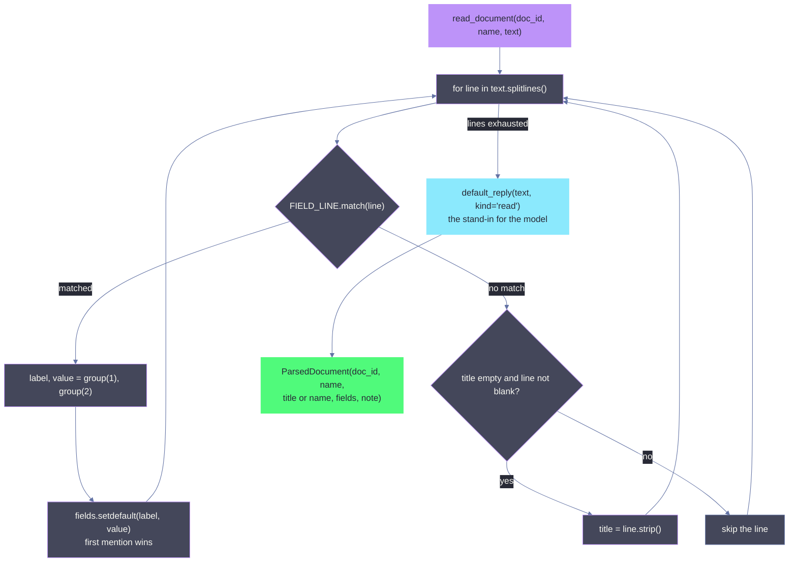
```mermaid
%%{init:{'theme':'base','themeVariables':{'darkMode':true,'background':'#282a36','mainBkg':'#44475a','primaryColor':'#44475a','primaryTextColor':'#f8f8f2','primaryBorderColor':'#bd93f9','lineColor':'#6272a4','textColor':'#f8f8f2','nodeBorder':'#bd93f9','clusterBkg':'#21222c','clusterBorder':'#6272a4','edgeLabelBackground':'#282a36','actorBkg':'#44475a','actorBorder':'#bd93f9','actorTextColor':'#f8f8f2','actorLineColor':'#6272a4','signalColor':'#f8f8f2','signalTextColor':'#f8f8f2','noteBkgColor':'#414458','noteBorderColor':'#ffb86c','noteTextColor':'#f8f8f2','activationBkgColor':'#6272a4','activationBorderColor':'#bd93f9','labelBoxBkgColor':'#44475a','labelBoxBorderColor':'#bd93f9','labelTextColor':'#f8f8f2','loopTextColor':'#f8f8f2','sequenceNumberColor':'#282a36'}}}%%
flowchart TD
    A["read_document(doc_id, name, text)"] --> B["for line in text.splitlines()"]
    B --> C{"FIELD_LINE.match(line)"}
    C -->|matched| D["label, value = group(1), group(2)"]
    D --> E["fields.setdefault(label, value)<br/>first mention wins"]
    E --> B
    C -->|no match| F{"title empty and line not blank?"}
    F -->|yes| G["title = line.strip()"]
    F -->|no| H["skip the line"]
    G --> B
    H --> B
    B -->|lines exhausted| I["default_reply(text, kind='read')<br/>the stand-in for the model"]
    I --> J["ParsedDocument(doc_id, name,<br/>title or name, fields, note)"]

    class A entry
    class I fn
    class J ok
    class H idle

    classDef entry fill:#bd93f9,stroke:#bd93f9,color:#282a36
    classDef fn fill:#8be9fd,stroke:#8be9fd,color:#282a36
    classDef ok fill:#50fa7b,stroke:#50fa7b,color:#282a36
    classDef idle fill:#44475a,stroke:#6272a4,color:#f8f8f2
```

`default_reply` is the one function a real implementation would replace. `crc32` of the
prompt picks one of four canned lines, so the same document always gets the same note.

What the regex accepts and rejects:

| line | result |
|---|---|
| `Total Amount: 51,000.00   ` | `('Total Amount', '51,000.00')` |
| `Time: 10:30` | `('Time', '10:30')` — the second colon is value |
| `PURCHASE ORDER` | no match, becomes the title |
| `The buyer confirmed on Tuesday that delivery is fine: see attached` | no match, 52 chars before the colon |

---

## 6 · Inside `compare_documents`

### 6a · The inversion

Input is *documents, each with fields*. This turns it into *fields, each with documents*.

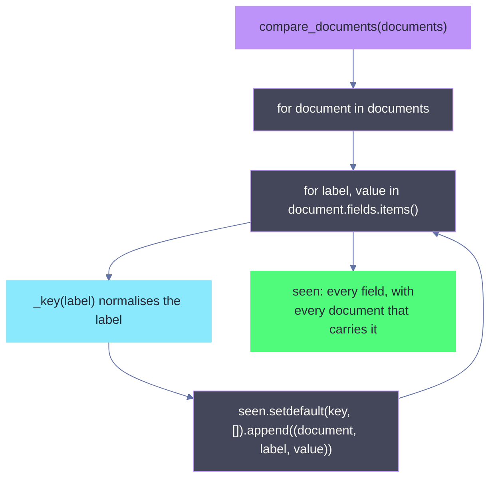
```mermaid
%%{init:{'theme':'base','themeVariables':{'darkMode':true,'background':'#282a36','mainBkg':'#44475a','primaryColor':'#44475a','primaryTextColor':'#f8f8f2','primaryBorderColor':'#bd93f9','lineColor':'#6272a4','textColor':'#f8f8f2','nodeBorder':'#bd93f9','clusterBkg':'#21222c','clusterBorder':'#6272a4','edgeLabelBackground':'#282a36','actorBkg':'#44475a','actorBorder':'#bd93f9','actorTextColor':'#f8f8f2','actorLineColor':'#6272a4','signalColor':'#f8f8f2','signalTextColor':'#f8f8f2','noteBkgColor':'#414458','noteBorderColor':'#ffb86c','noteTextColor':'#f8f8f2','activationBkgColor':'#6272a4','activationBorderColor':'#bd93f9','labelBoxBkgColor':'#44475a','labelBoxBorderColor':'#bd93f9','labelTextColor':'#f8f8f2','loopTextColor':'#f8f8f2','sequenceNumberColor':'#282a36'}}}%%
flowchart TD
    A["compare_documents(documents)"] --> B["for document in documents"]
    B --> C["for label, value in document.fields.items()"]
    C --> D["_key(label) normalises the label"]
    D --> E["seen.setdefault(key, []).append((document, label, value))"]
    E --> C
    C --> F["seen: every field, with<br/>every document that carries it"]

    class A entry
    class D fn
    class F ok

    classDef entry fill:#bd93f9,stroke:#bd93f9,color:#282a36
    classDef fn fill:#8be9fd,stroke:#8be9fd,color:#282a36
    classDef ok fill:#50fa7b,stroke:#50fa7b,color:#282a36
```

### 6b · The decision, per field

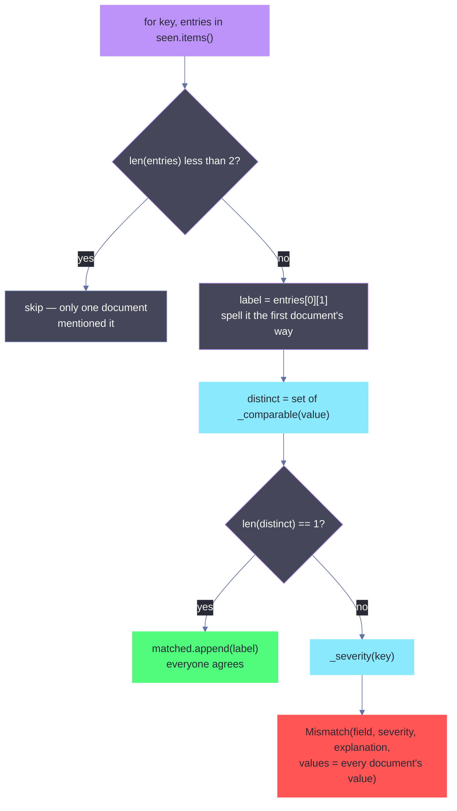
```mermaid
%%{init:{'theme':'base','themeVariables':{'darkMode':true,'background':'#282a36','mainBkg':'#44475a','primaryColor':'#44475a','primaryTextColor':'#f8f8f2','primaryBorderColor':'#bd93f9','lineColor':'#6272a4','textColor':'#f8f8f2','nodeBorder':'#bd93f9','clusterBkg':'#21222c','clusterBorder':'#6272a4','edgeLabelBackground':'#282a36','actorBkg':'#44475a','actorBorder':'#bd93f9','actorTextColor':'#f8f8f2','actorLineColor':'#6272a4','signalColor':'#f8f8f2','signalTextColor':'#f8f8f2','noteBkgColor':'#414458','noteBorderColor':'#ffb86c','noteTextColor':'#f8f8f2','activationBkgColor':'#6272a4','activationBorderColor':'#bd93f9','labelBoxBkgColor':'#44475a','labelBoxBorderColor':'#bd93f9','labelTextColor':'#f8f8f2','loopTextColor':'#f8f8f2','sequenceNumberColor':'#282a36'}}}%%
flowchart TD
    A["for key, entries in seen.items()"] --> B{"len(entries) less than 2?"}
    B -->|yes| C["skip — only one document<br/>mentioned it"]
    B -->|no| D["label = entries[0][1]<br/>spell it the first document's way"]
    D --> E["distinct = set of _comparable(value)"]
    E --> F{"len(distinct) == 1?"}
    F -->|yes| G["matched.append(label)<br/>everyone agrees"]
    F -->|no| H["_severity(key)"]
    H --> I["Mismatch(field, severity, explanation,<br/>values = every document's value)"]

    class A entry
    class C idle
    class E,H fn
    class G ok
    class I bad

    classDef entry fill:#bd93f9,stroke:#bd93f9,color:#282a36
    classDef idle fill:#44475a,stroke:#6272a4,color:#f8f8f2
    classDef fn fill:#8be9fd,stroke:#8be9fd,color:#282a36
    classDef ok fill:#50fa7b,stroke:#50fa7b,color:#282a36
    classDef bad fill:#ff5555,stroke:#ff5555,color:#282a36
```

`distinct` is a set comprehension, so it collapses duplicates. That gives
three-or-more-document agreement for free — no pairwise loop.

### 6c · The three normalisers

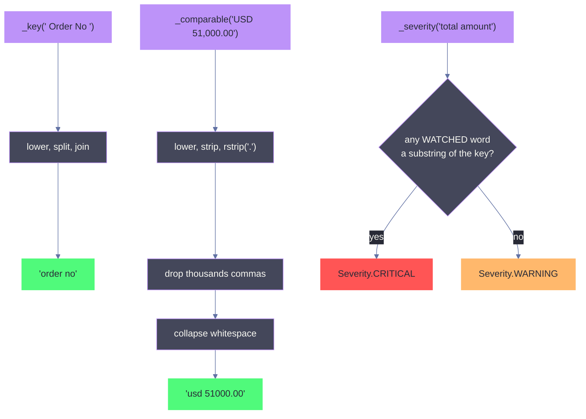
```mermaid
%%{init:{'theme':'base','themeVariables':{'darkMode':true,'background':'#282a36','mainBkg':'#44475a','primaryColor':'#44475a','primaryTextColor':'#f8f8f2','primaryBorderColor':'#bd93f9','lineColor':'#6272a4','textColor':'#f8f8f2','nodeBorder':'#bd93f9','clusterBkg':'#21222c','clusterBorder':'#6272a4','edgeLabelBackground':'#282a36','actorBkg':'#44475a','actorBorder':'#bd93f9','actorTextColor':'#f8f8f2','actorLineColor':'#6272a4','signalColor':'#f8f8f2','signalTextColor':'#f8f8f2','noteBkgColor':'#414458','noteBorderColor':'#ffb86c','noteTextColor':'#f8f8f2','activationBkgColor':'#6272a4','activationBorderColor':'#bd93f9','labelBoxBkgColor':'#44475a','labelBoxBorderColor':'#bd93f9','labelTextColor':'#f8f8f2','loopTextColor':'#f8f8f2','sequenceNumberColor':'#282a36'}}}%%
flowchart TD
    K1["_key('  Order   No ')"] --> K2["lower, split, join"] --> K3["'order no'"]
    C1["_comparable('USD 51,000.00')"] --> C2["lower, strip, rstrip('.')"] --> C3["drop thousands commas"] --> C4["collapse whitespace"] --> C5["'usd 51000.00'"]
    S1["_severity('total amount')"] --> S2{"any WATCHED word<br/>a substring of the key?"}
    S2 -->|yes| S3["Severity.CRITICAL"]
    S2 -->|no| S4["Severity.WARNING"]

    class K1,C1,S1 entry
    class K3,C5 ok
    class S3 bad
    class S4 warn

    classDef entry fill:#bd93f9,stroke:#bd93f9,color:#282a36
    classDef ok fill:#50fa7b,stroke:#50fa7b,color:#282a36
    classDef bad fill:#ff5555,stroke:#ff5555,color:#282a36
    classDef warn fill:#ffb86c,stroke:#ffb86c,color:#282a36
```

`_severity` is substring matching, not word matching — which is why `'delivery date'` is
caught by `'date'`, and also why `'Valuation Method'` would be caught by `'value'`.

### 6d · Assembling the `Report`

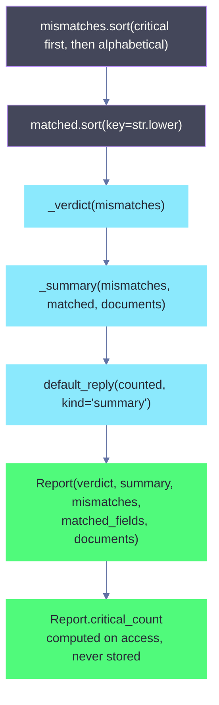
```mermaid
%%{init:{'theme':'base','themeVariables':{'darkMode':true,'background':'#282a36','mainBkg':'#44475a','primaryColor':'#44475a','primaryTextColor':'#f8f8f2','primaryBorderColor':'#bd93f9','lineColor':'#6272a4','textColor':'#f8f8f2','nodeBorder':'#bd93f9','clusterBkg':'#21222c','clusterBorder':'#6272a4','edgeLabelBackground':'#282a36','actorBkg':'#44475a','actorBorder':'#bd93f9','actorTextColor':'#f8f8f2','actorLineColor':'#6272a4','signalColor':'#f8f8f2','signalTextColor':'#f8f8f2','noteBkgColor':'#414458','noteBorderColor':'#ffb86c','noteTextColor':'#f8f8f2','activationBkgColor':'#6272a4','activationBorderColor':'#bd93f9','labelBoxBkgColor':'#44475a','labelBoxBorderColor':'#bd93f9','labelTextColor':'#f8f8f2','loopTextColor':'#f8f8f2','sequenceNumberColor':'#282a36'}}}%%
flowchart TD
    A["mismatches.sort(critical first, then alphabetical)"] --> B["matched.sort(key=str.lower)"]
    B --> C["_verdict(mismatches)"]
    C --> D["_summary(mismatches, matched, documents)"]
    D --> E["default_reply(counted, kind='summary')"]
    E --> F["Report(verdict, summary, mismatches,<br/>matched_fields, documents)"]
    F --> G["Report.critical_count<br/>computed on access, never stored"]

    class C,D,E fn
    class F,G ok

    classDef fn fill:#8be9fd,stroke:#8be9fd,color:#282a36
    classDef ok fill:#50fa7b,stroke:#50fa7b,color:#282a36
```

### 6e · `_verdict`

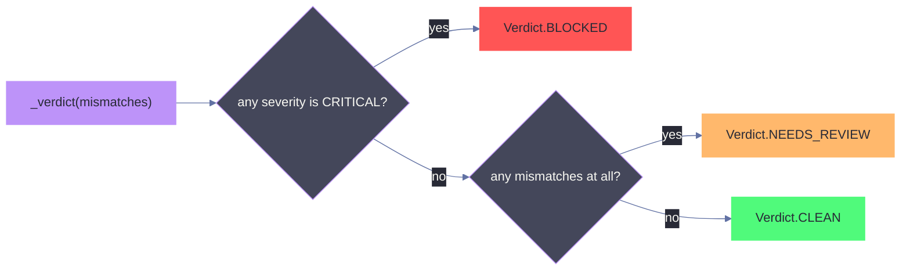
```mermaid
%%{init:{'theme':'base','themeVariables':{'darkMode':true,'background':'#282a36','mainBkg':'#44475a','primaryColor':'#44475a','primaryTextColor':'#f8f8f2','primaryBorderColor':'#bd93f9','lineColor':'#6272a4','textColor':'#f8f8f2','nodeBorder':'#bd93f9','clusterBkg':'#21222c','clusterBorder':'#6272a4','edgeLabelBackground':'#282a36','actorBkg':'#44475a','actorBorder':'#bd93f9','actorTextColor':'#f8f8f2','actorLineColor':'#6272a4','signalColor':'#f8f8f2','signalTextColor':'#f8f8f2','noteBkgColor':'#414458','noteBorderColor':'#ffb86c','noteTextColor':'#f8f8f2','activationBkgColor':'#6272a4','activationBorderColor':'#bd93f9','labelBoxBkgColor':'#44475a','labelBoxBorderColor':'#bd93f9','labelTextColor':'#f8f8f2','loopTextColor':'#f8f8f2','sequenceNumberColor':'#282a36'}}}%%
flowchart LR
    A["_verdict(mismatches)"] --> B{"any severity is CRITICAL?"}
    B -->|yes| C["Verdict.BLOCKED"]
    B -->|no| D{"any mismatches at all?"}
    D -->|yes| E["Verdict.NEEDS_REVIEW"]
    D -->|no| F["Verdict.CLEAN"]

    class A entry
    class C bad
    class E warn
    class F ok

    classDef entry fill:#bd93f9,stroke:#bd93f9,color:#282a36
    classDef bad fill:#ff5555,stroke:#ff5555,color:#282a36
    classDef warn fill:#ffb86c,stroke:#ffb86c,color:#282a36
    classDef ok fill:#50fa7b,stroke:#50fa7b,color:#282a36
```

> A case where no field appears on two documents also returns `clean` — nothing disagreed,
> but nothing was checked either.

### 6f · `_summary` — the seam

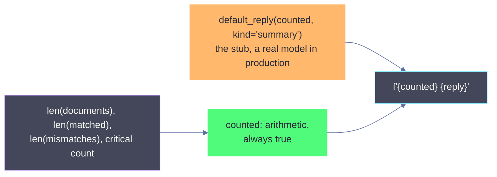
```mermaid
%%{init:{'theme':'base','themeVariables':{'darkMode':true,'background':'#282a36','mainBkg':'#44475a','primaryColor':'#44475a','primaryTextColor':'#f8f8f2','primaryBorderColor':'#bd93f9','lineColor':'#6272a4','textColor':'#f8f8f2','nodeBorder':'#bd93f9','clusterBkg':'#21222c','clusterBorder':'#6272a4','edgeLabelBackground':'#282a36','actorBkg':'#44475a','actorBorder':'#bd93f9','actorTextColor':'#f8f8f2','actorLineColor':'#6272a4','signalColor':'#f8f8f2','signalTextColor':'#f8f8f2','noteBkgColor':'#414458','noteBorderColor':'#ffb86c','noteTextColor':'#f8f8f2','activationBkgColor':'#6272a4','activationBorderColor':'#bd93f9','labelBoxBkgColor':'#44475a','labelBoxBorderColor':'#bd93f9','labelTextColor':'#f8f8f2','loopTextColor':'#f8f8f2','sequenceNumberColor':'#282a36'}}}%%
flowchart LR
    A["len(documents), len(matched),<br/>len(mismatches), critical count"] --> B["counted: arithmetic,<br/>always true"]
    C["default_reply(counted, kind='summary')<br/>the stub, a real model in production"] --> D["f'{counted} {reply}'"]
    B --> D

    class B ok
    class C warn
    class D fn

    classDef ok fill:#50fa7b,stroke:#50fa7b,color:#282a36
    classDef warn fill:#ffb86c,stroke:#ffb86c,color:#282a36
    classDef fn fill:#44475a,stroke:#8be9fd,color:#f8f8f2
```

On the sample:

```
Checked 3 documents on 7 shared fields: 4 agreed, 3 did not (3 critical). Anything only one document mentioned was left out of the comparison.
|------------------------ counted, from the data ---------------------| |------------------- default_reply, the stub ------------------------|
```

---

## 7 · `GET /v1/cases/{case_id}`

The polling half. No work, no waiting — whatever the record says right now.

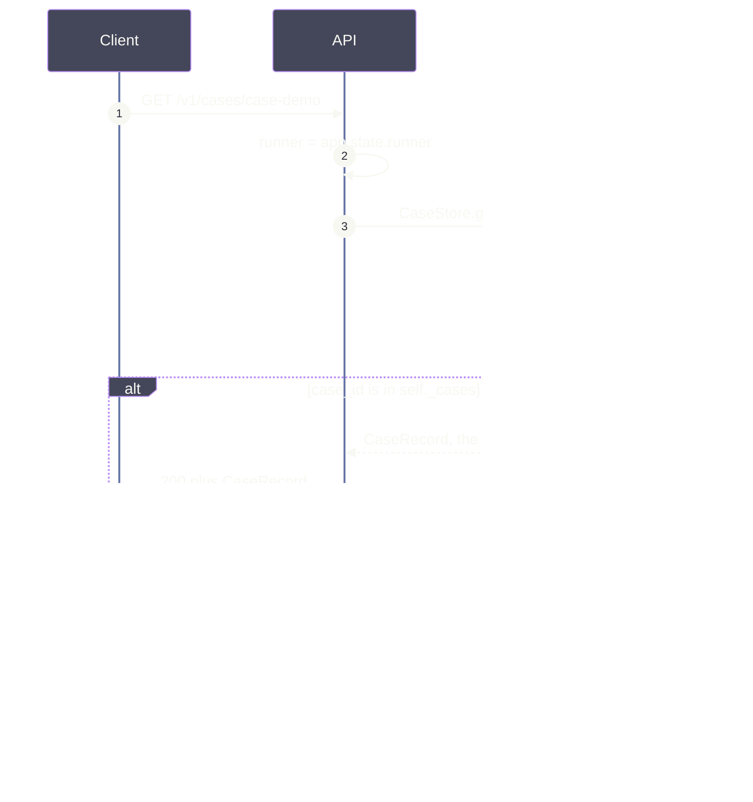
```mermaid
%%{init:{'theme':'base','themeVariables':{'darkMode':true,'background':'#282a36','mainBkg':'#44475a','primaryColor':'#44475a','primaryTextColor':'#f8f8f2','primaryBorderColor':'#bd93f9','lineColor':'#6272a4','textColor':'#f8f8f2','nodeBorder':'#bd93f9','clusterBkg':'#21222c','clusterBorder':'#6272a4','edgeLabelBackground':'#282a36','actorBkg':'#44475a','actorBorder':'#bd93f9','actorTextColor':'#f8f8f2','actorLineColor':'#6272a4','signalColor':'#f8f8f2','signalTextColor':'#f8f8f2','noteBkgColor':'#414458','noteBorderColor':'#ffb86c','noteTextColor':'#f8f8f2','activationBkgColor':'#6272a4','activationBorderColor':'#bd93f9','labelBoxBkgColor':'#44475a','labelBoxBorderColor':'#bd93f9','labelTextColor':'#f8f8f2','loopTextColor':'#f8f8f2','sequenceNumberColor':'#282a36'}}}%%
sequenceDiagram
    autonumber
    participant Client
    participant API
    participant Store

    Client->>API: GET /v1/cases/case-demo
    API->>API: runner = app.state.runner
    API->>Store: CaseStore.get(case_id)
    activate Store
    Store->>Store: async with self._lock
    Store->>Store: CaseStore._live(case_id)

    alt case_id is in self._cases
        Store-->>API: CaseRecord, the current snapshot
        API-->>Client: 200 plus CaseRecord
    else missing or already evicted
        Store-->>API: raise CaseNotFound
        API->>API: _case_not_found handler
        API-->>Client: 404 no case case-demo
    end
    deactivate Store
```

The same route answers at every stage of the case's life:

| when | `status` | `events` | `report` | `error` |
|---|---|---|---|---|
| right after POST | `queued` | `[]` | `null` | `null` |
| during the reads | `running` | 1 to 4 | `null` | `null` |
| after `compare` | `succeeded` | 5 | the `Report` | `null` |
| after a failure | `failed` | however far it got | `null` | the message |
| after DELETE | — | — | — | 404 |

---

## 8 · `DELETE /v1/cases/{case_id}`

Drops the record and releases anyone watching. It does **not** cancel the run.

```mermaid
%%{init:{'theme':'base','themeVariables':{'darkMode':true,'background':'#282a36','mainBkg':'#44475a','primaryColor':'#44475a','primaryTextColor':'#f8f8f2','primaryBorderColor':'#bd93f9','lineColor':'#6272a4','textColor':'#f8f8f2','nodeBorder':'#bd93f9','clusterBkg':'#21222c','clusterBorder':'#6272a4','edgeLabelBackground':'#282a36','actorBkg':'#44475a','actorBorder':'#bd93f9','actorTextColor':'#f8f8f2','actorLineColor':'#6272a4','signalColor':'#f8f8f2','signalTextColor':'#f8f8f2','noteBkgColor':'#414458','noteBorderColor':'#ffb86c','noteTextColor':'#f8f8f2','activationBkgColor':'#6272a4','activationBorderColor':'#bd93f9','labelBoxBkgColor':'#44475a','labelBoxBorderColor':'#bd93f9','labelTextColor':'#f8f8f2','loopTextColor':'#f8f8f2','sequenceNumberColor':'#282a36'}}}%%
sequenceDiagram
    autonumber
    participant Client
    participant API
    participant Store
    participant Pump
    participant Task

    Client->>API: DELETE /v1/cases/case-demo
    API->>Store: CaseStore.forget(case_id)
    activate Store
    Store->>Store: async with self._lock
    Store->>Store: live = self._cases.pop(case_id, None)

    opt live is None
        Store-->>API: raise CaseNotFound
        API-->>Client: 404
    end

    Store->>Pump: live.changed.set()
    deactivate Store
    API-->>Client: 204 No Content

    Pump->>Store: loops, calls CaseStore._live(case_id)
    Store-->>Pump: raise CaseNotFound
    Pump-->>Client: emit error, no case case-demo

    Note over Task: still running, and does not know
    Task->>Store: append_event or succeed
    Store-->>Task: raise CaseNotFound
    Task->>Task: except CaseNotFound, return
```

Verified against a real mid-run delete: the runner's task set drains to zero and no
exception escapes. The case simply stops existing.

---

## 9 · Socket.IO

Every `case` frame carries a whole `CaseRecord` — the same object the GET returns.

### 9a · `subscribe`

```mermaid
%%{init:{'theme':'base','themeVariables':{'darkMode':true,'background':'#282a36','mainBkg':'#44475a','primaryColor':'#44475a','primaryTextColor':'#f8f8f2','primaryBorderColor':'#bd93f9','lineColor':'#6272a4','textColor':'#f8f8f2','nodeBorder':'#bd93f9','clusterBkg':'#21222c','clusterBorder':'#6272a4','edgeLabelBackground':'#282a36','actorBkg':'#44475a','actorBorder':'#bd93f9','actorTextColor':'#f8f8f2','actorLineColor':'#6272a4','signalColor':'#f8f8f2','signalTextColor':'#f8f8f2','noteBkgColor':'#414458','noteBorderColor':'#ffb86c','noteTextColor':'#f8f8f2','activationBkgColor':'#6272a4','activationBorderColor':'#bd93f9','labelBoxBkgColor':'#44475a','labelBoxBorderColor':'#bd93f9','labelTextColor':'#f8f8f2','loopTextColor':'#f8f8f2','sequenceNumberColor':'#282a36'}}}%%
flowchart TD
    A["client emits subscribe"] --> B["case_id = data.get('case_id')<br/>if isinstance(data, dict) else None"]
    B --> C{"is it a non-empty string?"}
    C -->|no| D["emit error<br/>expected case_id<br/>return, no task created"]
    C -->|yes| E["stop(sid, case_id)<br/>re-subscribing replaces the stream"]
    E --> F["asyncio.create_task(pump(sid, case_id))"]
    F --> G["streams[sid][case_id] = task"]
    G --> H["task.add_done_callback(remove from streams)"]

    class A entry
    class D bad
    class E,F conc
    class H ok

    classDef entry fill:#bd93f9,stroke:#bd93f9,color:#282a36
    classDef bad fill:#ff5555,stroke:#ff5555,color:#282a36
    classDef conc fill:#ff79c6,stroke:#ff79c6,color:#282a36
    classDef ok fill:#50fa7b,stroke:#50fa7b,color:#282a36
```

Socket payloads get none of the validation a FastAPI route body does, hence the two-step
check: is it a dict, and is `case_id` a non-empty string.

### 9b · `pump`, the whole streaming protocol

```mermaid
%%{init:{'theme':'base','themeVariables':{'darkMode':true,'background':'#282a36','mainBkg':'#44475a','primaryColor':'#44475a','primaryTextColor':'#f8f8f2','primaryBorderColor':'#bd93f9','lineColor':'#6272a4','textColor':'#f8f8f2','nodeBorder':'#bd93f9','clusterBkg':'#21222c','clusterBorder':'#6272a4','edgeLabelBackground':'#282a36','actorBkg':'#44475a','actorBorder':'#bd93f9','actorTextColor':'#f8f8f2','actorLineColor':'#6272a4','signalColor':'#f8f8f2','signalTextColor':'#f8f8f2','noteBkgColor':'#414458','noteBorderColor':'#ffb86c','noteTextColor':'#f8f8f2','activationBkgColor':'#6272a4','activationBorderColor':'#bd93f9','labelBoxBkgColor':'#44475a','labelBoxBorderColor':'#bd93f9','labelTextColor':'#f8f8f2','loopTextColor':'#f8f8f2','sequenceNumberColor':'#282a36'}}}%%
sequenceDiagram
    autonumber
    participant Pump
    participant Store
    participant Client

    Pump->>Pump: runner = app.state.runner, read at event time
    Pump->>Store: CaseStore.watch(case_id)
    activate Store

    opt case does not exist
        Store-->>Pump: raise CaseNotFound
        Pump-->>Client: emit error with the detail
    end

    loop until record.is_terminal
        Store-->>Pump: CaseRecord
        Pump->>Pump: record.model_dump(mode='json')
        Pump-->>Client: emit case with the whole record
    end
    deactivate Store

    Pump-->>Client: emit done with the case_id
```

`app.state.runner` is read **here, at event time**, not captured when `build_socket_app`
ran — the lifespan handler creates the runner after this app is assembled.

### 9c · Every payload shape

| client emits | server emits |
|---|---|
| `subscribe {"case_id": "case-demo"}` | `case` … `case` … `done {"case_id": "case-demo"}` |
| `subscribe {"case_id": "nope"}` | `error {"detail": "no case 'nope'"}` |
| `subscribe "case-demo"` | `error {"detail": "expected {'case_id': '...'}"}` |
| `subscribe {"case_id": ""}` | `error {"detail": "expected {'case_id': '...'}"}` |
| `subscribe {}` | `error {"detail": "expected {'case_id': '...'}"}` |
| `unsubscribe {"case_id": "case-demo"}` | nothing, the task is cancelled |

All five verified by driving the handlers directly.

The two errors come from different places. The three malformed payloads are rejected by
`subscribe` before any task exists. `no case 'nope'` comes from `pump`, because the id
looked fine and only `store.watch` could know there was nothing behind it.

**A failed case still ends with `done`, not `error`.** `failed` is terminal, so `watch()`
returns normally. `error` means "I could not stream this", never "the analysis went badly".

### 9d · `disconnect`

```mermaid
%%{init:{'theme':'base','themeVariables':{'darkMode':true,'background':'#282a36','mainBkg':'#44475a','primaryColor':'#44475a','primaryTextColor':'#f8f8f2','primaryBorderColor':'#bd93f9','lineColor':'#6272a4','textColor':'#f8f8f2','nodeBorder':'#bd93f9','clusterBkg':'#21222c','clusterBorder':'#6272a4','edgeLabelBackground':'#282a36','actorBkg':'#44475a','actorBorder':'#bd93f9','actorTextColor':'#f8f8f2','actorLineColor':'#6272a4','signalColor':'#f8f8f2','signalTextColor':'#f8f8f2','noteBkgColor':'#414458','noteBorderColor':'#ffb86c','noteTextColor':'#f8f8f2','activationBkgColor':'#6272a4','activationBorderColor':'#bd93f9','labelBoxBkgColor':'#44475a','labelBoxBorderColor':'#bd93f9','labelTextColor':'#f8f8f2','loopTextColor':'#f8f8f2','sequenceNumberColor':'#282a36'}}}%%
flowchart LR
    A["client disconnects"] --> B["streams.pop(sid, {})"]
    B --> C["for task in values(): task.cancel()"]
    C --> D["nothing left emitting into<br/>a socket nobody reads"]

    class A entry
    class C conc
    class D ok

    classDef entry fill:#bd93f9,stroke:#bd93f9,color:#282a36
    classDef conc fill:#ff79c6,stroke:#ff79c6,color:#282a36
    classDef ok fill:#50fa7b,stroke:#50fa7b,color:#282a36
```

`pop` removes and returns in one step, so the session entry is gone before the loop starts.

### 9e · `model_dump(mode='json')`

```mermaid
%%{init:{'theme':'base','themeVariables':{'darkMode':true,'background':'#282a36','mainBkg':'#44475a','primaryColor':'#44475a','primaryTextColor':'#f8f8f2','primaryBorderColor':'#bd93f9','lineColor':'#6272a4','textColor':'#f8f8f2','nodeBorder':'#bd93f9','clusterBkg':'#21222c','clusterBorder':'#6272a4','edgeLabelBackground':'#282a36','actorBkg':'#44475a','actorBorder':'#bd93f9','actorTextColor':'#f8f8f2','actorLineColor':'#6272a4','signalColor':'#f8f8f2','signalTextColor':'#f8f8f2','noteBkgColor':'#414458','noteBorderColor':'#ffb86c','noteTextColor':'#f8f8f2','activationBkgColor':'#6272a4','activationBorderColor':'#bd93f9','labelBoxBkgColor':'#44475a','labelBoxBorderColor':'#bd93f9','labelTextColor':'#f8f8f2','loopTextColor':'#f8f8f2','sequenceNumberColor':'#282a36'}}}%%
flowchart LR
    A["CaseRecord"] --> B["model_dump()"]
    B --> C["datetime objects<br/>json.dumps raises TypeError"]
    A --> D["model_dump(mode='json')"]
    D --> E["'2026-09-17T10:13:57.390861Z'<br/>safe to emit"]

    class C bad
    class E ok

    classDef bad fill:#ff5555,stroke:#ff5555,color:#282a36
    classDef ok fill:#50fa7b,stroke:#50fa7b,color:#282a36
```

The FastAPI routes never need this — returning a model lets FastAPI serialise it. Socket.IO
is handed a plain dict, so the conversion happens here.

---

## 10 · How a watcher is woken

The subtlest mechanism in the project, and why several tabs can watch one case without any
of them missing an update.

### 10a · The swap

```mermaid
%%{init:{'theme':'base','themeVariables':{'darkMode':true,'background':'#282a36','mainBkg':'#44475a','primaryColor':'#44475a','primaryTextColor':'#f8f8f2','primaryBorderColor':'#bd93f9','lineColor':'#6272a4','textColor':'#f8f8f2','nodeBorder':'#bd93f9','clusterBkg':'#21222c','clusterBorder':'#6272a4','edgeLabelBackground':'#282a36','actorBkg':'#44475a','actorBorder':'#bd93f9','actorTextColor':'#f8f8f2','actorLineColor':'#6272a4','signalColor':'#f8f8f2','signalTextColor':'#f8f8f2','noteBkgColor':'#414458','noteBorderColor':'#ffb86c','noteTextColor':'#f8f8f2','activationBkgColor':'#6272a4','activationBorderColor':'#bd93f9','labelBoxBkgColor':'#44475a','labelBoxBorderColor':'#bd93f9','labelTextColor':'#f8f8f2','loopTextColor':'#f8f8f2','sequenceNumberColor':'#282a36'}}}%%
sequenceDiagram
    autonumber
    participant WA as Watcher A
    participant WB as Watcher B
    participant Store
    participant Task

    Note over WA,WB: both inside watch(), holding Event 1

    WA->>Store: lock, grab changed and record
    WA->>WA: yield record, then await Event 1
    WB->>Store: lock, grab changed and record
    WB->>WB: yield record, then await Event 1

    Task->>Store: CaseStore.append_event(...)
    activate Store
    Store->>Store: CaseStore._publish(live, events=[...])
    Store->>Store: live.record = live.record.model_copy(update=fields)
    Store->>Store: woken, live.changed = live.changed, asyncio.Event()
    Note over Store: woken is Event 1, live.changed is now Event 2
    Store->>Store: woken.set()
    deactivate Store

    Store-->>WA: Event 1 set, wakes
    Store-->>WB: Event 1 set, wakes
    Note over WA,WB: both loop, grab Event 2, yield the new record
```

### 10b · Why replacing, not set-then-clear

```mermaid
%%{init:{'theme':'base','themeVariables':{'darkMode':true,'background':'#282a36','mainBkg':'#44475a','primaryColor':'#44475a','primaryTextColor':'#f8f8f2','primaryBorderColor':'#bd93f9','lineColor':'#6272a4','textColor':'#f8f8f2','nodeBorder':'#bd93f9','clusterBkg':'#21222c','clusterBorder':'#6272a4','edgeLabelBackground':'#282a36','actorBkg':'#44475a','actorBorder':'#bd93f9','actorTextColor':'#f8f8f2','actorLineColor':'#6272a4','signalColor':'#f8f8f2','signalTextColor':'#f8f8f2','noteBkgColor':'#414458','noteBorderColor':'#ffb86c','noteTextColor':'#f8f8f2','activationBkgColor':'#6272a4','activationBorderColor':'#bd93f9','labelBoxBkgColor':'#44475a','labelBoxBorderColor':'#bd93f9','labelTextColor':'#f8f8f2','loopTextColor':'#f8f8f2','sequenceNumberColor':'#282a36'}}}%%
flowchart TD
    A["an update lands"] --> B{"how is it signalled?"}
    B -->|"set() then clear()"| C["watcher A wakes first"]
    C --> D["A clears the flag"]
    D --> E["watcher B is still asleep,<br/>and the flag is gone"]
    E --> F["B sleeps through the update"]
    B -->|"swap in a fresh Event,<br/>then set the old one"| G["every waiter holds<br/>the old object"]
    G --> H["all of them wake"]
    H --> I["a waiter's event is never reused,<br/>so there is no window to miss"]

    class F bad
    class I ok
    class A entry

    classDef entry fill:#bd93f9,stroke:#bd93f9,color:#282a36
    classDef bad fill:#ff5555,stroke:#ff5555,color:#282a36
    classDef ok fill:#50fa7b,stroke:#50fa7b,color:#282a36
```

### 10c · Why the event is grabbed before the yield

```mermaid
%%{init:{'theme':'base','themeVariables':{'darkMode':true,'background':'#282a36','mainBkg':'#44475a','primaryColor':'#44475a','primaryTextColor':'#f8f8f2','primaryBorderColor':'#bd93f9','lineColor':'#6272a4','textColor':'#f8f8f2','nodeBorder':'#bd93f9','clusterBkg':'#21222c','clusterBorder':'#6272a4','edgeLabelBackground':'#282a36','actorBkg':'#44475a','actorBorder':'#bd93f9','actorTextColor':'#f8f8f2','actorLineColor':'#6272a4','signalColor':'#f8f8f2','signalTextColor':'#f8f8f2','noteBkgColor':'#414458','noteBorderColor':'#ffb86c','noteTextColor':'#f8f8f2','activationBkgColor':'#6272a4','activationBorderColor':'#bd93f9','labelBoxBkgColor':'#44475a','labelBoxBorderColor':'#bd93f9','labelTextColor':'#f8f8f2','loopTextColor':'#f8f8f2','sequenceNumberColor':'#282a36'}}}%%
flowchart LR
    A["grab changed and record<br/>under the lock"] --> B["release the lock"]
    B --> C["yield record<br/>an update can land here"]
    C --> D["await the event grabbed at step 1"]
    D --> E["if the update landed during the yield<br/>it set THAT event, so wait() returns at once"]

    class C conc
    class E ok

    classDef conc fill:#ff79c6,stroke:#ff79c6,color:#282a36
    classDef ok fill:#50fa7b,stroke:#50fa7b,color:#282a36
```

Grab the event *after* yielding instead and there is a race: the update fires while the
watcher is between steps, the watcher then waits for the *next* one, and the change it just
missed never arrives.

---

## 11 · Status updates

Everything about how a record changes, and who changes it.

### 11a · The state machine

```mermaid
%%{init:{'theme':'base','themeVariables':{'darkMode':true,'background':'#282a36','mainBkg':'#44475a','primaryColor':'#44475a','primaryTextColor':'#f8f8f2','primaryBorderColor':'#bd93f9','lineColor':'#6272a4','textColor':'#f8f8f2','nodeBorder':'#bd93f9','clusterBkg':'#21222c','clusterBorder':'#6272a4','edgeLabelBackground':'#282a36','actorBkg':'#44475a','actorBorder':'#bd93f9','actorTextColor':'#f8f8f2','actorLineColor':'#6272a4','signalColor':'#f8f8f2','signalTextColor':'#f8f8f2','noteBkgColor':'#414458','noteBorderColor':'#ffb86c','noteTextColor':'#f8f8f2','activationBkgColor':'#6272a4','activationBorderColor':'#bd93f9','labelBoxBkgColor':'#44475a','labelBoxBorderColor':'#bd93f9','labelTextColor':'#f8f8f2','loopTextColor':'#f8f8f2','sequenceNumberColor':'#282a36'}}}%%
stateDiagram-v2
    [*] --> queued
    queued --> running
    running --> running
    running --> succeeded
    running --> failed
    succeeded --> [*]
    failed --> [*]

    note right of queued
        CaseStore.create()
        POST returns here
        report null, error null, events empty
    end note

    note right of running
        CaseRunner._run calls
        CaseStore.update(status=RUNNING)
        then append_event repeatedly
        status stays running
    end note

    note right of succeeded
        CaseStore.succeed(report)
        sets report and finished_at
        is_terminal becomes True
    end note

    note right of failed
        CaseStore.fail(detail)
        sets error and finished_at
        is_terminal becomes True
    end note
```

The `running --> running` self-loop is `append_event`: it grows `events` and wakes every
watcher, but never touches `status`.

### 11b · Every write, and what it changes

| store method | called by | `status` | other fields |
|---|---|---|---|
| `create` | `CaseRunner.submit` | sets `queued` | `case_id`, `document_count`, `submitted_at` |
| `update(status=RUNNING)` | `CaseRunner._run` | sets `running` | — |
| `append_event` | `drain`, once per event | unchanged | `events` replaced with `[*old, new]` |
| `succeed` | `CaseRunner._run` | sets `succeeded` | `report`, `finished_at` |
| `fail` | `CaseRunner._run` | sets `failed` | `error`, `finished_at` |
| `forget` | `forget_case` route | — | record removed entirely |

Every one of them except `forget` goes through `CaseStore._publish`, so every one of them
wakes the watchers.

### 11c · The one path every write takes

```mermaid
%%{init:{'theme':'base','themeVariables':{'darkMode':true,'background':'#282a36','mainBkg':'#44475a','primaryColor':'#44475a','primaryTextColor':'#f8f8f2','primaryBorderColor':'#bd93f9','lineColor':'#6272a4','textColor':'#f8f8f2','nodeBorder':'#bd93f9','clusterBkg':'#21222c','clusterBorder':'#6272a4','edgeLabelBackground':'#282a36','actorBkg':'#44475a','actorBorder':'#bd93f9','actorTextColor':'#f8f8f2','actorLineColor':'#6272a4','signalColor':'#f8f8f2','signalTextColor':'#f8f8f2','noteBkgColor':'#414458','noteBorderColor':'#ffb86c','noteTextColor':'#f8f8f2','activationBkgColor':'#6272a4','activationBorderColor':'#bd93f9','labelBoxBkgColor':'#44475a','labelBoxBorderColor':'#bd93f9','labelTextColor':'#f8f8f2','loopTextColor':'#f8f8f2','sequenceNumberColor':'#282a36'}}}%%
flowchart TD
    A["create"] --> P
    B["update"] --> P
    C["append_event"] --> P
    D["succeed"] --> E["update(status, report, finished_at)"]
    F["fail"] --> G["update(status, error, finished_at)"]
    E --> B
    G --> B
    P["CaseStore._publish(live, **fields)"] --> Q["live.record = live.record.model_copy(update=fields)"]
    Q --> R["woken, live.changed = live.changed, asyncio.Event()"]
    R --> S["woken.set() — every watcher wakes"]

    class A,B,C,D,F entry
    class P,Q status
    class R,S conc

    classDef entry fill:#bd93f9,stroke:#bd93f9,color:#282a36
    classDef status fill:#ffb86c,stroke:#ffb86c,color:#282a36
    classDef conc fill:#ff79c6,stroke:#ff79c6,color:#282a36
```

`succeed` and `fail` are thin wrappers over `update`, which is why both stamp `finished_at`
the same way — and why `_evict` can sort on it later.

### 11d · `is_terminal`, defined once

```mermaid
%%{init:{'theme':'base','themeVariables':{'darkMode':true,'background':'#282a36','mainBkg':'#44475a','primaryColor':'#44475a','primaryTextColor':'#f8f8f2','primaryBorderColor':'#bd93f9','lineColor':'#6272a4','textColor':'#f8f8f2','nodeBorder':'#bd93f9','clusterBkg':'#21222c','clusterBorder':'#6272a4','edgeLabelBackground':'#282a36','actorBkg':'#44475a','actorBorder':'#bd93f9','actorTextColor':'#f8f8f2','actorLineColor':'#6272a4','signalColor':'#f8f8f2','signalTextColor':'#f8f8f2','noteBkgColor':'#414458','noteBorderColor':'#ffb86c','noteTextColor':'#f8f8f2','activationBkgColor':'#6272a4','activationBorderColor':'#bd93f9','labelBoxBkgColor':'#44475a','labelBoxBorderColor':'#bd93f9','labelTextColor':'#f8f8f2','loopTextColor':'#f8f8f2','sequenceNumberColor':'#282a36'}}}%%
flowchart LR
    A["JobStatus.is_terminal<br/>status in SUCCEEDED, FAILED"] --> B["CaseRecord.is_terminal<br/>forwards it"]
    B --> C["CaseStore.watch<br/>stops iterating"]
    B --> D["events.pump<br/>emits done"]
    A --> E["CaseStore._evict<br/>via finished_at"]

    class A entry
    class C,D,E fn

    classDef entry fill:#bd93f9,stroke:#bd93f9,color:#282a36
    classDef fn fill:#44475a,stroke:#8be9fd,color:#f8f8f2
```

Three places ask the question and none of them re-derives it.

### 11e · The real sequence, frame by frame

What `store.watch()` yields for one sample case, start to finish:

| # | `status` | `events` | `report` | `is_terminal` | caused by |
|---|---|---|---|---|---|
| 1 | `queued` | 0 | `null` | `False` | `create`, yielded immediately on subscribe |
| 2 | `running` | 0 | `null` | `False` | `update(status=RUNNING)` |
| 3 | `running` | 1 | `null` | `False` | `append_event` · ingest |
| 4 | `running` | 2 | `null` | `False` | `append_event` · read doc-3 |
| 5 | `running` | 3 | `null` | `False` | `append_event` · read doc-1 |
| 6 | `running` | 4 | `null` | `False` | `append_event` · read doc-2 |
| 7 | `running` | 5 | `null` | `False` | `append_event` · compare |
| 8 | `succeeded` | 5 | the `Report` | `True` | `succeed`, loop ends here |

Eight frames, then `done`. A client that connects at frame five gets `events=4` immediately
and has missed nothing it needs — every frame is complete, so the latest one is always
enough.

### 11f · Eviction

```mermaid
%%{init:{'theme':'base','themeVariables':{'darkMode':true,'background':'#282a36','mainBkg':'#44475a','primaryColor':'#44475a','primaryTextColor':'#f8f8f2','primaryBorderColor':'#bd93f9','lineColor':'#6272a4','textColor':'#f8f8f2','nodeBorder':'#bd93f9','clusterBkg':'#21222c','clusterBorder':'#6272a4','edgeLabelBackground':'#282a36','actorBkg':'#44475a','actorBorder':'#bd93f9','actorTextColor':'#f8f8f2','actorLineColor':'#6272a4','signalColor':'#f8f8f2','signalTextColor':'#f8f8f2','noteBkgColor':'#414458','noteBorderColor':'#ffb86c','noteTextColor':'#f8f8f2','activationBkgColor':'#6272a4','activationBorderColor':'#bd93f9','labelBoxBkgColor':'#44475a','labelBoxBorderColor':'#bd93f9','labelTextColor':'#f8f8f2','loopTextColor':'#f8f8f2','sequenceNumberColor':'#282a36'}}}%%
flowchart TD
    A["CaseStore._evict(), called from create"] --> B["sorted((finished_at, case_id))<br/>for cases where finished_at is not None"]
    B --> C["running cases are never in this list"]
    C --> D["delete finished[: len(self._cases) - MAX_CASES]"]

    class A entry
    class C ok
    class D bad

    classDef entry fill:#bd93f9,stroke:#bd93f9,color:#282a36
    classDef ok fill:#50fa7b,stroke:#50fa7b,color:#282a36
    classDef bad fill:#ff5555,stroke:#ff5555,color:#282a36
```

> **The red box is a real bug.** The slice is meant to read "how many need to go, and
> nothing when that is zero or less". When the store holds fewer than `MAX_CASES` the count
> is *negative*, and a negative stop index counts backwards from the end of `finished` — so
> `finished[:-2]` keeps the newest two and deletes everything before them. Measured: with
> 30 cases in the store, 25 finished, one `create` deleted 5 of them. The fix is
> `finished[: max(0, len(self._cases) - MAX_CASES)]`.

---

## 12 · The failure paths

### 12a · Where each one is answered

```mermaid
%%{init:{'theme':'base','themeVariables':{'darkMode':true,'background':'#282a36','mainBkg':'#44475a','primaryColor':'#44475a','primaryTextColor':'#f8f8f2','primaryBorderColor':'#bd93f9','lineColor':'#6272a4','textColor':'#f8f8f2','nodeBorder':'#bd93f9','clusterBkg':'#21222c','clusterBorder':'#6272a4','edgeLabelBackground':'#282a36','actorBkg':'#44475a','actorBorder':'#bd93f9','actorTextColor':'#f8f8f2','actorLineColor':'#6272a4','signalColor':'#f8f8f2','signalTextColor':'#f8f8f2','noteBkgColor':'#414458','noteBorderColor':'#ffb86c','noteTextColor':'#f8f8f2','activationBkgColor':'#6272a4','activationBorderColor':'#bd93f9','labelBoxBkgColor':'#44475a','labelBoxBorderColor':'#bd93f9','labelTextColor':'#f8f8f2','loopTextColor':'#f8f8f2','sequenceNumberColor':'#282a36'}}}%%
flowchart TD
    A["POST /v1/cases"] --> B{"body valid?"}
    B -->|no| C["422 from pydantic,<br/>before any code runs"]
    B -->|yes| D{"case_id free?"}
    D -->|no| E["409 CaseExists"]
    D -->|yes| F["202 plus queued record"]
    F --> G["CaseRunner._run on a task"]
    G --> H{"what happens?"}
    H -->|a step raises| I["status failed"]
    H -->|case deleted mid-run| J["return quietly"]
    H -->|shutdown| K["CancelledError re-raised"]
    H -->|all well| L["status succeeded"]
    M["GET or DELETE an unknown id"] --> N["404 CaseNotFound"]

    class A,M entry
    class C,E,I,N bad
    class F,L ok
    class J,K idle

    classDef entry fill:#bd93f9,stroke:#bd93f9,color:#282a36
    classDef bad fill:#ff5555,stroke:#ff5555,color:#282a36
    classDef ok fill:#50fa7b,stroke:#50fa7b,color:#282a36
    classDef idle fill:#44475a,stroke:#6272a4,color:#f8f8f2
```

### 12b · The three `except` clauses

```mermaid
%%{init:{'theme':'base','themeVariables':{'darkMode':true,'background':'#282a36','mainBkg':'#44475a','primaryColor':'#44475a','primaryTextColor':'#f8f8f2','primaryBorderColor':'#bd93f9','lineColor':'#6272a4','textColor':'#f8f8f2','nodeBorder':'#bd93f9','clusterBkg':'#21222c','clusterBorder':'#6272a4','edgeLabelBackground':'#282a36','actorBkg':'#44475a','actorBorder':'#bd93f9','actorTextColor':'#f8f8f2','actorLineColor':'#6272a4','signalColor':'#f8f8f2','signalTextColor':'#f8f8f2','noteBkgColor':'#414458','noteBorderColor':'#ffb86c','noteTextColor':'#f8f8f2','activationBkgColor':'#6272a4','activationBorderColor':'#bd93f9','labelBoxBkgColor':'#44475a','labelBoxBorderColor':'#bd93f9','labelTextColor':'#f8f8f2','loopTextColor':'#f8f8f2','sequenceNumberColor':'#282a36'}}}%%
flowchart TD
    A["except asyncio.CancelledError"] --> B["raise<br/>not an error, an instruction.<br/>Swallowing it means the task<br/>refuses to die on shutdown"]
    C["except CaseNotFound"] --> D["return<br/>someone deleted the case.<br/>Nothing left to report to"]
    E["except Exception"] --> F["CaseStore.fail(...)<br/>deliberately broad. A case that never<br/>reaches a terminal state is one<br/>a client polls forever"]

    class A,C,E entry
    class B conc
    class D idle
    class F bad

    classDef entry fill:#bd93f9,stroke:#bd93f9,color:#282a36
    classDef conc fill:#ff79c6,stroke:#ff79c6,color:#282a36
    classDef idle fill:#44475a,stroke:#6272a4,color:#f8f8f2
    classDef bad fill:#ff5555,stroke:#ff5555,color:#282a36
```

A failed case, from a real error induced inside `read_document`:

```json
{
  "case_id": "case-bad",
  "status": "failed",
  "error": "ValueError: unreadable layout on page 2",
  "report": null,
  "events": [
    {"stage": "ingest", "message": "3 documents received", "doc_id": null}
  ],
  "finished_at": "2026-09-17T..."
}
```

`ingest` had already recorded its line, so the trail keeps it. The reads never got to
record theirs. `error` is `f'{type(exc).__name__}: {exc}'` — the class name is kept because
the message alone would not say what kind of failure it was.

### 12c · Status codes, by origin

| code | raised by | reaches the client via |
|---|---|---|
| `422` | pydantic validating `CaseRequest` | FastAPI's built-in handler |
| `409` | `CaseStore.create` raising `CaseExists` | `_case_exists` handler |
| `404` | `CaseStore._live` raising `CaseNotFound` | `_case_not_found` handler |
| `204` | `forget_case` returning `None` | `status_code` on the decorator |
| `202` | `submit` | `status_code` on the decorator |
| `failed` status | any step raising | recorded in the record, still a `200` |

The last row is the important distinction: **a failed analysis is not an HTTP error.** The
request to fetch it succeeded; the thing it fetched says `failed`.

---

## 13 · Supporting routes and lifecycle

### 13a · The three routes with no case in them

```mermaid
%%{init:{'theme':'base','themeVariables':{'darkMode':true,'background':'#282a36','mainBkg':'#44475a','primaryColor':'#44475a','primaryTextColor':'#f8f8f2','primaryBorderColor':'#bd93f9','lineColor':'#6272a4','textColor':'#f8f8f2','nodeBorder':'#bd93f9','clusterBkg':'#21222c','clusterBorder':'#6272a4','edgeLabelBackground':'#282a36','actorBkg':'#44475a','actorBorder':'#bd93f9','actorTextColor':'#f8f8f2','actorLineColor':'#6272a4','signalColor':'#f8f8f2','signalTextColor':'#f8f8f2','noteBkgColor':'#414458','noteBorderColor':'#ffb86c','noteTextColor':'#f8f8f2','activationBkgColor':'#6272a4','activationBorderColor':'#bd93f9','labelBoxBkgColor':'#44475a','labelBoxBorderColor':'#bd93f9','labelTextColor':'#f8f8f2','loopTextColor':'#f8f8f2','sequenceNumberColor':'#282a36'}}}%%
sequenceDiagram
    autonumber
    participant Client
    participant API
    participant Graph
    participant Sample as sample.py

    Client->>API: GET /health
    API-->>Client: 200 status ok, stage_delay_seconds

    Client->>API: GET /v1/sample
    API->>Sample: SAMPLE
    Sample-->>API: three dicts of name and text
    API-->>Client: 200 with the list

    Client->>API: GET /v1/graph
    API->>Graph: render_mermaid(title)
    Graph->>Graph: case_graph.render(title)
    Graph-->>API: Mermaid source
    API-->>Client: 200 text/plain
```

`/v1/graph` returns the diagram drawn from the wiring that actually runs — the same five
`builder.edge_from(...)` calls that execute the pipeline, so it cannot go stale.

### 13b · Startup and shutdown

```mermaid
%%{init:{'theme':'base','themeVariables':{'darkMode':true,'background':'#282a36','mainBkg':'#44475a','primaryColor':'#44475a','primaryTextColor':'#f8f8f2','primaryBorderColor':'#bd93f9','lineColor':'#6272a4','textColor':'#f8f8f2','nodeBorder':'#bd93f9','clusterBkg':'#21222c','clusterBorder':'#6272a4','edgeLabelBackground':'#282a36','actorBkg':'#44475a','actorBorder':'#bd93f9','actorTextColor':'#f8f8f2','actorLineColor':'#6272a4','signalColor':'#f8f8f2','signalTextColor':'#f8f8f2','noteBkgColor':'#414458','noteBorderColor':'#ffb86c','noteTextColor':'#f8f8f2','activationBkgColor':'#6272a4','activationBorderColor':'#bd93f9','labelBoxBkgColor':'#44475a','labelBoxBorderColor':'#bd93f9','labelTextColor':'#f8f8f2','loopTextColor':'#f8f8f2','sequenceNumberColor':'#282a36'}}}%%
sequenceDiagram
    autonumber
    participant Uvicorn
    participant API
    participant Runner

    Uvicorn->>API: startup
    API->>Runner: app.state.runner = CaseRunner()
    Note over API: before the yield in lifespan

    Note over Uvicorn,Runner: serving

    Uvicorn->>API: shutdown
    API->>Runner: await CaseRunner.aclose()
    Runner->>Runner: tuple(self._tasks), snapshot first
    Runner->>Runner: task.cancel() for each
    Runner->>Runner: await gather(*tasks, return_exceptions=True)
    Note over Runner: in-flight cases cancelled, never orphaned
```

`tuple(self._tasks)` takes the snapshot because cancelling triggers the done callback that
mutates the set being iterated. The `try/finally` in `lifespan` guarantees `aclose()` even
when the app is shutting down because of an error.

### 13c · Mount order

```mermaid
%%{init:{'theme':'base','themeVariables':{'darkMode':true,'background':'#282a36','mainBkg':'#44475a','primaryColor':'#44475a','primaryTextColor':'#f8f8f2','primaryBorderColor':'#bd93f9','lineColor':'#6272a4','textColor':'#f8f8f2','nodeBorder':'#bd93f9','clusterBkg':'#21222c','clusterBorder':'#6272a4','edgeLabelBackground':'#282a36','actorBkg':'#44475a','actorBorder':'#bd93f9','actorTextColor':'#f8f8f2','actorLineColor':'#6272a4','signalColor':'#f8f8f2','signalTextColor':'#f8f8f2','noteBkgColor':'#414458','noteBorderColor':'#ffb86c','noteTextColor':'#f8f8f2','activationBkgColor':'#6272a4','activationBorderColor':'#bd93f9','labelBoxBkgColor':'#44475a','labelBoxBorderColor':'#bd93f9','labelTextColor':'#f8f8f2','loopTextColor':'#f8f8f2','sequenceNumberColor':'#282a36'}}}%%
flowchart TD
    A["incoming request"] --> B{"path starts with /socket.io?"}
    B -->|yes| C["Socket.IO ASGI app"]
    B -->|no| D{"matches a declared route?"}
    D -->|yes| E["/health, /v1/graph, /v1/sample,<br/>/v1/cases and friends"]
    D -->|no| F["StaticFiles at '/', mounted LAST"]
    F --> G["index.html and the frontend"]

    class A entry
    class C,E fn
    class F,G ok

    classDef entry fill:#bd93f9,stroke:#bd93f9,color:#282a36
    classDef fn fill:#44475a,stroke:#8be9fd,color:#f8f8f2
    classDef ok fill:#50fa7b,stroke:#50fa7b,color:#282a36
```

A mount at `/` matches everything, so it has to come last. Move it above the routes and
every API call would return the HTML page instead.

---

## 14 · One case, end to end

Split in two so each half stays readable.

### 14a · Submit and subscribe

```mermaid
%%{init:{'theme':'base','themeVariables':{'darkMode':true,'background':'#282a36','mainBkg':'#44475a','primaryColor':'#44475a','primaryTextColor':'#f8f8f2','primaryBorderColor':'#bd93f9','lineColor':'#6272a4','textColor':'#f8f8f2','nodeBorder':'#bd93f9','clusterBkg':'#21222c','clusterBorder':'#6272a4','edgeLabelBackground':'#282a36','actorBkg':'#44475a','actorBorder':'#bd93f9','actorTextColor':'#f8f8f2','actorLineColor':'#6272a4','signalColor':'#f8f8f2','signalTextColor':'#f8f8f2','noteBkgColor':'#414458','noteBorderColor':'#ffb86c','noteTextColor':'#f8f8f2','activationBkgColor':'#6272a4','activationBorderColor':'#bd93f9','labelBoxBkgColor':'#44475a','labelBoxBorderColor':'#bd93f9','labelTextColor':'#f8f8f2','loopTextColor':'#f8f8f2','sequenceNumberColor':'#282a36'}}}%%
sequenceDiagram
    autonumber
    participant Client
    participant API
    participant Runner
    participant Store
    participant Pump

    Client->>API: POST /v1/cases with 3 documents
    API->>Runner: CaseRunner.submit(request)
    Runner->>Store: CaseStore.create()
    Runner->>Runner: asyncio.create_task(_run)
    Runner-->>API: CaseRecord queued
    API-->>Client: 202 with case_id

    Client->>Pump: socket subscribe with case_id
    Pump->>Store: CaseStore.watch(case_id)
    Store-->>Pump: CaseRecord queued
    Pump-->>Client: emit case, status queued, events 0
```

### 14b · The run

```mermaid
%%{init:{'theme':'base','themeVariables':{'darkMode':true,'background':'#282a36','mainBkg':'#44475a','primaryColor':'#44475a','primaryTextColor':'#f8f8f2','primaryBorderColor':'#bd93f9','lineColor':'#6272a4','textColor':'#f8f8f2','nodeBorder':'#bd93f9','clusterBkg':'#21222c','clusterBorder':'#6272a4','edgeLabelBackground':'#282a36','actorBkg':'#44475a','actorBorder':'#bd93f9','actorTextColor':'#f8f8f2','actorLineColor':'#6272a4','signalColor':'#f8f8f2','signalTextColor':'#f8f8f2','noteBkgColor':'#414458','noteBorderColor':'#ffb86c','noteTextColor':'#f8f8f2','activationBkgColor':'#6272a4','activationBorderColor':'#bd93f9','labelBoxBkgColor':'#44475a','labelBoxBorderColor':'#bd93f9','labelTextColor':'#f8f8f2','loopTextColor':'#f8f8f2','sequenceNumberColor':'#282a36'}}}%%
sequenceDiagram
    autonumber
    participant Task
    participant Store
    participant Graph
    participant Pump
    participant Client

    Task->>Store: update(status=RUNNING)
    Store-->>Pump: wakes
    Pump-->>Client: emit case, running, events 0

    Graph->>Graph: ingest, sleep 0.5s, record
    Task->>Store: append_event(ingest)
    Store-->>Pump: wakes
    Pump-->>Client: emit case, events 1

    par doc-3, 1.139s
        Graph->>Graph: read doc-3
    and doc-1, 1.371s
        Graph->>Graph: read doc-1
    and doc-2, 1.644s
        Graph->>Graph: read doc-2
    end

    Task->>Store: append_event(read doc-3)
    Pump-->>Client: emit case, events 2
    Task->>Store: append_event(read doc-1)
    Pump-->>Client: emit case, events 3
    Task->>Store: append_event(read doc-2)
    Pump-->>Client: emit case, events 4

    Graph->>Graph: compare, sleep 1s, compare_documents, record
    Task->>Store: append_event(compare)
    Pump-->>Client: emit case, events 5

    Graph-->>Task: Report, verdict blocked, 3 mismatches
    Task->>Store: CaseStore.succeed(report)
    Store-->>Pump: wakes
    Pump-->>Client: emit case, succeeded, report present
    Note over Pump: record.is_terminal, watch() returns
    Pump-->>Client: emit done
```

---

## 15 · Function index

Every function in `app/`, what calls it, and which diagram shows it.

| function | called by | diagram |
|---|---|---|
| `lifespan` | uvicorn startup and shutdown | [13b](#13b--startup-and-shutdown) |
| `submit` route | client POST | [2a](#2a--the-route) |
| `get_case` route | client GET | [7](#7--get-v1casescase_id) |
| `forget_case` route | client DELETE | [8](#8--delete-v1casescase_id) |
| `health` / `sample` / `graph` routes | client GET | [13a](#13a--the-three-routes-with-no-case-in-them) |
| `_case_not_found` / `_case_exists` | FastAPI, on raise | [12a](#12a--where-each-one-is-answered) |
| `CaseRequest.to_case_input` | `CaseRunner.submit` | [2b](#2b--inside-caserunnersubmit) |
| `JobStatus.is_terminal` | `CaseRecord.is_terminal` | [11d](#11d--is_terminal-defined-once) |
| `CaseRecord.is_terminal` | `watch`, `pump` | [11d](#11d--is_terminal-defined-once) |
| `Report.critical_count` | serialisation, the page | [6d](#6d--assembling-the-report) |
| `CaseRunner.submit` | `submit` route | [2b](#2b--inside-caserunnersubmit) |
| `CaseRunner._run` | the background task | [3a](#3a--the-shape-of-a-run) |
| `drain` (closure in `_run`) | `_run`, per node boundary | [3b](#3b--inside-drain) |
| `CaseRunner.aclose` | `lifespan`, on shutdown | [13b](#13b--startup-and-shutdown) |
| `CaseStore.create` | `CaseRunner.submit` | [2c](#2c--inside-casestorecreate) |
| `CaseStore._evict` | `CaseStore.create` | [11f](#11f--eviction) |
| `CaseStore.get` | `get_case` route | [7](#7--get-v1casescase_id) |
| `CaseStore.watch` | `events.pump` | [9b](#9b--pump-the-whole-streaming-protocol) |
| `CaseStore.update` | `_run`, `succeed`, `fail` | [11c](#11c--the-one-path-every-write-takes) |
| `CaseStore.append_event` | `drain` | [11c](#11c--the-one-path-every-write-takes) |
| `CaseStore.succeed` / `fail` | `CaseRunner._run` | [11c](#11c--the-one-path-every-write-takes) |
| `CaseStore.forget` | `forget_case` route | [8](#8--delete-v1casescase_id) |
| `CaseStore._live` | every store method | [7](#7--get-v1casescase_id) |
| `CaseStore._publish` | every writing store method | [11c](#11c--the-one-path-every-write-takes) |
| `RunState.record` | all three steps | [4c](#4c--ingest-call-by-call) |
| `ingest` step | the graph | [4c](#4c--ingest-call-by-call) |
| `read` step | the graph, once per document | [4d](#4d--read-call-by-call) |
| `_read_delay` | `read` | [4d](#4d--read-call-by-call) |
| `compare` step | the graph | [4e](#4e--compare-call-by-call) |
| `render_mermaid` | `graph` route | [13a](#13a--the-three-routes-with-no-case-in-them) |
| `read_document` | `read` step | [5](#5--inside-read_document) |
| `compare_documents` | `compare` step | [6a](#6a--the-inversion) |
| `_key` / `_comparable` / `_severity` | `compare_documents` | [6c](#6c--the-three-normalisers) |
| `_verdict` | `compare_documents` | [6e](#6e--_verdict) |
| `_summary` | `compare_documents` | [6f](#6f--_summary--the-seam) |
| `default_reply` | `read_document`, `_summary` | [5](#5--inside-read_document), [6f](#6f--_summary--the-seam) |
| `build_socket_app` | `main.py`, at import | [9a](#9a--subscribe) |
| `pump` | `subscribe` handler | [9b](#9b--pump-the-whole-streaming-protocol) |
| `subscribe` / `unsubscribe` | Socket.IO server | [9a](#9a--subscribe) |
| `stop` | `subscribe`, `unsubscribe` | [9a](#9a--subscribe) |
| `disconnect` | Socket.IO server | [9d](#9d--disconnect) |
| `main` | `uv run tfd` | — |
