# Full flow

One diagram, the whole system: three documents in at the top, a `blocked` verdict out at
the bottom. Every function call, every status change, every branch.

It is deliberately tall — the flow *is* long. Scroll it like a map.

- [`API_FLOW.md`](API_FLOW.md) is the same system broken into 39 small diagrams, one per
  function. Use that when you want to read one piece closely.
- [`WALKTHROUGH.md`](WALKTHROUGH.md) explains what each line of code means.

## Legend

| colour | meaning |
|---|---|
| 🟡 yellow | the input documents |
| 🟣 purple | an entry point — a route, a socket event, a task starting |
| ⬜ grey diamond | a decision |
| 🔵 cyan | a function call |
| 🟢 green | a value produced, or a success path |
| 🟠 orange | a **status change** written to the store |
| 🩷 pink | concurrency — a fork, a join, a wake-up |
| 🔴 red | an error path |
| 💠 light blue | what goes out over the socket |

`⟳` marks a loop that is drawn once rather than unrolled.

---

## The whole thing

```mermaid
%%{init:{'theme':'base','themeVariables':{'darkMode':true,'background':'#282a36','mainBkg':'#44475a','primaryColor':'#44475a','primaryTextColor':'#f8f8f2','primaryBorderColor':'#bd93f9','lineColor':'#6272a4','textColor':'#f8f8f2','nodeBorder':'#bd93f9','clusterBkg':'#21222c','clusterBorder':'#6272a4','edgeLabelBackground':'#282a36','actorBkg':'#44475a','actorBorder':'#bd93f9','actorTextColor':'#f8f8f2','actorLineColor':'#6272a4','signalColor':'#f8f8f2','signalTextColor':'#f8f8f2','noteBkgColor':'#414458','noteBorderColor':'#ffb86c','noteTextColor':'#f8f8f2','activationBkgColor':'#6272a4','activationBorderColor':'#bd93f9','labelBoxBkgColor':'#44475a','labelBoxBorderColor':'#bd93f9','labelTextColor':'#f8f8f2','loopTextColor':'#f8f8f2','sequenceNumberColor':'#282a36'}}}%%
flowchart TD

subgraph IN["1 · INPUT — three documents that disagree on purpose"]
    direction LR
    I1["Purchase order<br/>Order No: PO-1042<br/>Seller: Acme Trading<br/>Total Amount: 50,000.00<br/>Delivery Date: 2026-03-01"]
    I2["Invoice<br/>Order No: PO-1042<br/>Seller: Acme Trading<br/>Total Amount: 51,000.00"]
    I3["Delivery note<br/>Order No: PO-1042<br/>Seller: Acme Trading Ltd<br/>Delivery Date: 2026-03-04"]
end

subgraph POST["2 · POST /v1/cases — replies before any work happens"]
    H1["main.submit(request: CaseRequest)"]
    H2{"pydantic validates the body<br/>documents min_length 2 · text min_length 1 · extra forbid"}
    H3["422 Unprocessable Entity"]
    H4["CaseRunner.submit(request)"]
    H5["CaseStore.create(document_count, case_id)<br/>calls CaseStore._evict() first"]
    H7{"case_id already taken?"}
    H8["409 Conflict — CaseExists"]
    H9["CaseRecord status=queued<br/>_Live(record, asyncio.Event())"]
    H10["CaseRequest.to_case_input(case_id)<br/>assigns doc-1 · doc-2 · doc-3"]
    H11["asyncio.create_task(CaseRunner._run)<br/>_tasks.add + add_done_callback"]
    H12["202 Accepted · status queued · events empty"]
end

I1 --> H1
I2 --> H1
I3 --> H1
H1 --> H2
H2 -->|invalid| H3
H2 -->|valid| H4
H4 --> H5
H5 --> H7
H7 -->|yes| H8
H7 -->|no| H9
H9 --> H10
H10 --> H11
H11 --> H12

subgraph RUN["3 · CaseRunner._run — the background task"]
    R1["RunState(case_id) · delivered = 0"]
    R2["CaseStore.update(status=RUNNING)"]
    R3["case_graph.iter(state, deps, inputs)"]
    R5["async for _ in run → await drain()<br/>⟳ 9 iterations, one per node boundary"]
end

H11 ==>|task gets the loop| R1
R1 --> R2
R2 --> R3
R3 --> R5

subgraph GRP["4 · the graph"]
    G1["ingest(ctx)"]
    G2{"len(documents) less than 2?"}
    G3["raise ValueError"]
    G4["sleep(stage_delay × 0.5)<br/>RunState.record('ingest')"]
    G5{{"fan_out_documents — one branch per document"}}
    G6["read · doc-1 · 1.371s"]
    G7["read · doc-2 · 1.644s"]
    G8["read · doc-3 · 1.139s"]
end

R3 ==> G1
G1 --> G2
G2 -->|yes| G3
G2 -->|no| G4
G4 --> G5
G5 --> G6
G5 --> G7
G5 --> G8

subgraph RDOC["5 · detector.read_document — runs inside each read branch"]
    D1["⟳ for line in text.splitlines()"]
    D2{"FIELD_LINE.match — label of 1 to 40 chars, then a colon"}
    D3["fields.setdefault(label, value)<br/>first mention wins"]
    D4["title = first non-field line<br/>PURCHASE ORDER"]
    D5["default_reply(text, kind='read')<br/>crc32 picks one of four canned notes"]
    D6["ParsedDocument<br/>doc_id · name · title · 7 fields · note"]
end

G6 --> D1
G7 --> D1
G8 --> D1
D1 --> D2
D2 -->|matched| D3
D2 -->|no match| D4
D3 --> D5
D4 --> D5
D5 --> D6

subgraph JOIN["6 · join, then compare"]
    G9{{"collect_documents · reduce_list_append<br/>appends in COMPLETION order: doc-3, doc-1, doc-2"}}
    G10["compare(ctx) · sorted(inputs, key=doc_id)<br/>restores submission order"]
end

D6 --> G9
G9 --> G10

subgraph CMP["7 · detector.compare_documents"]
    C1["invert → seen[_key(label)] = [(doc, label, value)]"]
    C2{"len(entries) less than 2?"}
    C3["skip — Invoice No, Carrier"]
    C4["distinct = set of _comparable(value)<br/>drops case, spacing, thousands commas"]
    C5{"len(distinct) == 1?"}
    C6["matched_fields → Buyer, Currency, Order No, Ship To"]
    C7["_severity(key) — WATCHED substring match"]
    C8["Mismatch(field, severity, explanation,<br/>values = EVERY document's value)"]
    C9["sort: critical first, then alphabetical"]
    C10["_verdict → BLOCKED, any critical"]
    C11["_summary → counted arithmetic<br/>+ default_reply(kind='summary')"]
    C12["Report(verdict, summary, mismatches,<br/>matched_fields, documents, critical_count)"]
end

G10 --> C1
C1 --> C2
C2 -->|yes| C3
C2 -->|no| C4
C4 --> C5
C5 -->|yes| C6
C5 -->|no| C7
C7 --> C8
C6 --> C9
C8 --> C9
C9 --> C10
C10 --> C11
C11 --> C12

subgraph ST["8 · CaseStore — every change funnels through one method"]
    S1["CaseStore.append_event(case_id, event)<br/>events = [*old, new] · status unchanged · ×5"]
    S2["CaseStore.succeed(case_id, report)<br/>status → succeeded · report · finished_at"]
    S3["CaseStore.fail(case_id, detail)<br/>status → failed · error · finished_at"]
    S4["CaseStore._publish(live, **fields)"]
    S5["live.record = live.record.model_copy(update=fields)<br/>replaced, never mutated"]
    S6["woken, live.changed = live.changed, asyncio.Event()<br/>woken.set() → EVERY watcher wakes"]
end

R5 ==>|per drained event| S1
C12 ==>|Report| S2
G3 -.->|any exception| S3
S1 --> S4
S2 --> S4
S3 --> S4
S4 --> S5
S5 --> S6

subgraph STR["9 · streaming it to the browser"]
    W1["client emits subscribe {case_id}"]
    W2{"a dict with a non-empty case_id?"}
    W3["emit error — expected case_id"]
    W4["asyncio.create_task(events.pump)"]
    W5["CaseStore.watch(case_id)<br/>⟳ yields now, then after every change"]
    W6["record.model_dump(mode='json')<br/>datetime → ISO string"]
    W7["emit 'case' — the WHOLE record, not a delta"]
    W8{"record.is_terminal?"}
    W9["emit 'done'"]
end

H12 ==>|browser opens the socket| W1
W1 --> W2
W2 -->|no| W3
W2 -->|yes| W4
W4 --> W5
S6 ==>|wakes every watcher| W5
W5 --> W6
W6 --> W7
W7 --> W8
W8 -->|not yet — loop| W5
W8 -->|yes| W9

subgraph OUT["10 · END RESULT"]
    Z1["8 'case' frames then 'done'<br/>queued → running ×6 → succeeded"]
    Z2["verdict: blocked · critical_count: 3"]
    Z3["Total Amount — 50,000.00 vs 51,000.00"]
    Z4["Seller — Acme Trading vs Acme Trading Ltd"]
    Z5["Delivery Date — 2026-03-01 vs 2026-03-04"]
    Z6["matched: Buyer, Currency, Order No, Ship To"]
    Z7["Checked 3 documents on 7 shared fields:<br/>4 agreed, 3 did not (3 critical)."]
end

W9 ==> Z1
Z1 --> Z2
Z2 --> Z3
Z2 --> Z4
Z2 --> Z5
Z2 --> Z6
Z2 --> Z7

class I1,I2,I3 input
class H1,H4,W1 entry
class H2,H7,G2,D2,C2,C5,W2,W8 decide
class H3,H8,G3,W3,S3 bad
class H9,H12,R2,S1,S2,S4,S5 status
class H5,H10,H11,R1,R3,R5,D5,C1,C4,C7,C9,C10,C11,W4,W6 fn
class G5,G9,S6 conc
class G6,G7,G8,G1,G4,G10,D1,D3,D4 leaf
class C3 idle
class D6,C12,C6,Z2,Z6,Z7 ok
class Z3,Z4,Z5 bad
class Z1,W5,W7,W9 out

classDef input fill:#f1fa8c,stroke:#f1fa8c,color:#282a36
classDef entry fill:#bd93f9,stroke:#bd93f9,color:#282a36
classDef decide fill:#44475a,stroke:#f1fa8c,color:#f8f8f2
classDef bad fill:#ff5555,stroke:#ff5555,color:#282a36
classDef status fill:#ffb86c,stroke:#ffb86c,color:#282a36
classDef fn fill:#44475a,stroke:#8be9fd,color:#f8f8f2
classDef conc fill:#ff79c6,stroke:#ff79c6,color:#282a36
classDef leaf fill:#44475a,stroke:#50fa7b,color:#f8f8f2
classDef idle fill:#44475a,stroke:#6272a4,color:#6272a4
classDef ok fill:#50fa7b,stroke:#50fa7b,color:#282a36
classDef out fill:#8be9fd,stroke:#8be9fd,color:#282a36
```



---

## The same trip, in words

Ten stages, matching the boxes above.

### 1 · Input

Three documents, as plain `KEY: VALUE` text. They agree on `Order No`, `Buyer`, `Currency`
and `Ship To`, and disagree on three things on purpose:

| field | purchase order | invoice | delivery note |
|---|---|---|---|
| `Total Amount` | 50,000.00 | **51,000.00** | — |
| `Seller` | Acme Trading | Acme Trading | **Acme Trading Ltd** |
| `Delivery Date` | 2026-03-01 | — | **2026-03-04** |

`Invoice No` and `Carrier` appear on one document each, so they are never compared.

### 2 · `POST /v1/cases`

Pydantic validates the body before any of the project's own code runs — a request with one
document, an empty `text`, or a typo'd key is a `422` that never reaches `submit`.

Then four calls in order: `CaseStore.create` (which runs `_evict` first, then refuses a
duplicate id with a `409`), `to_case_input` to assign `doc-1`/`doc-2`/`doc-3`,
`asyncio.create_task` to schedule the run, and a `202` back to the caller — **still
`queued`, with `events` empty.** No analysis has happened yet.

### 3 · `CaseRunner._run`

The task gets the event loop. It sets `status=running` — the first of only two status
changes in a successful case — and then drives the graph with `iter()` rather than `run()`,
calling `drain()` at each of the nine node boundaries to forward whatever the steps
recorded.

### 4 · The graph

`ingest` is the only step that can fail the whole case. Then the `map` edge forks into one
`read` branch per document, running concurrently. The delays are derived from the text by
`crc32`, so they are repeatable: 1.371s, 1.644s, 1.139s.

### 5 · `read_document`

Per document, per line. `FIELD_LINE` matches a label of 1–40 characters followed by a
colon — the ceiling is what stops prose from parsing as data. First mention of a label
wins; the first non-field line becomes the title. `default_reply` stands in for the model.

### 6 · Join, then compare

`collect_documents` appends in **completion** order — doc-3, doc-1, doc-2 — which is why
`compare` sorts by `doc_id` before doing anything. That is the only reason the report reads
in submission order.

### 7 · `compare_documents`

The inversion is the whole trick: documents-with-fields becomes fields-with-documents. Then
one pass per field — skip it if only one document has it, record it as matched if every
value normalises the same, otherwise build a `Mismatch` carrying *every* document's value,
not just the odd one out.

### 8 · `CaseStore`

Every write goes through `_publish`, which does two things: replaces the record with
`model_copy` so a watcher already holding one is unaffected, and **swaps** the wake-up
event rather than setting-and-clearing it, so every watcher wakes instead of only the first.

Across one case that is 7 writes: 1 `create`, 1 `update`, 5 `append_event`, 1 `succeed` —
but only **two** of them change `status`.

### 9 · Streaming

`watch()` yields the current record immediately, then once per change, and ends by itself
when the record is terminal. `pump` turns each yield into a `case` frame carrying the whole
record, then emits `done`. A client that connects late has missed nothing, because every
frame is complete.

### 10 · End result

```json
{
  "case_id": "case-demo",
  "status": "succeeded",
  "document_count": 3,
  "events": [
    {"stage": "ingest",  "message": "3 documents received",          "doc_id": null},
    {"stage": "read",    "message": "DELIVERY NOTE — 7 fields",      "doc_id": "doc-3"},
    {"stage": "read",    "message": "PURCHASE ORDER — 7 fields",     "doc_id": "doc-1"},
    {"stage": "read",    "message": "INVOICE — 7 fields",            "doc_id": "doc-2"},
    {"stage": "compare", "message": "3 mismatches, verdict blocked", "doc_id": null}
  ],
  "report": {
    "verdict": "blocked",
    "critical_count": 3,
    "summary": "Checked 3 documents on 7 shared fields: 4 agreed, 3 did not (3 critical). Anything only one document mentioned was left out of the comparison.",
    "mismatches": [
      {"field": "Delivery Date", "severity": "critical",
       "values": [{"doc_id": "doc-1", "value": "2026-03-01"},
                  {"doc_id": "doc-3", "value": "2026-03-04"}]},
      {"field": "Seller", "severity": "critical",
       "values": [{"doc_id": "doc-1", "value": "Acme Trading"},
                  {"doc_id": "doc-2", "value": "Acme Trading"},
                  {"doc_id": "doc-3", "value": "Acme Trading Ltd"}]},
      {"field": "Total Amount", "severity": "critical",
       "values": [{"doc_id": "doc-1", "value": "50,000.00"},
                  {"doc_id": "doc-2", "value": "51,000.00"}]}
    ],
    "matched_fields": ["Buyer", "Currency", "Order No", "Ship To"]
  },
  "error": null
}
```

`Seller` carries three values although only two are distinct — doc-1 and doc-2 agreeing is
part of the evidence, not noise to be dropped.

---

## The eight frames the browser actually sees

| # | `status` | `events` | `report` | caused by |
|---|---|---|---|---|
| 1 | `queued` | 0 | `null` | `create` — yielded the moment you subscribe |
| 2 | `running` | 0 | `null` | `update(status=RUNNING)` |
| 3 | `running` | 1 | `null` | `append_event` · ingest |
| 4 | `running` | 2 | `null` | `append_event` · read doc-3 |
| 5 | `running` | 3 | `null` | `append_event` · read doc-1 |
| 6 | `running` | 4 | `null` | `append_event` · read doc-2 |
| 7 | `running` | 5 | `null` | `append_event` · compare |
| 8 | `succeeded` | 5 | the `Report` | `succeed` — terminal, loop ends, `done` follows |

Frames 4, 5 and 6 arrive in *completion* order, not submission order. That reordering is
the fan-out, visible from outside the system.
