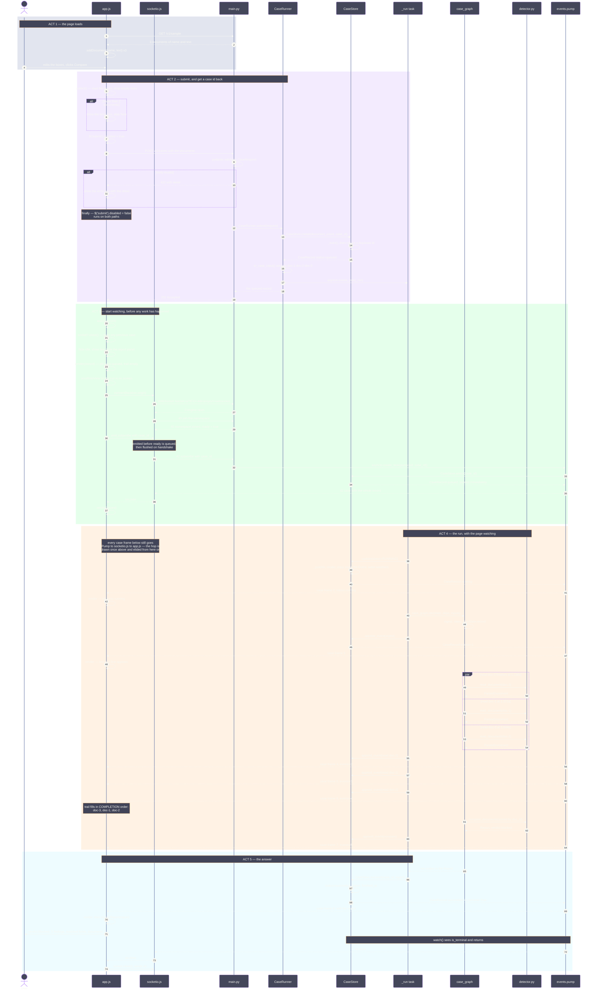
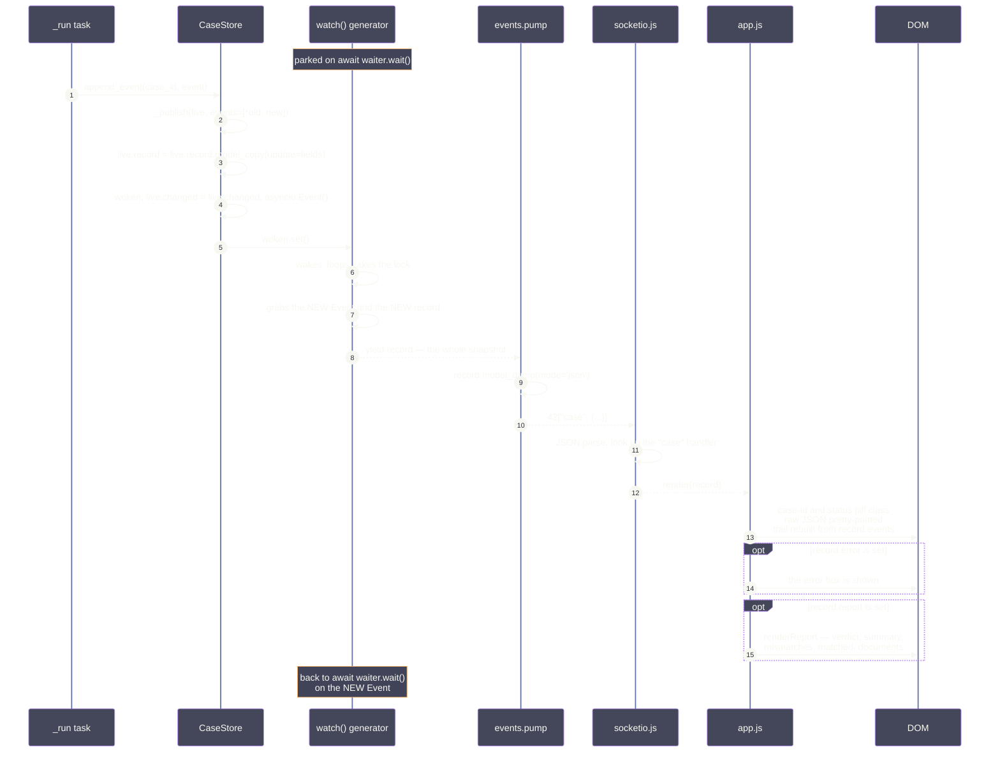
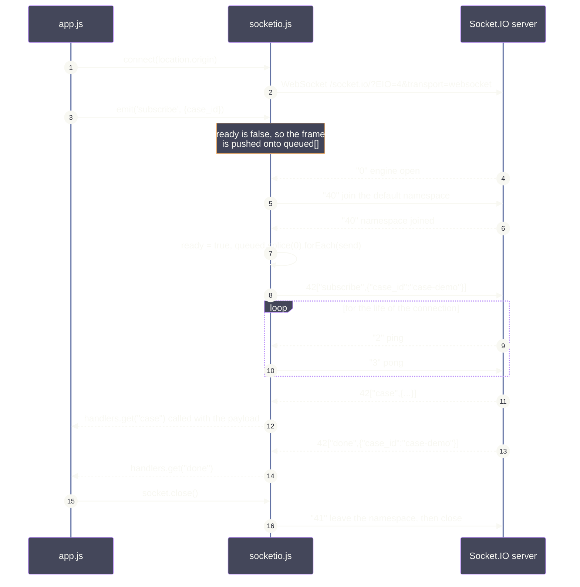

# Full flow

The whole system as one sequence diagram — from the browser loading the page to the verdict
appearing on screen. The frontend is in it: `app.js`, the WebSocket client, and every DOM
update.

- [`API_FLOW.md`](API_FLOW.md) — the same system as 39 small diagrams, one per function.
- [`WALKTHROUGH.md`](WALKTHROUGH.md) — what each line of code means.

## The short version

1. The page asks for sample documents and shows them in editable boxes.
2. You click **Compare**. The page POSTs and gets a `case_id` back in milliseconds — no
   analysis has happened yet.
3. The page renders that empty record straight away, *then* opens a WebSocket and
   subscribes.
4. The run happens on a background task. Every time anything changes, the store wakes the
   subscription and a **complete** record is pushed.
5. The page re-renders from scratch on every push. There is no state machine in the
   browser — `render(record)` is the whole client.
6. When the record is terminal, the stream ends by itself and the socket closes.

The one idea everything rests on: **every push is the whole record, never a delta.** That
is why connecting late loses nothing and why the page can be this simple.

## Who is who

| participant | is |
|---|---|
| `app.js` | the page — `submit`, `watch`, `render`, `renderReport` |
| `socketio.js` | a tiny hand-rolled Socket.IO client, no library |
| `main.py` | FastAPI — the routes |
| `CaseRunner` | accepts a case, owns the background task |
| `CaseStore` | holds records, wakes watchers |
| `_run task` | drives the graph, forwards events |
| `case_graph` | the pipeline — ingest, read, compare |
| `detector.py` | the pure logic — `read_document`, `compare_documents` |
| `events.pump` | one task per subscription, pushing frames |

---

## The whole thing, end to end

Five acts, colour-banded. Read it top to bottom.



Two things to notice in Act 3.

**The page renders before it connects.** `watch(record)` calls `render(record)` with the
202 response, so the status pill says `queued` and the panel is on screen before the socket
exists. If the connection were to fail, you would still see the case.

**Subscribing late costs nothing.** By the time the socket is up, a document may already
have been read. `watch()` yields the *current* record immediately, so the page catches up
in one frame rather than missing what it slept through.

---

## Zoom 1 · How one status change reaches the screen

This is the loop the whole design is built around. It runs eight times per case.



The two subtle steps are 4 and 5.

**Step 4 swaps the Event rather than setting and clearing it.** Every watcher parked on the
old Event wakes. The obvious alternative — `set()` then `clear()` — is broken with more
than one browser tab open: whichever wakes first clears the flag and the rest sleep through
the update.

**Step 7 grabs the new Event *before* yielding.** If a change lands while the record is
being handed over, it sets the Event the watcher is about to wait on, so the wait returns
immediately instead of missing it.

---

## Zoom 2 · The WebSocket handshake

`socketio.js` is 60 lines and implements just enough of the protocol. Worth its own diagram
because of the ordering problem it solves.



`app.js` calls `emit('subscribe', ...)` immediately after `connect()`, long before the
namespace handshake finishes. The client queues the frame and flushes it on `ready` — so
the page never has to know about handshake timing.

The frame prefixes: Engine.IO uses the first character (`0` open, `1` close, `2` ping,
`3` pong, `4` message) and Socket.IO adds a second inside a `4` (`0` connect, `1`
disconnect, `2` event). So `42["case",{...}]` reads as *message · event · named "case"*.

---

## What the page shows, frame by frame

Eight `case` frames, then `done`. The status pill and the trail are driven entirely by this.

| # | `status` | `events` | what you see change |
|---|---|---|---|
| 1 | `queued` | 0 | pill grey, trail empty, panel scrolls into view |
| 2 | `running` | 0 | pill turns to running |
| 3 | `running` | 1 | first trail line — `ingest · 3 documents received` |
| 4 | `running` | 2 | `read · DELIVERY NOTE — 7 fields` |
| 5 | `running` | 3 | `read · PURCHASE ORDER — 7 fields` |
| 6 | `running` | 4 | `read · INVOICE — 7 fields` |
| 7 | `running` | 5 | `compare · 3 mismatches, verdict blocked` |
| 8 | `succeeded` | 5 | pill green, **report panel appears** |

Frames 4, 5 and 6 arrive in *completion* order — doc-3, doc-1, doc-2 — not the order you
submitted them. That reordering is the fan-out, visible from the outside.

## What `render` touches

Every frame, from scratch. No diffing, no accumulation.

| element | set from |
|---|---|
| `#case-id` | `record.case_id` |
| `#status` | `record.status`, also as the pill's CSS class |
| `#raw` | the whole record, pretty-printed |
| `#trail` | rebuilt from `record.events` |
| `#error` | shown only if `record.error` |
| `#report-panel` | shown only once `record.report` exists |

And `renderReport`, once, on the final frame:

| element | set from |
|---|---|
| `#verdict` | `report.verdict`, mapped to a sentence |
| `#summary` | `report.summary` |
| `#mismatches` | one card per `Mismatch`, with every document's value |
| `#matched` | `report.matched_fields` joined |
| `#documents` | one card per `ParsedDocument` — title, note, fields |

`renderReport` builds a `doc_id → name` map first, because a finding cites `doc-2` but a
person wants to read *Invoice*.

## The end result

For the three sample documents:

```
verdict        blocked — important fields disagree
critical_count 3

Total Amount   Purchase order  50,000.00
               Invoice         51,000.00
Seller         Purchase order  Acme Trading
               Invoice         Acme Trading
               Delivery note   Acme Trading Ltd
Delivery Date  Purchase order  2026-03-01
               Delivery note   2026-03-04

matched        Buyer · Currency · Order No · Ship To
```

`Seller` lists three values although only two are distinct — doc-1 and doc-2 agreeing is
part of the evidence, not noise to be dropped.
