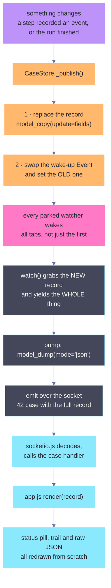
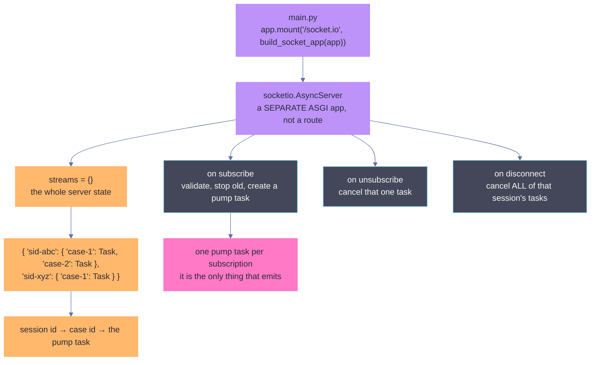
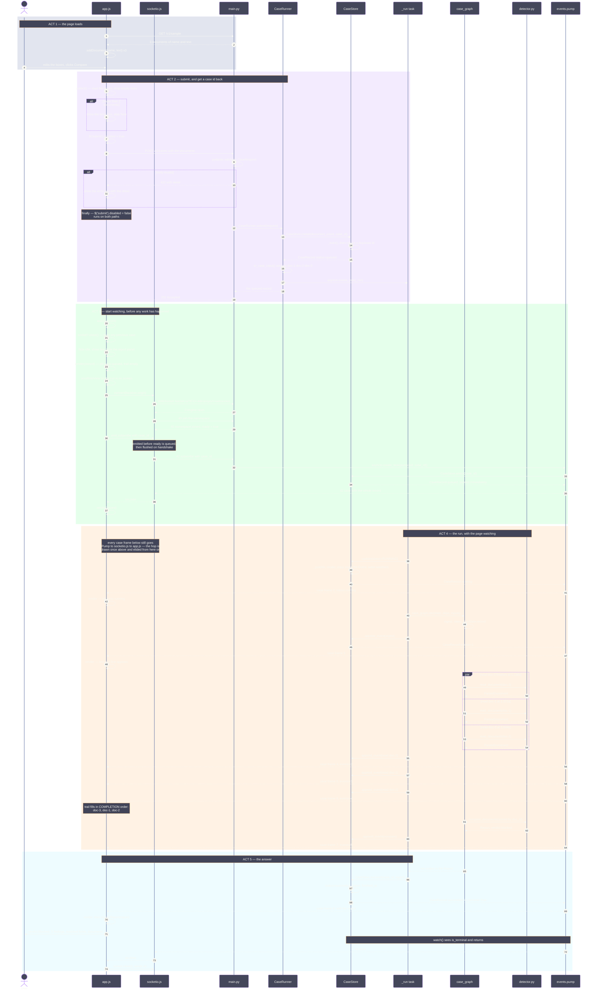
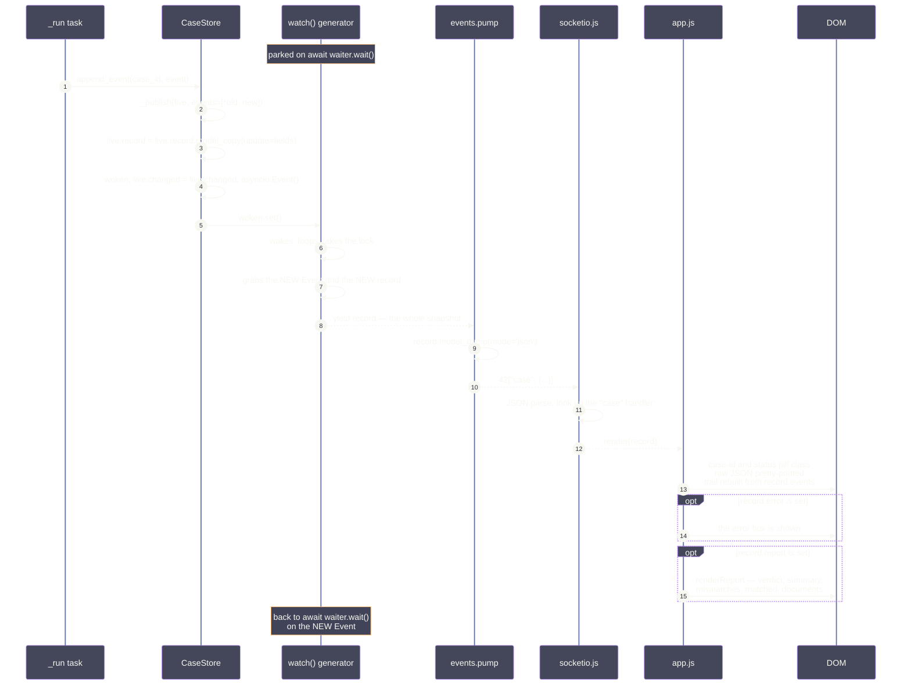
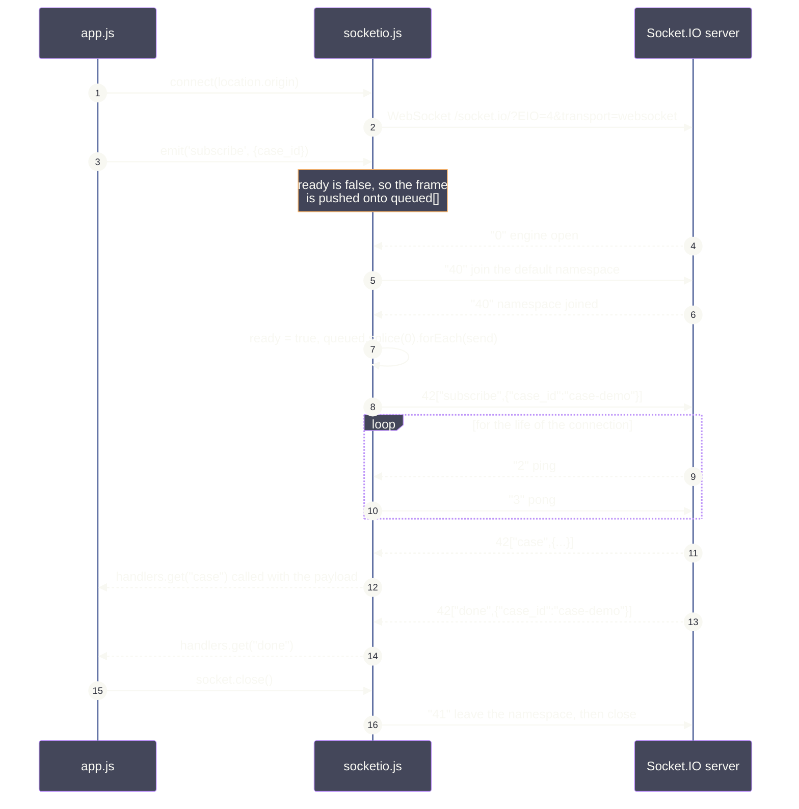

# Full flow

The whole system as one sequence diagram — from the browser loading the page to the verdict
appearing on screen. The frontend is in it: `app.js`, the WebSocket client, and every DOM
update.

- [`API_FLOW.md`](API_FLOW.md) — the same system as 39 small diagrams, one per function.
- [`WALKTHROUGH.md`](WALKTHROUGH.md) — what each line of code means.

## The short version

1. The page asks for sample documents and shows them in editable boxes.
2. You click **Compare**. The page POSTs and gets a `case_id` back in milliseconds — no
   analysis has happened yet.
3. The page renders that empty record straight away, *then* opens a WebSocket and
   subscribes.
4. The run happens on a background task. Every time anything changes, the store wakes the
   subscription and a **complete** record is pushed.
5. The page re-renders from scratch on every push. There is no state machine in the
   browser — `render(record)` is the whole client.
6. When the record is terminal, the stream ends by itself and the socket closes.

The one idea everything rests on: **every push is the whole record, never a delta.** That
is why connecting late loses nothing and why the page can be this simple.

---

# ⭐ How status updates actually work

**This is the part to read.** Everything else in this file is detail around it.

## In one sentence

> **Nobody polls.** The browser opens one long-lived connection, says *"tell me about case
> X"*, and then sits still. Every time anything about that case changes, the server pushes
> the **entire** case record down that connection, and the page throws away what it drew and
> redraws from the new one.

There is no "status changed" message. There is no "a document finished" message. There is
**one** message type — `case` — and it always carries the whole record.

## What that looks like on the wire

Captured from a real run. Nothing here is illustrative; this is a log of actual frames.

```
      7ms  OPEN  ws://127.0.0.1:8111/socket.io/?EIO=4&transport=websocket
      7ms  RECV  0{"sid":"inrDNnz50aF8SmgWAAAA","upgrades":[],"pingTimeout":20000,...}
      8ms  SEND  40
      8ms  RECV  40{"sid":"955okEg2RvdqHQfkAAAB"}
     11ms  HTTP  POST /v1/cases -> 202  case_id=case-cfd5df72  status=queued
     11ms  SEND  42["subscribe",{"case_id":"case-cfd5df72"}]
     16ms  RECV  42["case",...]  status=running    events=0  report=null    179 bytes
    220ms  RECV  42["case",...]  status=running    events=1  report=null    279 bytes
    679ms  RECV  42["case",...]  status=running    events=2  report=null    390 bytes
    770ms  RECV  42["case",...]  status=running    events=3  report=null    502 bytes
    881ms  RECV  42["case",...]  status=running    events=4  report=null    607 bytes
   1284ms  RECV  42["case",...]  status=running    events=5  report=null    718 bytes
   1285ms  RECV  42["case",...]  status=succeeded  events=5  report=yes    2680 bytes
   1285ms  RECV  42["done",{"case_id":"case-cfd5df72"}]
   1285ms  SEND  41
```

Read the `bytes` column. Every frame is bigger than the last, because every frame is the
**whole** record and the record keeps growing — one more trail line each time, then the
report all at once at the end. Nothing is ever sent as a diff.

Here is one of those frames, exactly as it came off the socket:

```
42["case",{"case_id":"case-ff2430bf","status":"running","document_count":3,"submitted_at":"2026-09-18T06:56:34.157418Z","finished_at":null,"events":[],"report":null,"error":null}]
```

`42` is the frame type. The rest is `["<event name>", <payload>]`. So the page receives an
event called `case` whose payload is a complete `CaseRecord` — the same JSON
`GET /v1/cases/{id}` would have returned at that instant.

## The chain, one link at a time



The two boxes in orange are the whole trick, and they are six lines of Python in
`CaseStore._publish`:

```python
live.record = live.record.model_copy(update=fields)          # 1 · replace, never mutate

woken, live.changed = live.changed, asyncio.Event()          # 2 · swap in a fresh Event
woken.set()                                                  #     and fire the old one
```

**Why replace the record instead of editing it.** A watcher that was already handed the
previous record still holds exactly what it was shown. It cannot see a record change
underneath it mid-send.

**Why swap the Event instead of `set()` then `clear()`.** Every watcher parked on the old
Event wakes. With a single shared flag, whichever tab woke first would clear it and the
others would sleep through the update. Proven with two live connections on one case:

```
tab A: first frame running, 7 case frames, then done
tab B: first frame running, 7 case frames, then done
```

Identical. Neither missed anything.

---

# The two ends of the socket

## What the WebSocket server actually is

It is **not** a FastAPI route. It is a separate ASGI application mounted alongside them,
and all of its state is one dictionary.



`streams` is `{session id: {case id: task}}` — two levels, because one browser tab can
watch several cases at once, and a disconnect must cancel all of *that* tab's tasks without
touching anyone else's.

The server itself pushes nothing. **A `pump` task does all the emitting**, one per
subscription, and its entire body is:

```python
async for record in runner.store.watch(case_id):       # blocks until something changes
    await server.emit('case', record.model_dump(mode='json'), to=sid)
await server.emit('done', {'case_id': case_id}, to=sid)
```

The `async for` ends by itself when the record is terminal. That is why `done` needs no
flag and no check — **the generator running out *is* the signal.**

Its three handlers, and what each does:

| client sends | server does |
|---|---|
| `subscribe {"case_id": ...}` | validates, cancels any existing stream for that case, starts a `pump` task |
| `unsubscribe {"case_id": ...}` | cancels that one task |
| *disconnects* | cancels **every** task for that session |

Cancelling on `subscribe` is what stops a double-subscribe from delivering everything twice,
forever. Real replies to every payload shape:

```
SEND 42["subscribe",{"case_id":"nope"}]   RECV 42["error",{"detail":"no case 'nope'"}]
SEND 42["subscribe","case-demo"]          RECV 42["error",{"detail":"expected {'case_id': '...'}"}]
SEND 42["subscribe",{"case_id":""}]       RECV 42["error",{"detail":"expected {'case_id': '...'}"}]
SEND 42["subscribe",{}]                   RECV 42["error",{"detail":"expected {'case_id': '...'}"}]
```

Note where each comes from. The last three are rejected by the `subscribe` handler before
any task exists — a socket payload gets none of the validation a FastAPI body does, so it
is checked by hand. `no case 'nope'` comes from `pump`, because the id looked fine and only
`store.watch` could know there was nothing behind it.

> **`error` never means "the analysis failed".** It means "I could not stream this to you".
> A case that fails analysis is terminal, so `watch()` returns normally and you get a final
> `case` frame with `status: "failed"` followed by `done`, exactly like a success.

## What the frontend actually is

Two files, and neither is large.

**`socketio.js`** — 60 lines, no library, no CDN. It speaks just enough of the protocol.
Both layers put their type in the leading characters:

| prefix | layer | meaning |
|---|---|---|
| `0` | Engine.IO | connection open, here is your session id |
| `2` / `3` | Engine.IO | ping / pong — answer or you get dropped |
| `40` | Socket.IO | join the default namespace |
| `42` | Socket.IO | an event: `42["name", payload]` |
| `41` | Socket.IO | leave the namespace |

So `42["case",{...}]` decodes as *message · event · named `case`*.

It solves exactly one timing problem. `app.js` calls `emit('subscribe', ...)` immediately
after `connect()` — long before the namespace handshake has finished. Rather than make the
page wait, the client queues the frame and flushes it when `ready` flips:

```js
emit(name, payload) {
  const frame = '42' + JSON.stringify([name, payload]);
  ready ? send(frame) : queued.push(frame);      // <- the whole trick
}
```

**`app.js`** — the page. The important thing is what it *does not* have: no state machine,
no accumulation, no reconciliation. Three lines wire the socket up:

```js
socket = connect(location.origin);
socket.on('case', render);              // every frame goes straight to render
socket.on('done', () => socket.close());
socket.emit('subscribe', { case_id: record.case_id });
```

`socket.on('case', render)` is the entire client-side update logic. `render(record)` takes
a whole record and redraws everything from it — it never asks what changed, because it does
not need to.

> **This is only possible because every frame is complete.** If the server sent deltas, the
> browser would need to hold state, apply patches in order, detect gaps and recover from a
> missed one. Sending the whole record every time moves all of that complexity into one
> `model_copy` call on the server.

## Why the frame count varies

The capture above shows **7** frames, and the first one says `running`. Elsewhere in these
docs you will see **8**, starting at `queued`. Both are correct, and the difference is the
point.

`watch()` yields the current record *immediately*, then once per change. So what you get
first is whatever is true when you subscribe:

| you subscribe | first frame | total frames |
|---|---|---|
| on an already-open socket, ~5ms after the POST | `running` | 7 |
| from a browser, which must open a WebSocket first | `queued` | 8 |
| after two documents are already read | `running` with `events=3` | fewer still |

> **Subscribing late costs you nothing.** You do not replay the frames you missed — you get
> the current state in one frame, which already contains everything those frames would have
> told you. The same property makes a reconnect need no cursor, and makes it safe for the
> page to render the `202` response before the socket even exists.

---

# The rest of the system

## Who is who

| participant | is |
|---|---|
| `app.js` | the page — `submit`, `watch`, `render`, `renderReport` |
| `socketio.js` | a tiny hand-rolled Socket.IO client, no library |
| `main.py` | FastAPI — the routes |
| `CaseRunner` | accepts a case, owns the background task |
| `CaseStore` | holds records, wakes watchers |
| `_run task` | drives the graph, forwards events |
| `case_graph` | the pipeline — ingest, read, compare |
| `detector.py` | the pure logic — `read_document`, `compare_documents` |
| `events.pump` | one task per subscription, pushing frames |

---

## The whole thing, end to end

Five acts, colour-banded. Read it top to bottom.



Two things to notice in Act 3.

**The page renders before it connects.** `watch(record)` calls `render(record)` with the
202 response, so the status pill says `queued` and the panel is on screen before the socket
exists. If the connection were to fail, you would still see the case.

**Subscribing late costs nothing.** By the time the socket is up, a document may already
have been read. `watch()` yields the *current* record immediately, so the page catches up
in one frame rather than missing what it slept through.

---

## Zoom · The same chain as a sequence, with the DOM writes

This is the loop the whole design is built around. It runs eight times per case.



The two subtle steps are 4 and 5.

**Step 4 swaps the Event rather than setting and clearing it.** Every watcher parked on the
old Event wakes. The obvious alternative — `set()` then `clear()` — is broken with more
than one browser tab open: whichever wakes first clears the flag and the rest sleep through
the update.

**Step 7 grabs the new Event *before* yielding.** If a change lands while the record is
being handed over, it sets the Event the watcher is about to wait on, so the wait returns
immediately instead of missing it.

---

## Zoom · The handshake, message by message

`socketio.js` is 60 lines and implements just enough of the protocol. Worth its own diagram
because of the ordering problem it solves.



`app.js` calls `emit('subscribe', ...)` immediately after `connect()`, long before the
namespace handshake finishes. The client queues the frame and flushes it on `ready` — so
the page never has to know about handshake timing.

The frame prefixes: Engine.IO uses the first character (`0` open, `1` close, `2` ping,
`3` pong, `4` message) and Socket.IO adds a second inside a `4` (`0` connect, `1`
disconnect, `2` event). So `42["case",{...}]` reads as *message · event · named "case"*.

---

## What the page shows, frame by frame

Eight `case` frames, then `done`. The status pill and the trail are driven entirely by this.

| # | `status` | `events` | what you see change |
|---|---|---|---|
| 1 | `queued` | 0 | pill grey, trail empty, panel scrolls into view |
| 2 | `running` | 0 | pill turns to running |
| 3 | `running` | 1 | first trail line — `ingest · 3 documents received` |
| 4 | `running` | 2 | `read · DELIVERY NOTE — 7 fields` |
| 5 | `running` | 3 | `read · PURCHASE ORDER — 7 fields` |
| 6 | `running` | 4 | `read · INVOICE — 7 fields` |
| 7 | `running` | 5 | `compare · 3 mismatches, verdict blocked` |
| 8 | `succeeded` | 5 | pill green, **report panel appears** |

Frames 4, 5 and 6 arrive in *completion* order — doc-3, doc-1, doc-2 — not the order you
submitted them. That reordering is the fan-out, visible from the outside.

## What `render` touches

Every frame, from scratch. No diffing, no accumulation.

| element | set from |
|---|---|
| `#case-id` | `record.case_id` |
| `#status` | `record.status`, also as the pill's CSS class |
| `#raw` | the whole record, pretty-printed |
| `#trail` | rebuilt from `record.events` |
| `#error` | shown only if `record.error` |
| `#report-panel` | shown only once `record.report` exists |

And `renderReport`, once, on the final frame:

| element | set from |
|---|---|
| `#verdict` | `report.verdict`, mapped to a sentence |
| `#summary` | `report.summary` |
| `#mismatches` | one card per `Mismatch`, with every document's value |
| `#matched` | `report.matched_fields` joined |
| `#documents` | one card per `ParsedDocument` — title, note, fields |

`renderReport` builds a `doc_id → name` map first, because a finding cites `doc-2` but a
person wants to read *Invoice*.

## The end result

For the three sample documents:

```
verdict        blocked — important fields disagree
critical_count 3

Total Amount   Purchase order  50,000.00
               Invoice         51,000.00
Seller         Purchase order  Acme Trading
               Invoice         Acme Trading
               Delivery note   Acme Trading Ltd
Delivery Date  Purchase order  2026-03-01
               Delivery note   2026-03-04

matched        Buyer · Currency · Order No · Ship To
```

`Seller` lists three values although only two are distinct — doc-1 and doc-2 agreeing is
part of the evidence, not noise to be dropped.
