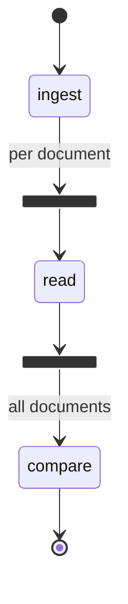

# Document Mismatch Detector — a prototype

A miniature of [Trade_Finance_Doc_Mismatch_Detector](https://github.com/selvakumarperumal/Trade_Finance_Doc_Mismatch_Detector),
built to show **how that architecture works** rather than what it knows about trade finance.

Submit a few documents; every field that appears on more than one of them is compared, and
the disagreements stream back to the browser as they are found. Under 700 lines of actual code
(the files are about half comments), with no `pydantic-ai`, no model calls, no OCR, no API key and no build step.

```
POST /v1/cases  ──▶ 202 {case_id}        the answer isn't ready yet, so you get a receipt
                     │
                     ├──▶ background task drives a pydantic-graph run
                     │         │
                     └──▶ Socket.IO 'case' ──▶ the whole record, after every change
                                               ──▶ 'done' when it is finished
```

The pipeline itself is a [Pydantic Graph](https://ai.pydantic.dev/graph/) — the same
library the original uses, without `pydantic-ai`:



That diagram is not hand-drawn — `GET /v1/graph` renders it from the wiring that actually
runs, so it cannot quietly go out of date.

## Run it

```bash
uv sync
uv run tfd
```

Open <http://localhost:8000>. The sample documents load themselves — press **Compare them**.
Set `TFD_PORT=8100` if 8000 is taken.

These all start the same server, so use whichever you reach for:

```bash
uv run tfd                        # the entry point in [project.scripts]
uv run app/main.py                # running the file directly
uv run python -m app.main
uv run uvicorn app.main:app --reload
```

Or from the command line:

```bash
curl -s localhost:8000/v1/sample > docs.json
curl -s -X POST localhost:8000/v1/cases \
  -H 'Content-Type: application/json' \
  -d "{\"documents\": $(cat docs.json)}"          # -> 202, a case id
curl -s localhost:8000/v1/cases/<case-id>          # -> poll it
```

Interactive API docs at `/docs`.

> **Reading the code?** [`WALKTHROUGH.md`](WALKTHROUGH.md) goes through every snippet in
> `app/` — what each line does and why it is written that way.

## The one idea worth taking away

**Every push is a complete snapshot, not a delta.**

`CaseRecord` carries the status, the audit trail and the report, and it is what comes back
from the POST, from the GET, and from every Socket.IO `case` event. Nothing is incremental.

That single decision removes most of the hard parts:

- **No race.** The browser POSTs, gets an id, *then* opens the socket. By then a document
  may already be read — and it doesn't matter, because the first thing a subscriber is
  handed is the current state.
- **No cursor.** A reconnect re-subscribes and is immediately correct.
- **No state machine in the client.** [`frontend/app.js`](frontend/app.js) is one
  `render(record)` that redraws from scratch.

The cost is bandwidth, which for a case this size is nothing.

## How a request travels

| Step | Where | What happens |
|---|---|---|
| 1 | [`app/main.py`](app/main.py) | `POST /v1/cases` validates the body as a `CaseRequest` and hands it to the runner |
| 2 | [`app/cases.py`](app/cases.py) | `CaseRunner.submit` registers the case, starts an `asyncio.Task`, returns `202` |
| 3 | [`app/graph.py`](app/graph.py) | the graph runs: `ingest`, then one `read` per document at once, then `compare` |
| 4 | [`app/cases.py`](app/cases.py) | the runner iterates the graph, draining `state.events` between nodes |
| 5 | [`app/events.py`](app/events.py) | every change wakes the watchers; each gets the whole record |

Two details in `CaseStore` are load-bearing and easy to get wrong:

- Records are **replaced, never mutated**, so a record already handed to a watcher stays
  exactly what that watcher was shown.
- Watchers are woken by **replacing** an `asyncio.Event` rather than setting and clearing
  one. With a single shared event, the first watcher to wake would clear it and the rest
  would sleep through the update.

## Why a graph, for three steps

`ingest → read → compare` is a loop you could write by hand. What the graph buys is in the
two edges, not the nodes:

```python
builder.edge_from(ingest)
    .label('per document')
    .map(fork_id=FAN_OUT_ID, downstream_join_id=COLLECT_ID)   # fan out
    .to(read),
builder.edge_from(read).to(collect),                          # join, via reduce_list_append
```

- **The fan-out is declared, not written.** Every document is read concurrently because
  of that `.map()`, and `collect` waits for all of them. No `asyncio.gather`, no place to
  forget one.
- **Progress comes from outside the steps.** The runner uses `graph.iter()` rather than
  `graph.run()`, which hands back control between nodes; whatever the run recorded since
  the last look is forwarded to anyone watching. A step appends to `state.events` and has
  no idea a websocket exists.
- **The diagram is generated.** `graph.render()` above.

`RunState` is what a run accumulates (its trail); `RunDeps` is what it is handed and never
changes — in the real service, the model client and the OCR client. Steps take everything
from their `StepContext` and nothing from module scope, which is what makes them testable
on their own.

One consequence worth seeing, and the reason every step pauses: because the reads really
are concurrent, the trail fills in **completion order**, not submission order. Timed from
the moment the POST returns:

```
+0.51s  ingest   3 documents received
+1.65s  read     DELIVERY NOTE — 7 fields      <- submitted third
+1.88s  read     PURCHASE ORDER — 7 fields
+2.16s  read     INVOICE — 7 fields
+3.16s  compare  3 mismatches, verdict blocked
```

The three reads start together and land apart. Each one's pretend latency comes from the
document — longer text costs more, plus a spread derived from a checksum of the text, so
no two calls take quite the same time and the same document always takes the same time.
Without that spread every branch would finish in the same millisecond and a genuinely
concurrent fan-out would look sequential from outside.

## Where the model would go

[`app/detector.py`](app/detector.py) has one function standing in for the whole of the AI:

```python
def default_reply(prompt: str, *, kind: str = 'read') -> str:
    """Return canned words instead of calling a language model."""
```

It picks a fixed line from a small pool, keyed on a checksum of the prompt — so it is
deterministic across restarts, the way a real call at temperature zero would be.

The split it leaves behind is the interesting part, and it is the split worth keeping in
real systems too:

| | comes from | in the real service |
|---|---|---|
| the **facts** — fields, comparisons, counts, verdict | plain Python | still plain Python |
| the **prose** — per-document notes, the closing line of the summary | `default_reply` | the model |

The summary is literally concatenated from both halves, so you can see the seam:

> Checked 3 documents on 7 shared fields: 4 agreed, 3 did not (3 critical). *Anything only
> one document mentioned was left out of the comparison.*

Swapping in a real model means changing `default_reply` and nothing else.

## What it actually checks

Nothing domain-specific — that is the difference from the original. A document is a title
and a bag of `KEY: VALUE` lines:

```
INVOICE
Order No: PO-1042
Total Amount: 51,000.00
```

Then: every field named by **two or more** documents is compared, case, spacing and
thousands separators ignored (`USD 51,000.00` == `usd 51000.00`). A field only one
document carries is skipped — documents legitimately hold different things.

Severity comes from the field's *name*, via the `WATCHED` list in `app/detector.py`:
anything that looks like money, a date or a party is `critical`, everything else is
`warning`. One critical finding → **blocked**; any other disagreement → **needs_review**;
none → **clean**.

The sample plants three: a total of 50,000 against 51,000, a delivery date four days late,
and `Acme Trading` vs `Acme Trading Ltd`.

## Layout

```
app/
  models.py     every shape that crosses a boundary — the whole data model
  graph.py      the pydantic-graph pipeline: ingest -> (fan out) read -> (join) compare
  detector.py   default_reply, the reader, the comparer — the graph's steps call these
  cases.py      the case store (snapshots + waking watchers) and the background runner
  events.py     the Socket.IO layer: subscribe -> case -> done
  main.py       five routes, one socket mount, the static page
  sample.py     three documents that disagree on purpose
frontend/
  index.html    three panels: submit, watch, read
  app.js        submit, subscribe, render(record)
  socketio.js   ~55 lines of Socket.IO protocol, so there is no CDN or build step
  styles.css
```

Two environment variables: `TFD_PORT` (default `8000`), and `TFD_STAGE_DELAY` (default
`1.0`) — the unit of pretend latency, standing in for the model round trip the real
service waits on. Every step waits some multiple of it, which is what makes a run slow
enough to watch: the default gives a run of about three seconds.

```bash
TFD_STAGE_DELAY=2.5 uv run tfd    # slower, for walking someone through it
TFD_STAGE_DELAY=0 uv run tfd      # instant, for tests
```

The project installs itself into the environment (`[build-system]` + `packages = ["app"]`
in `pyproject.toml`), which is what makes `app` importable however you start it. Without
that, running the file directly fails with `ModuleNotFoundError: No module named 'app'`,
because Python puts the *script's* directory on `sys.path`, not the project root.

## What the real project has that this does not

Worth knowing before mistaking this for a starting point:

- **OCR.** The original reads scanned PDFs with Amazon Textract, splitting per page. Here
  documents arrive as text.
- **Real extraction.** Gemini classifies each document and extracts it under a Pydantic
  schema per family (letter of credit, invoice, bill of lading, …). Here a regex reads
  labelled lines, and anything else — table rows, prose, multi-line values — is ignored.
- **Real rules.** UCP 600 / ISBP 745 checks with article references, tolerances and
  presentation windows. Here, a list of suggestive words.
- **A wider graph.** The same `GraphBuilder`, but with an OCR step, a `Decision` that
  routes each document to an extractor per family, and per-document failure paths that
  degrade to a finding instead of failing the case.
- **Back pressure and retention.** Concurrency ceilings, a queue limit, per-case budgets,
  cancellation. Here: a task set and a 50-case cap.

Two rough edges left in on purpose: a case where no field appears twice is reported
`clean` (nothing disagreed — but nothing was checked either), and fields are matched by
name, so `Order No` and `Order Number` are two different fields.
